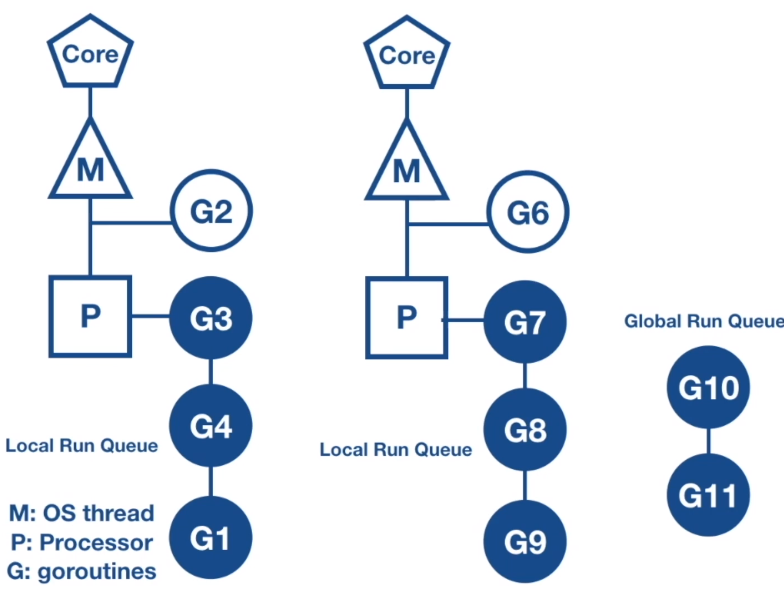
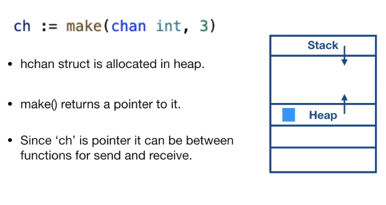
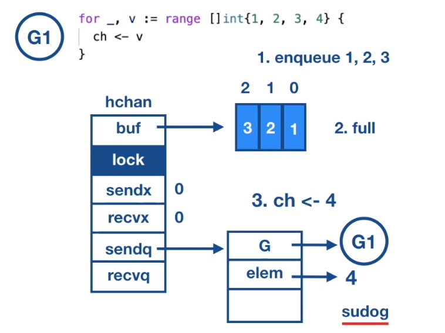

# Concurrency in Go

Learn the Why's and How's of concurrency in Go.

## Introduction

### Overview of concurrency

- Concurrency is about *multiple things happening at same time* in random order
- Go provides a *built-in support for concurrency*

Why we need to think about concurrency?

```go
// Add -- sequential code to add numbers
func Add(numbers []int) int64 {
    var sum int64
    for _, n := range numbers {
        sum += int64(n)
    }
}
```

When `Add()` is executed, it runs on single core. To run faster, divide the input and run multiple instances of `Add()` function on each part in parallel on different cores.

```go
// AddConcurrent -- concurrent code to add numbers
func AddConcurrent(numbers []int) int64 {
    // Utilize all cores on machine
    numOfCores := runtime.NumCPU()
    runtime.GOMAXPROCS(numOfCores)

    var sum int64
    max := len(numbers)

    sizeOfParts := max / numOfCores

    var wg sync.WaitGroup

    for i := 0; i < numOfCores; i++ {
        // Divide the input into parts
        start := i + sizeOfParts
        end := start + sizeOfParts
        part := numbers[start:end]

        // Run computation for each part in a separate goroutine
        wg.Add(1)
        go func(nums []int) {
            defer wg.Done()

            var partSum int64

            // Calculate sum for each part
            for _, n := range nums {
                partSum += int64(n)
            }

            // Add sum of each part to cummulative sum
            atomic.AddInt64(&sum, partSum)
        }(part)

        wg.Wait()
        return sum
    }
}
```

```go
func main() {
    numbers := counting.GenerateNumbers(1e7)

    t := time.Now()
    sum := counting.Add(numbers)
    fmt.Printf("Sequential Add, sum: %d, time taken: %s\n", sum, time,Since(t))

    t = time.Now()
    sum = counting.AddConcurrent(numbers)
    fmt.Printf("Concurrent Add, sum: %d, time taken: %s\n", sum, time,Since(t))
}
```

- Concurrency is a composition of *independent execution of computations* which may or may not run in parallel
- Parallelism is ability to *execute multiple computations simulteniously*
- Concurrency enables Parallelism

### Processes and Threads

Why there was a need to build concurrency primitives in Go?

- Operating System
  - The job of an operating system is to give a fair chance for all processes access to CPU, memory and other resources
- What is a Process?
  - An instance of a running programm is called a process
  - Process provides environment for program to execute
  - OS allocates memory in virtual address space which contain
    - code segment (machine instructions)
    - data (global data)
    - heap (dynamic memory allocation)
    - stack (used to store local variables of a function)
- Threads
  - Are the *smallest unit of execution* that CPU accepts
  - Each process has at least one thread -- the main thread
  - Processes can have multiple threads
  - Threads share the same address space, but each thread has its own stack
  - Threads run independent of each other
  - OS scheduler makes scheduling decisions at all thread level, not at process level
  - Threads can run concurrently or in parallel (on different cores)
- Context switches are expensive
  - Process context
    - Process state
    - CPU scheduling information
    - Memory management information
    - Accounting information
    - I/O status information
  - Thread conntext
    - Program counter
    - CPU registers
    - Stack
- C10k Problem
  - As we scale up number of threads, scheduler cycle increases and application can become less responsive
  - Scheduler allocates a process a time slice for execution on CPU core
  - This CPU time slice is divided equally among threads
- Fixed stack size
  - Threads are allocated a fixed stack size
  - This limits amount of threads you can create

### Why Concurrency is hard

- Shared memory
  - Threads communicate between each other by sharing memory. They share code, data, heap
  - Sharing of memory between threads creates a lot of complexity
  - Concurrent access to shared memory by two or more threads can lead to *Data Race* and outcome can be *un-deterministic*
  - Memory Access Synchronization
    - We need to guard the access to shared memory so that a thread gets exclusive access at a time
    - It is a developer's convention to `locl()` and `unlock()`
    - If developers don't follow this convention, we have no guarantee of exclusive access
    - Locking *reduces parallelism*, locks force to execute sequentially
    - Inappropriate use of locks (circular wait) can lead to *deadlocks*

## Goroutines

### Goroutine

Concurrency in Go is based on CSP =  Communicating Sequential Processes by Tony Hoare, 1978.

Built on 3 core ideas.

- Each process is built for sequential execution. Every process has a state and operates on that state.
- Data is communicated between processes, *no shared memory*. Data is copied from one process to another. No shared memory means no locking and no deadlocks.
- Scale by adding more of the same.

Go's concurrency tool set:

- Goroutines (concurrently executing functions)
  - We can think goroutines as *user space threads managed by go runtime*
  - Goroutines are extremely lightweight. Goroutines start with 2k of stack, which grows and shrinks as required
  - Low CPU overhead, 3 instructions per function call
  - Cancreate thousands of goroutines in the same address space
  - Context switching between goroutines is much cheaper than thread context switching
  - Go runtime can be more *selective* in *what is persisted* for retrieval, how it is persisted, and when the persisting needs to occur
  - Go runtime creates worker OS threads
  - Goroutines run in the context of OS thread
  - Many goroutines execute in the context of single OS thread
  - OS schedules OS threads, and the Go runtime schedules multiple goroutines in the OS thread

- Channels (used to communicate data between goroutines)
- Select (used to multiplex the channels)
- Sync package (provides classical synchronization tools like mutex)

### Excersise 01: Hello

```go
package main

import (
  "fmt"
  "time"
)

func fun(s string) {
  for i := 0; i < 3; i++ {
    fmt.Println(s)
    time.Sleep(1 * time.Millisecond)
  }
}

func main() {
  // Direct call
  fun("direct call")

  // TODO: write goroutine with different variants for function call.

  // goroutine function call

  // goroutine with anonymous function

  // goroutine with function value call

  // wait for goroutines to end

  fmt.Println("done..")
}
```

### Excersise 02: Client-Server

Client

```go
package main

import (
  "io"
  "log"
)

func main() {
  // TODO: connect to server on localhost port 8000
}

// mustCopy - utility function
func mustCopy(dst io.Writer, src io.Reader) {
  if _, err := io.Copy(dst, src); err != nil {
    log.Fatal(err)
  }
}
```

Server

```go
package main

import (
  "io"
  "net"
  "time"
)

func main() {
  // TODO: write server program to handle concurrent client connections.
}

// handleConn - utility function
func handleConn(c net.Conn) {
  defer c.Close()
  for {
    _, err := io.WriteString(c, "response from server\n")
    if err != nil {
      return
    }
    time.Sleep(time.Second)
  }
}
```

### Wait Groups

- Race Condition occurs when order of excution is not guaranteed
- Concurrent programs do not execute in te order they are coded
- Goroutine follows 'fork and join' principle. The `go` keyword forks a goroutine, and when it is executed it joins the parent

```go
var wg sync.WaitGroup
wg.Add(1) // We call this outside of goroutine
go func() {
  defer wg.Done() // Decrement the counter
  // . . .
}()
wg.Wait() // Waits till counter is zero
```

### Excersise 03: Join

```go
package main

import (
  "fmt"
)

func main() {
  // TODO: modify the program to print the value as 1 deterministically.
  var data int
  go func() {
    data++
  }()

  fmt.Printf("the value of data is %v\n", data)
  fmt.Println("Done..")
}
```

### Goroutines & Closures

- Goroutines execute within the same address space they are created in.
- They can directly modify variables in the enclosing lexical block.

```go
func inc() {
  // Here Go compiler pins the `i` variable for access inside the goroutine
  // even after enclosing function returns.
  var i int
  go func() {
    i++
    fmt.Println(i)
  }()
  return
}
```

### Excersise 04: Closure

```go
package main

import (
  "fmt"
  "sync"
)

// TODO: run the program and check that variable i
// was pinned for access from goroutine even after
// enclosing function returns.

func main() {
  var wg sync.WaitGroup

  incr := func(wg *sync.WaitGroup) {
    var i int
    wg.Add(1)
    go func() {
      defer wg.Done()
      i++
      fmt.Printf("value of i: %v\n", i)
    }()
    fmt.Println("return from function")
    return
  }

  incr(&wg)
  wg.Wait()
  fmt.Println("done..")
}
```

### Excersise 05: Closure

Goroutines operate on the current value of the variable at the time of their execution.
If you want the goroutines operate on a specific value then you need to pass it as an input to the goroutine.

```go
package main

import (
  "fmt"
  "sync"
)

func main() {
  var wg sync.WaitGroup

  // what is the output
  // TODO: fix the issue: loop variable i captured by func literal
  for i := 1; i <= 3; i++ {
    wg.Add(1)
    go func() {
      defer wg.Done()
      fmt.Println(i)
    }()
  }
  wg.Wait()
}
```

### Deep Dive: Go Scheduler

Go scheduler is part of the Go runtime, Go runtime is part of the executable, it is built into the executable of the application.

Go scheduler is also known as `M:N` scheduler.
It runs in the user space.
Goroutines are scheduled on the OS threads by the Go scheduler.
So a goroutine runs in the context of the OS thread.

Go runtime creates a number of worker OS threads, equal to `GOMAXPROCS` environment variable value, the default value is the number of processors on the machine.

So if we have 4 cores, then 4 OS threads will be created.
If you have 8 cores, then 8 OS threads will be created.

It is the responsibility of the Go scheduler to distribute runnable goroutines over multiple threads that are created.

At any time `N` goroutines could be scheduled on `M` OS threads that runs on at most `GOMAXPROCS` number of processors.

As of Go 1.14, the Go scheduler implements asynchronous preemption.

It used to be co-operative scheduler, but then the question came, what happens when a long running routine just hogs onto the CPU?

Other goroutine would just get blocked.

So that's the reason why asynchronous pre-emption was implemented.

So in asynchronous preemption, what happens is, a goroutine is given a time slice of ten milliseconds for execution.

When that time slice is over, Go scheduler will try to preempt it, this provides other goroutines the opportunity to run even when there are long running CPU bound goroutines scheduled.

Similar to threads, goroutines also have states.


When it is created, it will be in runnable state, waiting in the run queue.

It moves to the executing state once the goroutine is scheduled on the OS thread.

If the goroutine runs through its time twice, then it is preempted and placed back into the run queue.

If the goroutine gets blocked on any condition, like blocked on channel, blocked on a syscall or waiting for the mutex lock, then they are moved to waiting state. Once the I/O operation is complete, they are moved back to the runnable state.

Now we will look into different elements involved in Go scheduling.

For a CPU core, Go runtime creates a OS thread, which is represented by the letter `M`. OS thread works pretty much like POSIX thread.

Go runtime also creates a logical processor `P` and associate that with the OS thread `M`. The logical processor holds the context for scheduling, which can be seen as a local scheduler running on a thread.

`G` represents a goroutine running on the OS thread.

Each logical processor `P` has a local run queue where runnable goroutines are queued.

Here it is depicted by the colored circles.


There is a global run queue, once the local queue is exhausted, the logical processor will pull goroutines from global run queue.

When new goroutines are created, they're added to the end of the global run queue.

Let's see a context switch.



Goroutine `G1` has reached a scheduling point, then the logical processor will pop a goroutine from its local run queue, in this case `G2`, and sets the stack and the instruction pointer for the goroutine `G2` and begins running that goroutine. The previously running goroutine `G1` is placed back into the local run queue.

As you see, there is no change as far as the OS is concerned. It is still scheduling the same OS thread.

The context switching between the goroutines is managed by the logical processor.

There is a one to one mapping between OS thread and the logical processor, if there are two cores and we have set `GOMAXPROCS` environment variable to 2, then go runtime creates another OS thread and logical processor and associates the OS thread with the logical processor and goroutines can be scheduled on the second OS thread.

Let us summarize.

- Go runtime has a mechanism known as `M:N` scheduler, where `N` goroutines could be scheduled on `M` OS threads that run on at most `GOMAXPROCS` number of processors.
- As of Go 1.14 Go scheduler implement asynchronous pre-emption where each goroutine is given a time slice of ten milliseconds for execution.
- We saw, what are the components of Go scheduler.
  - OS thread is represented by the letter `M`.
  - `P` is the logical processor which manages scheduling of goroutines.
  - `G` is the goroutine, which includes the scheduling information like stack and instructions pointer.
  - Local run queue is where runnable goroutines are queued.
- When a goroutine is created, they are placed into the global run queue.

### Deep Dive: Go Scheduler - context switching due to synchronous system call

What happens in general when a goroutine makes a synchronous system call, like reading or writing to a file with sync flag set?

There will be a disc I/O to be performed, so synchronous system call will block for I/O operation to complete, due to which the OS thread can be moved out of the CPU and placed in the waiting queue for the disc I/O to complete.

So we will not be able to schedule any other goroutine on that thread.

The implication is that synchronous system call can reduce parallelism.

So how does Go scheduler handle this scenario? Let us see.


Here goroutine `G1` is running on OS thread `M1`.
`G1` is going to make synchronous system call, like reading on a file, that will make the OS thread `M1` to block.

Go scheduler identifies that `G1` has caused OS thread `M1` to block, so it brings in a new OS thread, either from the thread pool cache or it creates a new OS thread if a thread is not available in the thread pool cache.


Then Go scheduler will detach the logical processor `P` from the OS thread `M1`, and moves it to the new OS thread `M2`.

`G1` is still attached to the old OS thread `M1`.


The logical processor `P` can now schedule other goroutines in its local run queue for execution on the OS thread `M2`.

Once the synchronous system call that was made by `G1` is complete, then it is moved back to the end of the local run queue on the logical processor `P`.


And `M1` is put to sleep and placed in the thread pool cache, so that it can be utilized in the future when the same scenario needs to happen again.

So let us summarize how context switching works when a goroutine calls synchronous system call.

- When a goroutine makes a synchronous system call, Go scheduler brings new OS thread from thread pool cache.
- And it moves the logical processor to the new thread.
- Goroutine that made the system call, will still be attached to the old thread.
- Other goroutines in the local run queue are scheduled for execution on the new thread.
- Once the system call returns, the goroutine which made the system call, is moved back to the local run queue of the logical processor and old thread is put to sleep.

### Deep Dive: Go Scheduler - context switching due to asynchronous system call

What happens when a asynchronized system call is made?

Asynchronous system call happens when the file descriptor that is used for doing network I/O operation is set to non-blocking mode.

If the file descriptor is not ready, for example, if the socket buffer is empty and we are trying to read from it, or if the socket buffer is full and we are trying to write to it, then the read or the write operation does not block, but returns an error.

And the application will have to retry the operation again at a later point in time.

So this is good, but it does increases the application complexity.

The application will have to create any event loop and set up callbacks, or it has to maintain a table mapping the file descriptor and the function pointer, and it has to maintain a state to keep track of how much data was read last time or how much data was written last time.

And all these things, does add up to the complexity of the application.

And if it is not implemented properly, then it does make the application a bit inefficient.

So how does Go handle this scenario?
Go uses `netpoller`, an abstraction built in the `syscall` package.

`Syscall` package uses `netpoller` to convert asynchronous system call to blocking system call.

When a goroutine makes an asynchronized system call, and file descriptor is not ready, then the Go scheduler uses `netpoller` OS thread to park that goroutine.

The `netpoller` uses the interface provided by the operating system, like `epoll` on Linux, `kqueue` on MacOS, `iocp` on Windows, to poll on the file descriptor.

Once the netpoller gets a notification from the operating system, it in-turn notifies the goroutine to retry the I/O operation.

In this way, the complexity of managing asynchronous system call is moved from the application to go runtime.

So the application need not have to make a call to select or poll and wait for the final descriptor to be ready, but instead it will be done by the `netpoller` in an efficient manner.

Let us look into an example.


Here `G1` is executing on the OS thread `M1`.
`G1` opens an network connection with `net.Dial`.
The file descriptor used for the connection is set to non-blocking mode.

When the goroutine tries to read or write to the connection the networking code will do the operation until it receives an error `EAGAIN`.

Then it calls into the `netpoller`, then the scheduler will move the goroutine `G1` out of the OS thread `M1` to the `netpoller` thread.

And another goroutine in the local run queue, in this case `G2` gets scheduled to run on the OS thread `M1`.


The `netpoller` uses the interface provided by the operating system to poll on the file descriptor.

When the `netpoller` receives the notification from the operating system that it can perform an I/O operation on the file descriptor, then it will look through its internal data structure to see if there are any goroutines that are blocked on that file descriptor.

Then it notifies that goroutine, then that goroutine can retry the I/O operation. Once the I/O operation is complete, the goroutine is moved back to the local run queue and it will be processed, by the OS thread `M1` when it gets a chance to run.


In this way to process an asynchronous system call, no extra OS thread is used, instead the `netpoller` OS thread is used to process the Go routines.

So let us summarize.

- Go uses `netpoller` to handle asynchronous system call. `netpoller` uses the interface provided by the operating system to poll on the file descriptor.
- And it notifies the Goroutine to try the I/O operation when it is ready.
- In this way, the application complexity of managing an asynchrous system call is moved to the Go runtime, which manages it in an efficient manner.

### Deep Dive: Go Scheduler - work stealing

Work stealing helps to balance the goroutines across the logical processors so that work gets better distributed and gets done more efficiently.

Let us look into an example, here we have a multithreaded go program, we have 2 OS threads and 2 logical processors, the goroutines are distributed among the logical processors.


Now, what happens if one of the logical processor services all its goroutines quickly?


We see that `P1` has no more goroutines to execute, but there are goroutines in runnable state in the global run queue and local run queue of `P2`.

The work stealing rule says that:

- If there are no goroutines in the local run queue, then try to steal from other logical processors.
- If not found, check the global run queue for the goroutines.
- If not found, check the `netpoller`.

In this case, `P1` does not have any runnable goroutine in its local run queue, so it randomly picks another logical processor, `P2` in this case and steals half of its goroutines from its local run queue.


We see `P1` has picked up goroutines, `G7` and `G8` to its own local run queue. And `P1` will be able to execute those goroutines.

Now we are able to better utilize the CPU cores and the work is fairly distributed between multiple logical processors.

What happens when `P2` finishes executing all its goroutines?
And `P1` one does not have any goroutine in its local run queue.

Then, according to work stealing rule, `P2` will look into the global run queue and finds goroutine `G9`. `G9` get scheduled on OS thread `M2`.


Let us summarize how work stealing scheduler works.

- If the logical processor runs out of goroutines in its local run queue, then it will steal goroutines from other logical processors or global run queue.
- So, work stealing helps to balance goroutines across the logical processor and work gets better distributed and gets done more efficiently.

## Channels

- Communicate data between goroutines
- Synchronise goroutines
- Typed
- Thread-safe

```go
// declare an initialize
var ch chan T
ch = make(chan T)
// or
ch := make(chan T)

// pointer operator is used for sending and receiving the value from channel
// the arrow indicates the direction of data flow
ch<- v // send
v = <-ch // receive

// channels are blocking, goroutine wait for a receiver to be ready
ch <- value // goroutine waits for receiver to be ready
value <- ch // goroutine waits for a value to be sent

close(ch) // no more values to be sent

value, ok = <- ch
// ok = true, value generated by a write
// ok = false, value generated by a close
```

It is responsibility of channel tomake the goroutine runnable again once it has data.

### Excersise 01: Channels

```go
package main

func main() {
  go func(a, b int) {
    c := a + b
  }(1, 2)
  // TODO: get the value computed from goroutine
  // fmt.Printf("computed value %v\n", c)
}
```

### Range

```go
for value := range ch {
  // . . .
}
```

- Iterate over values received from a channel
- Loop automatically breaks, when a channel is closed
- Range does not return the second boolean value

### Unbuffered and Buffered Channels

```go
ch := make(chan T) // unbuffered

ch := make(chan T, capacity) // buffered
```

The channels that we have been creating till now are `unbuffered` channels.
There is no buffer between the sender goroutine and the receiver goroutine.

Since there is no buffer, the sender goroutine will block until there is a receiver, to receive the value, and the receiver goroutine will block until there is a sender, sending the value.


In `buffered` channels, there is a buffer between the sender and the receiver goroutine, and we can specify the capacity, that is the buffer size, which indicates the number of elements that can be sent without the receiver being ready to receive the values.

The sender can keep sending the values without blocking, till the buffer gets full, when the buffer gets full, the sender will block.


The buffered channels are in-memory FIFO queues, so the element that is sent first, will be the element that will be read first.

### Excersise 02: Range

```go
package main

func main() {
  go func() {
    for i := 0; i < 6; i++ {
      // TODO: send iterator over channel
    }
  }()

  // TODO: range over channel to recv values
}
```

### Excersise 03: Buffered Channel

```go
package main

import (
  "fmt"
)

func main() {
  ch := make(chan int)

  go func() {
  defer close(ch)

  // TODO: send all iterator values on channel without blocking
  for i := 0; i < 6; i++ {
      fmt.Printf("Sending: %d\n", i)
      ch <- i
    }
  }()

  for v := range ch {
    fmt.Printf("Received: %v\n", v)
  }
}
```

### Channel Direction

When using channels as function parameters, you can specify if a channel is meant to only send or receive values.

This specificity increases the type safety of the program.

```go
func pong(in <-chan string, out chan<- string) { }
```

### Excersise 04: Channel Direction

```go
package main

// TODO: Implement relaying of message with Channel Direction

func genMsg() {
  // send message on ch1
}

func relayMsg() {
  // recv message on ch1
  // send it on ch2
}

func main() {
  // create ch1 and ch2

  // spine goroutine genMsg and relayMsg

  // recv message on ch2
}
```

### Channel Ownership

Default value for channels is `nil`. Reading/writing to a `nil` channel will block forever.

```go
var ch chan interface{}
<-ch
ch <- struct{}{}
```

Closing a `nil` channel will panic.

```go
var ch chan interface{}
close(ch)
```

Ensure the channels are initialized first.

An idiomatic usage (best practice):

- The owner of a channei is a goroutine that instantiates, writes and closes a channel
- Channel utilizers only have a read-only view into the channel

Ownership of channels avoids:

- Deadlocking by writing to a `nil` channel
- Closing a `nil` channel (panics)
- Writing to a closed channel (panics)
- Closing a channel more than once (panics)

### Excersise 05: Channel Ownership

```go
package main

import "fmt"

func main() {
  // TODO: create channel owner goroutine which return channel and
  // writes data into channel and closes the channel when done.

  consumer := func(ch <-chan int) {
    // read values from channel
    for v := range ch {
      fmt.Printf("Received: %d\n", v)
    }
    fmt.Println("Done receiving!")
  }

  ch := owner()
  consumer(ch)
}
```

### Deep Dive: Channels

We use built-in function `make` to create channels.
Here we are creating a buffered channel with three elements.

```go
ch := make(chan int, 3)
```

Internally, the channels are represented by the `hchan` structure.

```go
type hchan struct {
  qcount   uint           // total data in the queue
  dataqsiz uint           // size of the circular queue
  buf      unsafe.Pointer // points to an array of dataqsiz elements
  elemsize uint16
  closed   uint32
  elemtype *_type // element type
  sendx    uint   // send index
  recvx    uint   // receive index
  recvq    waitq  // list of recv waiters
  sendq    waitq  // list of send waiters

  // lock protects all fields in hchan, as well as several
  // fields in sudogs blocked on this channel.
  lock mutex
}

type waitq struct {
  first *sudog
  last  *sudog
}
```

- It has a mutex `lock` field, any goroutine doing any channel operation must first acquire the lock on the channel.
- `buf` is a circular ring buffer where the actual data is stored.
- `datasiz` ( data queue size) is used only for the buffered channels, is the size of the buffer.
- `qcount` indicates a total data elements in the queue.
- `sendx` and `recvx` indicate the current index of the buffer from where it can send data, or receive data.
- `recvq` and `sendq` are the waiting queues which are used to store blocked goroutines, the goroutines that were blocked while they were trying to send data, or while they were trying to receive data from the channel.

`waitq` is the linked list of goroutines, the elements in the linked list is represented by the `sudog` struct.

```go
type sudog struct {
  // The following fields are protected by the hchan.lock of the
  // channel this sudog is blocking on. shrinkstack depends on
  // this for sudogs involved in channel ops.
  g *g
  next *sudog
  prev *sudog
  elem unsafe.Pointer // data element (may point to stack)
  // . . .
  c *hchan // channel
}
```

In the `sudog` struct, we have the field `g`, which is a reference to the goroutine, and elem field is pointer to memory, which contains the value to be sent, or to which the received value will be written to.



When we create a channel with built-in function `make`, `hchan` struct is allocated in the heap, and `make` returns a reference to the allocated memory.

And since `ch` is a pointer, it can be sent between the functions which can perform, send or receive operation on the channel.

This is a runtime values of `hchan` struct.


- `buf` is been allocated a ring buffer
- `dataq` size is set to 3, this value comes from the parameter that has been passed to the `make` function
- current `qcount` is zero, as no data has been enqueued yet

### Deep Dive: Channels - Send and Receive

In this code snippet, we have 2 goroutines.
Goroutine `G1` is sending a sequence of values into the channel, and goroutine `G2` is receiving the sequence of values by ranging over the channel.

```go
ch := make(chan int, 3)

// G1 - goroutine
func G1(ch chan<- int) {
  for _, v := range []int{1, 2, 3, 4} {
    ch <- v
  }
}

// G2 - goroutine
func G2(ch <-chan int) {
  for v := range ch {
    fmt.Println(v)
  }
}
```

Now, when we create a channel, this will be the representation.
There is a circular queue with size three, which is currently empty.


Let us now consider the scenario when the `G1` executes first, `G1` is trying to send a value on the channel, which has empty buffer.

First, the goroutine has to acquire the lock on the `hchan` struct.


Then it enqueues the element into the circular ring buffer.
Note that this is a memory copy.
The element is copied into the buffer.

Then it increments the value of the sendx to 1.

Then it releases the lock on the channel and proceed with its other computation.


Now `G2` comes along and tries to receive the value from the channel.

First, it has to acquire the lock on the `hchan` struct,


Then it dequeues the element from the buffer queue and copies the value to its variable, `v`.


And it increments the receive index by one and releases the lock on the channel struct and proceeds with its other computation.


The points to note are:

- There is no memory sharing between the goroutines.
- The goroutines copy elements to and from hchan struct and `hchan` struct is protected by the mutex lock.

So this is where the Go's tag line comes from.

`Do not communicate by sharing memory, but instead share memory by communicating.`

### Deep Dive: Channels - Buffer Full

Now, let us consider the buffer full scenario.

`G1` enqueues the values, one, two, three, buffer gets full and `G1` wants to send value four.

Now, since the buffer is full, what will happen, it will get blocked and it needs to wait for the receiver, right? Now, how does that happen?


`G1` creates a sudog struct and `G` element will hold a reference to the goroutine `G1`.

And the value to be sent will be saved in the `elem` field.

This structure is enqueued into the `sendq` list.



Then `G1` calls on to the scheduler, with call to `gopark`, the scheduler will move `G1` out of the execution on the OS thread.


And other goroutine in the local run queue gets scheduled to run on the OS thread.


Now, `G2` comes along and it tries to receive the value from the channel.

It first acquires a lock, dequeues element from the queue, and copies the value into its variable,


and pops the waiting `G1` on the `sendq` and enqueues the value saved in the elem field, that is value four into the buffer.

This is important, it is `G2`, which will enqueue the value to the buffer on which `G1` was blocked, and this is done for optimization, as `G1`, later need not have to do any channel operation again.


Once enqueue is done, `G2` sets the state of goroutine `G1` to runnable and this is done by `G2` calling `goready` function for `G1`.

Then `G1` is moved to the runnable state and gets added to the local run queue.

And `G1` will be scheduled to run on OS thread, when it gets a chance.


To summarize:

- The sender goroutine gets blocked, it is parked on the `sendq`. The data is saved in the `elem` field of the `sudog` struct.
- When the receiver comes along, it dequeues the value from the buffer and enqueues the data from the `elem` field into the buffer and pops the goroutine in the `sendq` and puts it into the runnable state.

### Deep Dive: Channels - Buffer Empty

What happens when a goroutine `G2` executes first and tries to receive on an empty channel?

The buffer is empty, and `G2` has called a receive on an empty channel.

So `G2` creates a `sudog` struct for itself and enqueues it into the receive queue of the channel and the `elem` field is going to hold the reference to a stack variable, `v`.


And `G2` calls upon the scheduler with the call to `gopark` function, the scheduler will move `G2` out of the OS thread.


And does a context switching to the next goroutine in the local run queue.


Now `G1` comes along and tries to send the value on the channel.

First, it checks if there are any goroutines waiting in the receive queue of the channel and it finds `G2`.


Now, `G1` copies of the value directly into the variable of the `G2` stack and this is important.

`G1` is directly accessing the stack of G2 and writing to the variable in the `G2` stack.

This is the only scenario where one goroutine accesses the stack of another goroutine, and this is done for the performance reasons so that later `G2` need not have to come and do one more channel operation and there is one fewer memory copy.


Then `G1` pops `G2` from the receive queue and puts it into the runnable state by calling the goready function for `G2`.


Now `G2` moves back to the local run queue and it will get scheduled on the OS thread M1 when it gets a chance to run.


Summary:

- When goroutine calls receive on an empty buffer, the goroutine is blocked and parked to the receive queue.
- The `elem` field in the `sudog` struct holds the reference to the stack variable of the receiver goroutine.
- The sender goroutine comes along and sender finds the goroutine in the receiver queue.
- And the sender goroutine copies the data directly into the stack variable of the receiver goroutine.
- And pops the receiver goroutine in the receive queue and puts it into the runnable state.

### Deep Dive: Channels - Unbuffered Channel

This is what happens when we do send on an unbuffered channel.

- When the sender goroutine wants to send values on the channel, if there is a corresponding receiver goroutine waiting in the receive queue, then the sender will write the value directly into the receiver goroutine's stack variable.
- The sender routine will then put the receiver goroutine back to the runnable state.
- If there is no receiver goroutine in the receive queue, then the sender gets parked into the send queue, and the data is saved in the `elem` field in the `sudog` struct.
- When the receiver comes along, it copies the data and puts the sender back to the runnable state.

Now, let us see what happens when we do receive on an unbuffered channel.

- The receiver goroutine wants to receive value on the channel.
- If it finds a sender goroutine in the send queue, then the receiver copies the value in the `elem` field of the `sudog` struct to its variable.
- Then puts the sender goroutine back to the runnable state.
- If there was no sender goroutine in the send queue, then the receiver gets parked into the receive queue.
- And a reference to the variable is saved in the `elem` field in this `sudog` struct.
- When the sender comes along, it copies the data directly into the receiver stack variable.
- And puts the receiver back to the runnable state.

### Deep Dive: Channels - Summary

- `hchan` struct represents the channel, it contains circular ring buffer and mutex lock.
- The goroutines have to acquire the mutex lock to do any channel operation.
- When a goroutine gets blocked on send or receive, then they are parked in the send queue or the receive queue.
- Go scheduler moves the blocked goroutine out of the OS thread.
- Once the channel operation is complete, goroutines are moved back to the local run queue.
- This was all about how to channel, send and receive works.

## Select

- Select statement is like a switch
- Each case specifies communication
- All channel operations are considered simultaneously
- Select waits until some case is ready to proceed
- When one of the channels is ready that operation will proceed

```go
select {
  case <-ch1:
    // block of statements
  case <-ch2:
    // block of statements
  case ch3 <- struct{}{}:
    // block of statements
}
```

- Select is helpful in implementing timeouts.
- It will wait until there is event on a channel `ch` or until timeout is reached.
- The `time.After` function takes in a `time.Duration` argument and returns a channel that will send the current time after the duration you provided.

```go
select {
  case v := <-ch1:
    fmt.Println(v)
  case <-time.After(3 * time.Second):
    fmt.Println("timeout")
}
```

Select is helpful in non-blocking communication.

```go
select {
  case m := <-ch1:
    fmt.Println("received massage", m)
  default:
    fmt.Println("no message received")
}
```

- Send or receive on a channel, but avoid blocking if the channel is not ready
- Default allows you to exit a select block without blocking

Empty select statement will block forever.

```go
select {}
```

Select on `nil` channel will block forever.

```go
var ch chan string
select {
  case v := <-ch:
  case ch <- v:
}
```

Summary.

- Select is like  a switch statement with each case statement specifying channel operation.
- Select will block until any of the case statement is ready.
- With select we can implement timeout and non-blocking communication (using default case which is always ready).
- Select on `nil` channel will block forever.

### Excersise 01: Select

```go
package main

import (
  "time"
)

func main() {
  ch1 := make(chan string)
  ch2 := make(chan string)

  go func() {
    time.Sleep(1 * time.Second)
    ch1 <- "one"
  }()

  go func() {
    time.Sleep(2 * time.Second)
    ch2 <- "two"
  }()

  // TODO: multiplex recv on channel - ch1, ch2
}
```

### Excersise 02: Timeout

```go
package main

import (
  "fmt"
  "time"
)

func main() {
  ch := make(chan string, 1)

  go func() {
    time.Sleep(2 * time.Second)
    ch <- "one"
  }()

  // TODO: implement timeout for recv on channel ch

  m := <-ch
  fmt.Println(m)
}
```

### Excersise 03: Non-Blocking Communication

```go
package main

import (
  "fmt"
  "time"
)

func main() {
  ch := make(chan string)

  go func() {
    for i := 0; i < 3; i++ {
      time.Sleep(1 * time.Second)
      ch <- "message"
    }
  }()

  // TODO: if there is no value on channel, do not block.
  for i := 0; i < 2; i++ {
    m := <-ch
    fmt.Println(m)

    // Do some processing..
    fmt.Println("processing..")
    time.Sleep(1500 * time.Millisecond)
  }
}
```

## Sync Package

### Mutex

We use channels:

- to pass data between the goroutines
- distribute units of work
- communicate asynchronous results

We use mutex:

- to protect caches, registries and states from concurrent access

Mutex is used to guard access to the shared resource.

Mutex provides a convention for the developers to follow, anytime a developer wants to access the shared memory, they must first acquire a lock and when they are finished, they must release the lock.

```go
mu.Lock()
balance += amount
mu.Unlock

mu.Lock()
defer mu.Unlock()
balance -= amount
```

- Locks are exclusive, if a goroutine has acquired the lock, then other goroutines will block until the lock is available.
- The region between the lock and unlock is called the critical section.
- It is common idiom to call unlock with defer, so that unlock gets executed at the end of the function.
- The critical section reflects the bottleneck where only one goroutine can be either be reading or writing to a shared memory.

`sync RW Mutex` allows multiple readers access to the critical section, simultaneously, unless the lock is being held by the writer.

The writer gets the exclusive look.

```go
mu.RLock()
defer mu.RUnlock()

// the deferred unlock runs after the return statement has read the value of the balance
return balance
```

Summary:

- Mutex is used to guard access to the shared resource.
- It is a developers convention to call lock to access the shared memory and call unluck when done.
- The critical section represents the bottleneck between the goroutines.

### Excersise 01: Mutex

```go
package main

import (
  "fmt"
  "runtime"
  "sync"
)

func main() {
  runtime.GOMAXPROCS(4)

  var balance int
  var wg sync.WaitGroup

  deposit := func(amount int) {
    balance += amount
  }

  withdrawal := func(amount int) {
    balance -= amount
  }

  // make 100 deposits of $1
  // and 100 withdrawal of $1 concurrently.
  // run the program and check result.

  // TODO: fix the issue for consistent output.

  wg.Add(100)
  for i := 0; i < 100; i++ {
    go func() {
      defer wg.Done()
      deposit(1)
    }()
  }

  wg.Add(100)
  for i := 0; i < 100; i++ {
    go func() {
      defer wg.Done()
      withdrawal(1)
    }()
  }

  wg.Wait()
  fmt.Println(balance)
}
```

### Excersise 02: RW Mutex

```go
package main

import (
  "fmt"
  "runtime"
  "sync"
)

func main() {

  runtime.GOMAXPROCS(4)

  var balance int
  var wg sync.WaitGroup
  var mu sync.Mutex

  deposit := func(amount int) {
    mu.Lock()
    balance += amount
    mu.Unlock()
  }

  wg.Add(10)
  for i := 0; i < 10; i++ {
    go func() {
      defer wg.Done()
      deposit(1)
    }()
  }

  // TODO: implement concurrent read.
  // allow multiple reads, writes holds the lock exclusively.

  wg.Wait()
  fmt.Println(balance)
}
```

### Atomic

Atomic is used to perform low level atomic operation on the memory. It is used by other synchronization utilities.

It is a Lockless operation.

In this example, we are using a atomic operation on the counters.

- We use `add` method to increment the value of the counter, and this `add` method can be called by multiple goroutines concurrently and the access to the memory will be concurrent safe.
- We use the `load` method to read the value of the counter in a concurrent safe manner.

```go
atomic.AddUint64(&ops, 1)

value := atomic.LoadUint64(&ops)
```

### Excersise 03: Atomic

```go
package main

import (
  "fmt"
  "runtime"
  "sync"
)

func main() {
  runtime.GOMAXPROCS(4)

  var counter uint64
  var wg sync.WaitGroup

  // TODO: implement concurrency safe counter

  for i := 0; i < 50; i++ {
    wg.Add(1)
    go func() {
      defer wg.Done()
      for c := 0; c < 1000; c++ {
        counter++
      }
    }()
  }
  wg.Wait()
  fmt.Println("counter: ", counter)
}
```

### Conditional Variable

Conditional variable is one of the synchronization mechanisms.
A conditional variable is basically a container of goroutines that are waiting for a certain condition.

One way -- wait in a loop for a condition.
In this code snippet, we have a shared resource, a map that is being shared between the goroutines.
And the consumer goroutine needs to wait for the shared map to be populated before processing it.

- So first we will acquire a lock.
- We check for the condition whether the shared map is populated by checking the length of the map.
- If it is not populated, then we release the lock, sleep for an arbitrary duration of time and again acquire a lock.
- And check for the condition again.

This is quite inefficient, right?

```go
var sharedRsc = make(map[string]string)
go func() {
    defer wg.Done()
    mu.Unlock()
    for len(sharedRsc) == 0 {
      mu.Unlock()
      time.Sleep(100 * time.Millisecond)
      mu.Lock()
    }
    // Do processing...
    fmt.Println(sharedRsc["rsc"])
    nu.Unlock()
}()
```

We need some way to make the goroutine suspend while waiting, and some way to signal the suspended goroutine that, that particular event has occurred.

We can use channels to block the goroutine on receive and sender goroutine to indicate the occurrence of the event.

But what if there are multiple goroutines waiting on multiple conditions?
That's where conditional variables comes into the picture.

Conditional variables are of type `sync.Cond`, we use the constructor method, `NewCond()` to create a conditional variable, and it takes a sync locker interface as input, which is usually a sync mutex.

This allows the conditional variable to facilitate the coordination between the goroutines in a concurrent safe way.

`sync cond` package contains three methods.

`Wait()` method suspends the execution of the calling thread, and it automatically releases the lock before suspending the goroutine. Wait does not return unless it is woken up by a `Broadcast()` or a `Signal()`.

Once it is woken up, it acquires the lock again.

On resume, the caller should check for the condition again, as it is very much possible that another goroutine could get scheduled between the Signal() and the resumption of wait and change the state of the condition.

```go
c.L.Lock()
// because c.L is not locked when Wait() first resumes,
// the caller cannot assume the condition is true;
// instead, the caller should Wait() in a loop
for !condition() {
  // - suspends execution of the calling goroutine
  // - automatically unlocks c.L
  // - Wait() cannot return unless awoken by Brodcast() or Signaal()
  c.Wait()
}
// ... make use of condition ...
c.L.Unlock()
```

The `Signal()` finds a goroutine that was waiting the longest and notifies that goroutine.
And it is allowed, but not required for the caller to hold the lock during this call.

```go
func (c *Cond) Signal()
```

`Broadcast()` wakes up all the goroutine that were waiting on the condition, and again, it is allowed, but it is not required for the caller to hold the lock during this call.

```go
func (c *Cond) Broadcast()
```

Let us look into an example, we have a goroutine `G2` which needs to wait for the shared resource to be populated before proceeding with its processing.

We create a conditional variable with the constructor `NewCond`, passing it the mutex as the input.

Here we have our shared resource, this is our goroutine and we take the lock for the entire duration of our processing.

We check for the condition, whether they shared resources populated, if not, we make a call to the wait. Wait implicitly releases the lock and suspends our goroutine.


Now the producer goroutine comes along.

It acquires a lock, populates the shared resource, and sends a signal to the consumer goroutine and then it releases the lock.

On receiving the signal, the consumer goroutine is put back to the runnable state and wait acquires the lock again, the wait returns, we check for the condition again, and then we proceed with our processing and we release the lock.


If there are multiple goroutines, waiting on a condition, then we use broadcast.

The broadcast will send a signal to all the goroutines that were waiting on the condition.


Summary:

- Conditional variable are used to synchronize the execution of the goroutines
- There are three methods
- `Wait()` suspends the execution of the goroutine
- `Signal()` wakes up one goroutine that was waiting on the condition
- `Broadcast()` wakes up all the goroutines that were waiting on that condition

### Excersise 04: Conditional Variable - Signal

```go
package main

import (
  "fmt"
  "sync"
  "time"
)

var sharedRsc = make(map[string]interface{})

func main() {
  var wg sync.WaitGroup

  wg.Add(1)
  go func() {
    defer wg.Done()

    // TODO: suspend goroutine until sharedRsc is populated.

    for len(sharedRsc) == 0 {
      time.Sleep(1 * time.Millisecond)
    }

    fmt.Println(sharedRsc["rsc1"])
  }()

  // writes changes to sharedRsc
  sharedRsc["rsc1"] = "foo"

  wg.Wait()
}
```

### Excersise 05: Conditional Variable - Broadcast

```go
package main

import (
  "fmt"
  "sync"
  "time"
)

var sharedRsc = make(map[string]interface{})

func main() {
  var wg sync.WaitGroup

  wg.Add(1)
  go func() {
    defer wg.Done()

    // TODO: suspend goroutine until sharedRsc is populated.
    for len(sharedRsc) == 0 {
      time.Sleep(1 * time.Millisecond)
    }
    fmt.Println(sharedRsc["rsc1"])
  }()

  wg.Add(1)
  go func() {
    defer wg.Done()

    // TODO: suspend goroutine until sharedRsc is populated.
    for len(sharedRsc) == 0 {
      time.Sleep(1 * time.Millisecond)
    }
    fmt.Println(sharedRsc["rsc2"])
  }()

  // writes changes to sharedRsc
  sharedRsc["rsc1"] = "foo"
  sharedRsc["rsc2"] = "bar"
  wg.Wait()
}
```

### Sync Once

```go
once.Do(funcValue)
```

Is used to run one time initialization functions, the `once.Do()` method accepts the initialization function as its argument.

It ensures that only one call to `once.Do()` ever calls the function, that is passed in, even when called from different goroutines.

And this is pretty useful in the creation of a singleton object or calling initialization functions, which multiple goroutines depends on, but we want the initialization function to run only once.

### Excersise 06: Sync Once

```go
package main

import (
  "fmt"
  "sync"
)

func main() {
  var wg sync.WaitGroup

  load := func() {
    fmt.Println("Run only once initialization function")
  }

  wg.Add(10)
  for i := 0; i < 10; i++ {
    go func() {
      defer wg.Done()

      // TODO: modify so that load function gets called only once.
      load()
    }()
  }
  wg.Wait()
}
```

### Sync Pool

```go
b := bufPool.Get.(*bytes.Buffer)
bufPool.Put(b)
```

Pool is commonly used to constrain the creation of expensive resources like the database connections, network connections and memory.

We will maintain a pool of fixed number of instances of the resource and those resources from the pool will be reused rather than creating new instances each time whenever the caller requires them.

The caller, calls the get method, whenever it wants access to the resource.

And this method will first check, whether there is any available instance within the pool.

- If yes, then it returns that instance to the caller.
- If not, then a new instance is created which is returned to the caller.

When finished with the usage, the caller, calls the put method, which places the instance back to the pool, which can be reused by other processes.

In this way, you can place a constraint on the creation of expensive resources.

### Excersise 07: Sync Pool

```go
package main

import (
  "bytes"
  "io"
  "os"
  "time"
)

// TODO: create pool of bytes.Buffers which can be reused.

func log(w io.Writer, val string) {
  var b bytes.Buffer

  b.WriteString(time.Now().Format("15:04:05"))
  b.WriteString(" : ")
  b.WriteString(val)
  b.WriteString("\n")

  w.Write(b.Bytes())
}

func main() {
  log(os.Stdout, "debug-string1")
  log(os.Stdout, "debug-string2")
}
```

## Race Detector

Go's concurrency mechanisms makes it easy to write clean concurrent code.

But they do not prevent us from making mistakes, so the code that we write needs to be tested for any race condition.

Go provides race detector tool, for finding race conditions in Go code. Race detector is integrated with other Go tools.

We can use the option minus race with go test, go run and go build and go install.

The binary built needs to be race enabled, to run a race tool.

In the binary, the compiler inserts code to record all memory access.

The runtime library watches for the unsynchronized access to the shared memory, when the racy behavior is detected, a warning is printed.

The race enabled binary can be 10 times slower and consume 10 times more memory.

So we cannot use a such in production, but integration test and the load test are good candidates for testing with binary with race enabled.

### Excersise 01: Race

```go
package main

import (
  "fmt"
  "math/rand"
  "time"
)

// TODO: identify the data race
// fix the issue.

func main() {
  start := time.Now()
  var t *time.Timer
  t = time.AfterFunc(randomDuration(), func() {
    fmt.Println(time.Now().Sub(start))
    t.Reset(randomDuration())
  })
  time.Sleep(5 * time.Second)
}

func randomDuration() time.Duration {
  return time.Duration(rand.Int63n(1e9))
}

//----------------------------------------------------
// (main goroutine) -> t <- (time.AfterFunc goroutine)
//----------------------------------------------------
// (working condition)
// main goroutine..
// t = time.AfterFunc()  // returns a timer..

// AfterFunc goroutine
// t.Reset()        // timer reset
//----------------------------------------------------
// (race condition- random duration is very small)
// AfterFunc goroutine
// t.Reset() // t = nil

// main goroutine..
// t = time.AfterFunc()
//----------------------------------------------------
```

## Web Crawler

### Sequential

Here we have an implementation for the web crawl, the current implementation is sequential, it finds links one page at a time.

In the `main` routine, we are calling the function `Crawl`, which takes an url and the maximum depth to which we want to crawl as input.

In the `Crawl` function, it is calling function `findLinks` and passing it an url.

In the `findLinks` function, we do a http get on the url, we check if the status is okay, if not, we return an error status.

Then we do a http parse on the response body and we pass the html document that we get to the `visit` function.

In the `visit` function, we find the links in the document and create and return a slice of the links.

Back in the `Crawl` function, we receive the slice of the urls.

We print the url, which we currently crawled and we are maintaining a map of the urls, so that we don't crawl the same url again.

We range over the urls and we recursively call the `Crawl` function on each url till the specified depth.

Now we need to modify the `Crawl` function to fetch the urls in parallel.

### Concurrent

Let me remove the previous sequential version.

First, let us make sure we use all the CPU cores that are available on our machine and how do we do that?

By setting, `GOMAXPROCS` environment variable, right, and we are going set it to number of CPUs on our machine.

We come here, we are going to create a data structure, `result`, that's going to hold the data that will be passed between the goroutine that we will create, for running the `findLinks` function and our main routine.

So it's going to contain:

- `url`, which is the url we are crawling.
- `urls`, which is going to be a slice of the urls, that will be returned from the `findLinks` function.
- `error`, to hold the error, that could happen during http get or html parse.
- `depth`, to check if we have reached the maximum depth.

In the `Crawl` function we are creating a channel, and this channel will be used to communicate the data between the goroutine and the main routine, and what we are going to be communicating, the `result`.

We create a function `fetch`, which will be running as our goroutine.
It's going to take you url and depth as input.

Here we are going to run the `findLinks` function, passing the url.

We're going to take the returned slice of urls and the error, and we are going to form the `result` structure, with the url, which we crawled, the slice of the urls that was returned and if there was any error, and the depth.

We are going to pass this `result` to the channel.

We come to our main routine, we are going to start the goroutine using the `fetch` function, we are going to pass the url and the depth as input.

We are going to mark the current url as fetched, so that we don't have to crawl the same url again.

We set up a loop using `fetching` variable which will be used to check, if we need to crawl the next level, and if we hit any error condition, then we want to terminate the loop, so we will initialize it to one, and we check if it is greater than zero, and for each iteration, we are decrementing it by one.

If we want to crawl the next level of the urls, then inside the for loop body, we are going to increment the `fetching` variable.

If we encounter any error, then we want to make sure that the loop terminates.

Now, let us receive the results from the channel.

We check if there was any error. If there was error, we continue so that the loop terminates.

We are going to print the url, which we were able to crawl.

We check if the depth is still greater than zero.

For each level, we will be decrementing the depth, so once we have reached the maximum depth, the depth value should be zero.

If it is greater than zero, then we want to crawl the next level of urls, so we set up a loop to crawl the urls, returned from the `findLinks` function.

We check if the url is not already fetched, we don't want to fetch the same url again.

We increment the fetching iterator, so that we collect the result from the goroutine we started the goroutine, using `fetch` function, we pass the url and depth we are going to decrement by one.

We are going to mark the url as fetched.

Once we are done, we are going to close the channel.

So what did we do here?

- We created a structure `result` which is going to hold the data that will be communicated between the goroutine that's going to run, the `findLinks` function and our main routine.
- We created a channel for the communication between the goroutine and the main routine.
- In our goroutine, we are running the `findLinks` function, and we are passing the `result` to the channel.
- We are receiving the `result` from the channel, we check for any error and we are printing the url that we were able to crawl.
- We check if we have reached the maximum depth, if not, then we are going to crawl the next level of the urls, each fetch function is happening in a separate goroutine.

So all http get and html parse operations are going to happen in a separate goroutines, so if one goroutine gets stuck on the http get, then other goroutine can still make progress, so in this way, by running fetch function concurrently, the program can run faster.

## Pipelines

### Pipeline

Go's concurrency primitives makes it easy to construct streaming pipelines.
It enables us to make an efficient use of the I/O and the multiple CPU cores available on the machine, to run our computation faster.
Pipelines are often used to process streams or batches of data.

Pipeline is a series of stages that are connected by the channels, where each stage is represented by a goroutine.

A goroutine takes the data from an in-bound channel, performs an operation on it and sends the data on the out-bound channel, that can be used by the next stage.

By using pipelines, we can separate the concerns of each stage, and process individual stages concurrently.

Stages could consume and return the same type.

For example, a square stage can take, receive only channel of type int and return receive only channel of type int as output.

This enables the composability of the pipeline.

For example, a generator stage can return a receiver only channel of type int, which a square stage can take as input, and we can compose the output of the square stage as input to another square stage.

Here is an example of a image processing pipeline.

This pipeline takes a list of images as input and generates thumbnail images that is then stored on the disk or transferred to a storage bucket in the cloud.

This pipeline has three stages. In stage one, we are running goroutine `G1`, which is generating a list of images to be processed.

It passes those image paths to the stage 2, via the channel 1.

In stage 2, we are running goroutine `G2`, it receives the paths of images on channel 1 and processes those images and generates thumbnail images, and outputs the thumbnail image information to the channel 2.

In stage 3, we are running goroutine `G3`, that is receiving the thumbnail image information on channel 2, and it stores the thumbnail images on the disk or transfers those images to a storage bucket in the cloud.

So what we see here is, we have separated the concerns into different stages,

- `G1` is only concerned about getting the list of images to processes.
- `G2` is only concerned about image processing.
- `G3` is only concerned about storing the images.

And all these stages can run in parallel, utilizing the multiple cores available on the machine.

If there are too many images to be processed, then we can scale up the number of goroutines in stage 2 to process the images faster.

Summary.

- Pipelines are used to process streams or batches of data.
- Pipelines enables us to make an efficient use of the I/O and multiple CPU cores to run our computation faster.
- Pipeline is a series of stages connected by channels, and each stage is represented by a goroutine.

### Excersise 01: Pipeline

```go
package main

// TODO: Build a Pipeline
// generator() -> square() -> print

// generator - convertes a list of integers to a channel
func generator(nums ...int) {
}

// square - receive on inbound channel
// square the number
// output on outbound channel
func square() {
}

func main() {
  // set up the pipeline

  // run the last stage of pipeline
  // receive the values from square stage
  // print each one, until channel is closed.
}
```

### Fan-out & Fan-in

Sometimes a stage in our pipeline can become more computationally intensive and it can take some time to produce output.

For example, in this pipeline, `G2` is a computationally intensive stage.


It takes time for `G2` to output values on the channel, channel 2.

As a result, the goroutines, `G3` and `G4` can become blocked while waiting for our expensive stage `G2` to send values.

So the question is, can we break a computationally intensive stage into multiple instances of the goroutines that can run in parallel to speed up the processing?

That's where the concept of fan out and fan in comes into the picture.

The term fan out is used when we start multiple goroutines to handle the input from the channel.

Multiple goroutines read data from the same channel.

By fanning out, we can distribute the work amongst a group of worker goroutine to parallelize the CPU usage and the I/O usage.


The term fan-in is used to describe the process of combining the multiple results into one channel.

In this diagram, the goroutines `G2a`, `G2b` and `G2c` are reading the data from the same channel, Channel `1` and output, the computational result on the individual channels, channel `2a`, `2b` and `2c`.

Merge goroutines `Ma`, `Mb` and `Mc` will collect that output from multiple channels and write them to a single channel, Channel `2`.

In this way, by parallelizing the computationally intensive stage, we can speed up the computation and the pipeline is going to run faster.

Summary:

- In fan-out, we start multiple goroutines to read data from a single channel, which enables us to distribute the work amongst a group of goroutines to parallelize the CPU usage, and I/O usage.
- This helps the computationally intensive stage to run faster and in-turn the pipeline is going to run faster.
- Fan-in is a process of combining multiple results into one channel.
- We create a merge goroutines to read data from multiple input channels and send the data to a single output channel.

### Excersise 02: Fan-out & Fan-in

```go
// generator() -> square() -> print

package main

func generator(nums ...int) <-chan int {
  out := make(chan int)

  go func() {
    for _, n := range nums {
      out <- n
    }
    close(out)
  }()
  return out
}

func square(in <-chan int) <-chan int {
  out := make(chan int)
  go func() {
    for n := range in {
      out <- n * n
    }
    close(out)
  }()
  return out
}

func merge(cs ...<-chan int) <-chan int {
  // Implement fan-in
  // merge a list of channels to a single channel
}

func main() {
  in := generator(2, 3)
  // TODO: fan out square stage to run two instances.
  // TODO: fan in the results of square stages.
}
```

#### Excersize 02 Solution

We are continuing with our previous exercise where we had a pipeline with three stages, generator square and print.

In this exercise, we want to pretend that our square stage is very expensive, so we want to fan out the square stage by creating two instances of the square goroutines.

Each instance will be reading the input from the same in-bound channel that is returned by the generator function.

We want to use a new function, merge to fan-in the results.

Merge will combine the values from a list of channels to a single outbound channel.

We will start two instances of square.

With each instance reading from the channel that is returned by the generator.

And each instance placing their output on separate channels, Channel one and Channel two.

We will call the merge function, passing channel one and channel two as input.

We come to the merge function.

Merge function is taking a variable list of receive only channels as input, from which we will copy the values, to a merged channel, which will be returned by this function.

Let us create the out channel on which the values will be merged.

We will return the channel, we will range over the input channels.

We will create a separate goroutine for each channel.

The output function is going to copy the values from the channel to the merged channel.

Let us code the output function.

This is going to take a channel as input.

It's going to receive the values from this channel and send that on the out channel.

The range loop will run until the Channel C is closed.

We need a wait group to synchronize the goroutines, so we create a variable for the wait group.

We will add the number of goroutines that we are starting.

And in the goroutine, once the range exits, we call the done method to indicate that the goroutine is terminating.

And we need to wait for all the goroutines to terminate.

So we will create a separate goroutine where we will wait for all the goroutines to terminate and then close our merged channel.

We wait and then we close our merged channel, so that the next stages is unblocked.

We come to the main routine.

In the main routine will receive the values from the channel that is returned by the merged function.

We will print the values out.

Summary:

- In this exercise, we fanned out a stage by starting multiple goroutines that read data from a single channel and produce the output on multiple channels.
- Then we fanned in the results from multiple channels into a single channel using merged goroutines that read values from multiple input channels and sent the value on a single output channel.

### Cancelling Goroutines

There is a pattern in our pipeline functions that we have been coding till now.

The upstream stages closes their outbound channel when they have sent all their values downstream.

The downstream stages keep receiving values from the inbound channel until the channel is closed.

This pattern allows each receiving stage to be written as range loop.

All the goroutines will exit, once all the values have been sent successfully downstream.

For example, in the merge function that we coded in our last exercise, we waited for all the goroutines to terminate and then we closed our merged out channel.

That enabled the main goroutine to exit from the range loop.

But in real pipelines, stages do not always receive all the inbound values.

The receiver may only need a subset of values to make progress.

Or a stage could exit early because an inbound value represented an error.

In either case, the receiver should not have to wait for all the remaining values to arrive.

And we want the earlier stage to stop producing the values that the later stage don't need.

If the main goroutine, just receives one value and abandons the inbound channel from merge, then the goroutines in the merge stage will get blocked on the channel send operation, in-turn, the goroutines in the square and the generator stage will also get blocked on their channels send operation.

This leads to goroutine leak.

The question is, how can we signal a goroutine to abandon what they are doing and terminate?

We can send a cancellation signal to the goroutines, by passing a read-only channel to the goroutine and then closing the channel, which will send a broadcast signal to all the goroutines.

On receiving the signal on the done channel, the goroutines needs to abandon their work and terminate.

We use select to make the send and receive operation on the channel preempted by multiplexing with receive on done channel.

```go
select {
  case out <- n:
  case <-done:
    return
}
```

So the goroutines that are blocked on the channel send operation, if they receive a signal on the done channel, then they will unblock and return from the goroutine function.

### Excersise 03: Cancelling Goroutines

```go
// generator() -> square() -> merge -> print
//             -> square() ->
package main

import (
  "fmt"
  "sync"
)

func generator(nums ...int) <-chan int {
  out := make(chan int)
  go func() {
    for _, n := range nums {
      out <- n
    }
    close(out)
  }()
  return out
}

func square(in <-chan int) <-chan int {
  out := make(chan int)
  go func() {
    for n := range in {
      out <- n * n
    }
    close(out)
  }()
  return out
}

func merge(cs ...<-chan int) <-chan int {
  out := make(chan int)
  var wg sync.WaitGroup

  output := func(c <-chan int) {
    for n := range c {
      out <- n
    }
    wg.Done()
  }

  wg.Add(len(cs))
  for _, c := range cs {
    go output(c)
  }

  go func() {
    wg.Wait()
    close(out)
  }()
  return out
}

func main() {
  in := generator(2, 3)

  c1 := square(in)
  c2 := square(in)

  out := merge(c1, c2)

  // TODO: cancel goroutines after receiving one value.

  fmt.Println(<-out)
}
```

### Excersise 03: Solution

In this exercise we need to cancel the goroutines after receiving one value.

We create a done channel of type empty struct. We use empty struct as we just want to send the close signal, we don't want to send any data.

After seeing one value, we will close the done channel.

Now we want the pipeline to be terminated.

We will be passing the done channel to all the stages.

It is a Go idiom to have the done channel as the first argument.

We will be passing the done channel to all the stages.

Now we come to the merge function, we add the parameter done, which is of type receive only channel, of type empty struct.

We come to each channel operation and we use select to make the channel operation pre-emptable.

We add a case statement for the send operation.

And we add a case statement to receive on the done channel, if we receive the signal on the done channel, we return from the function.

We will make the wait group done as deferred. So that it gets called on all the return paths.

We come to squares stage, we need to do the same thing.

We come to the channel operation. We use select. We add a case statement.

For the send operation and a case statement for the done channel, and we return on receiving the done signal.

We call the close on the channel with defer keyword. So that it gets called on all the return paths.

We need to repeat the same thing for the generator.

We come to the channel operation, use select.

We add a case statement for the send operation and another case statement for done, and we return and we use the defer keyword for close on the channel.

Now, the main routine is processing one output and cancelling all the goroutines in the pipeline,

Let us execute this. We are getting one value. But how to check if the goroutines have terminated?

We can use a method, `runtime.NumGoroutines`, it returns the number of active goroutines, let us assign it to a variable, we will print that out.

We need to allow some time for the goroutines to terminate. So we'll put the main routine to sleep for ten millisecond.

Let us execute now. We can see that there is only one goroutine, which is active, that is the main goroutine.

## Image Processing Pipeline

### Sequential Pipeline

Here we have an image processing program.

It takes a single directory containing images as input and it's going to generate thumbnail images and saves them in a folder.

It is processing sequentially one image file at a time.

Let us take a code walk.

The main routine is taking one argument that is a directory containing the images.

We call the walk file function, passing the input directory as the argument.

In the walk files, we are calling file path walk, which takes the root directory and the walk function as the input.

The walk function gets called for each file or the directory in the root directory.

We filter out for any error in visiting any file or the directory.

We check if it is a file, if not, we return, we check the content is a image jpeg, using the utility function, get file content type.

Get file content type is using http package, detect content type function to detect the content type of the file.

And this function is going to return the content type string and the error status.

In the walk function, we are checking the content type is image jpeg, if not, we are returning.

We call process image function for the jpeg images.

The process image function takes a path of the image file as the input, and it's going to return the pointer to the generated thumbnail image, which will be of type image NRGBA.

And it's going to return their status.

Here we are making use of the imaging package, which provides basic image processing functions.

Open function will load the image from the file to the memory, and it returns a reference.

We call the thumbnail function with the source image to generate the thumbnail image of size and the 100 pixel by 100 pixel.

We get a pointer and we return the pointer with the error status.

We come back to the walk function.

We take the thumbnail image that was returned by the process image function, we saved that on the disc by calling save thumbnail function, save thumbnail function is taking the source image path and the thumbnail image.

We form the path where we want to save the image, we call the function save and the imaging package, which is the image on the given path and the filename.

We come back to the walk function.

And once all the files in the root directory is processed, the file path walk is going to return with an error status.

We check if there was any error, if there was, we return the error, else we are going to return nil.

In our main routine, we check for the error, if there was error, we log fatal, else we are going to print the time taken to process all the images.

Let us look into the images folder. Images folder contains the jpeg images, and there are 40 images.

Let us run this program and we are passing the images directory as the input. It is printing the thumbnail images that are getting generated.

We need to modify this program to separate the tasks into separate stages in a pipeline.

We need to create stages like walkfiles, as the first stage, and process image as a second stage, and save image as a third stage.

So that we can parallelize our processing and run the task faster.

### Concurrent Pipeline

In this exercise, we will modify the previous sequential version to implement the pipeline version of the image processing.

- In the first stage, we will walk through the files in the root directory and we will send the path of the image file to the paths channel.
- In the second stage, we will do the image processing. We will receive the path of the image file from the paths channel, generate the thumbnail image and send that out on the results channel.
- In the third stage will save the thumbnail images to a folder.

Let us modify our previous sequential version. We come to the main routine.

Instead of walk files, we will call set up pipeline function, which we will create.

Setup pipeline function is going to take the root directory as the input, and return an error status.

We return nil on the success case.

We will create a done channel of type empty struct, which will be used to cancel the goroutines.

We defer close the done channel so that if this function returns, then we want to send a signal to all the routines in the pipeline to terminate.

We call the walk files function, we send the done channel and the root directory as the input, and this will be our first stage of the pipeline.

We come to the walk files function, the first parameter is going to be the done channel, of type empty struct, the second parameter is the root directory.

This function is going to return a channel on which the paths of the image file will be sent, which will be utilized by the next stage in the pipeline.

And it's going to return a channel, on which we will send any error that we encounter during the file path walk.

We create the paths channel.

We create the error channel, and this will be a buffered channel as we don't want to block the sender goroutine.

We spin a goroutine, and in the goroutine, we need to do the file path walk, so we need to move, the file path walk, inside the goroutine.

We take the error value that is returned by the file path walk and we send that on the error channel.

We will filter out the error.

We will check if it is a file.

We check if the content type is image JPEG, and we won't be doing any image processing in this stage.

Instead, we just want to send the path of the image file to the paths channel.

You want to make this send operation pre-emptable, so we use select.

We add a case statement, for the send operation, and we had another case statement for receive on the done channel.

On receiving the signal on the done channel, we want to return an error message, that walk was canceled.

We won't check any error here, and we will be returning, the paths channel and the error channel.

Once we have sent all the path of the image files, we want to close the paths channel, we do that with defer keyword.

So that the paths channel gets closed on all the return paths, even on the error return paths.

This was our first stage, in the first stage, we took the input directory, we spinned a goroutine, we are doing the file path walk, inside the goroutine, and we are sending the path of the image file on the paths channel.

We come back to the setup pipeline function.

We take the paths and the error channel, returned by the walk files function.

Now we need to start the second stage of the pipeline.

The second stage requires a data structure, that will be used to send the information on the generated thumbnail images to the save thumbnail image stage.

So let us define that.

It will be called result.

It will contain information on the source image.

And it will contain information on the thumbnail image, which is going to be pointer, of type image NRGBA.

And error, if there was any error encountered during image processing.

We will call the process image function in the second stage.

We pass the done channel and paths channel as input.

We come to the process image function.

The first parameter is going to be the done channel of type empty struct.

The second parameter is going to be the paths channel, of type string.

And this function is going to return a channel of type pointer to the result, which will be used by the next stage.

We'll create the results channel of type pointer to result.

And we will return that results channel.

In this stage, we want to spin 5 goroutines, which will process the image files in parallel.

So we will create a const variable.

We set it to five.

We will start a loop, on each loop iteration, we spin a goroutine.

And in each goroutine, we are going to call thumbnailer function, which will create.

In the thumbnailer function, we'll be doing the image processing.

We will implement the thumbnailer function.

In the thumbnailer function, we are going to receive the path of the image file from the paths channel, and for each image file, we need to call the imaging operations.

So for each image file, we load the image file into the memory.

We get the reference as the source image.

We call the thumbnail function on the source image to generate a thumbnail image of size 100 pixel by 100 pixel.

Once we have generated a thumbnail image, we will send the result to the next stage.

With information on the source image path and the thumbnail image generated and the error status, we take a pointer, we send that on the results channel.

Now we want to make this send operation preemptive, so we use select, with a case statement for the send operation and we add a case statement for the done channel, and if we receive a signal on the done channel, we want to return.

We need to handle the error scenario for the imaging open, so we copy select block and we paste here.

If there is an error in opening the image, then there won't be any thumbnail image and we want to return the error, which will be handled in the next stage.

Now we need to use wait group to synchronize the goroutines.

We create a variable for wait group.

We had a number of goroutines that we are creating.

And we come to the goroutine, we call the method done.

And we need to close the results channel, that we can do when all the thumbnailer goroutines have terminated.

So we spin is a seperate goroutine here, which is going to wait for all the thumbnail routines to terminate.

Once all the thumbnailer goroutines have terminated, we want to close the results channel, so that we unblock the goroutines in the next stage.

So this was our second stage, where we took the paths channel as the input and we spinned 5 goroutines, in each goroutine, we did the image processing, we generated the thumbnail image, we sent that on the results channel.

We come back to the setup pipeline function.

We take the returned results channel.

Now we need to implement the third stage, in our pipeline.

In the third stage, we will loop through the results channel.

We check if there was any error in image processing.

If there was any error, we return the error. else we call the save thumbnail function, with input as, source image path and the thumbnail image.

We come to the save, thumbnail function, in the save thumbnail function, we form the path, where we want to store the thumbnail image and we use the same filename name of the source image.

We use the imaging save function to save the thumbnail image on the given path and the filename, and here we are printing the source image path and the thumbnail image path.

We will come back to the setup pipeline function.

The last thing that we need to do is, we need to check if there was any error, on the error channel.

If there was any error during the file path walk, then we want to return error here, when we return error, what happens is the done channel is going to get closed and the pipeline is going to get terminated.

Let us summarize what we did till now.

- In the first stage, we are doing the file path walk, we are sending the path of the image files to the paths channel.
- In the second stage, we are spinning 5 goroutines, and in each goroutine, we are generating the thumbnail image and we are sending the information on the thumbnail image on the results channel.
- In the third stage, we will receive the information on the thumbnail image and save that on the disk.

Let us execute this. We pass the images folder as the input.

We are printing the thumbnail images that are getting generated.

## Context Package

### Context

In Go servers, each incoming request is handled in its own goroutine.

The request handler often starts additional goroutines to access the back end, such as the databases and RPC services.

The set of routines working on a request typically needs access to request specific values, such as the identity of the end user, authorization tokens and the request deadline.

When a request is cancelled by the end or if the request is timed out, then we want all the goroutines working on that request to exit quickly, so that the system can reclaim any resources they were using.

So we need a way to propagate the request scoped data, down the call graph to all the goroutines, and we need a way to propagate cancellation signals down the call graph to all the goroutines.

This is where the context package comes into play.

Context package serves two primary purposes.

It provides an API for cancelling branches of the call graph and it provides a databag for transporting request scoped data through the call graph.

Here is an example which shows how the context propagation could happen through the call graph.


The main routine creates a root context, it derives a cancellable context from the root context and passes that to function 1 and function 2, function 1 derives a new context from the cancellable context and sets a time out of one second and passes that to function 3.

Function 3 is supposed to complete its computation before one second or respect the timeout and return when the context is cancelled.

The context at function 2, is not affected by this time out, it is still just a cancellable context as the context is passed by value.

This allows the composability of the context and individual call graph can have its own properties without affecting the context of the parent call graph.

The core of the context package is a context type.

```go
type Context interface {
  // Deadline returns the time when work done on behalf of this context
  // should be canceled. Deadline returns ok==false when no deadline is
  // set. Successive calls to Deadline return the same results.
  Deadline() (deadline time.Time, ok bool)

  // Done returns a channel that's closed when work done on behalf of this
  // context should be canceled. Done may return nil if this context can
  // never be canceled. Successive calls to Done return the same value.
  // The close of the Done channel may happen asynchronously,
  // after the cancel function returns.
  //
  // Done is provided for use in select statements:
  Done() <-chan struct{}

  // If Done is not yet closed, Err returns nil.
  // If Done is closed, Err returns a non-nil error explaining why:
  // Canceled if the context was canceled
  // or DeadlineExceeded if the context's deadline passed.
  // After Err returns a non-nil error, successive calls to Err return the same error.
  Err() error

  // Value returns the value associated with this context for key, or nil
  // if no value is associated with key. Successive calls to Value with
  // the same key returns the same result.
  //
  // Use context values only for request-scoped data that transits
  // processes and API boundaries, not for passing optional parameters to
  // functions.
  //
  // A key identifies a specific value in a Context. Functions that wish
  // to store values in Context typically allocate a key in a global
  // variable then use that key as the argument to context.WithValue and
  // Context.Value. A key can be any type that supports equality;
  // packages should define keys as an unexported type to avoid
  // collisions.
  //
  // Packages that define a Context key should provide type-safe accessors
  // for the values stored using that key:
  Value(key interface{}) interface{}
}
```

- The `done` method returns a channel that is closed when the context is cancelled or timed out.
- The `error` method returns an error, indicating why the context was cancelled.
- The `deadline` method can be used to check if a context will be cancelled after a certain time.
- The value method returns the value associated with the key in the context.

A context is safe for simultaneous use by multiple goroutines.

We can pass a single context to any number of goroutines and cancel the context to send a signal to all the goroutines to abandon their work and terminate.

Now, let us look into functions that are provided by the context package to create a new context, `Background` and `TODO`.

`Background` returns and empty context, it is the root of any context tree.

It is never cancelled and has no value and has no deadline.

It is typically used by the main function, and it acts as a top level context for the incoming request.

Now, let us look into `todo` function, `todo` also returns an empty context, but its intended purpose is to serve as a placeholder.

It is used when we don't know which context to utilize or if we expect our code to be provided with the context, but the upstream code has not yet furnished one, then we use todo context as a placeholder.

Summary:

- Context package is used to send requests scoped values and cancellation signals across the API boundaries to all the goroutines involved in handling a request.
- Context package provides functions to create context.
- `Background` returns an empty context, which is used as the root of the context tree.
- `TODO` also returns an empty context, but its intended purpose is to be a placeholder until the upstream code is finalized.

### Cancellation

Context as such is immutable, to add behavior, we need to derive new context value from the existing ones.

Context package provides functions to add cancellation behavior.

We have functions `WithCancel`, `WithTimeout` and `WithDeadline`.

These functions generate new instance of the context and add options relative to the behavior of these functions.

The derived context is passed to the child goroutine, to facilitate their cancellation.

`WithCancel` function takes parent context as the input, we could pass the output of the background function as input to `WithCancel` function.

`WithCancel` function is going to return a copy of the parent context within a new `done` channel and a `cancel` function.

`Cancel` function is used to close the context's `done` channel.

Closing the `done` channel indicates to an operation to abandon its work and return.

Cancelling the context releases the resources that are associated with the context.

It is very important that we call the `cancel` function as soon as the operation running, the context is complete.

If we don't call the `cancel` function, then there will be a memory leak, the resources associated with the context won't be released until the current context is cancelled or the parent context is cancelled.

`Cancel` function does not wait for the operation to stop. It just closes the `done` channel and returns.

`Cancel` function, can be called from multiple goroutines simultaneously after the first call, the subsequent call to the `cancel` function, do not do anything, they just return.

Here is an example of using `WithCancel` function, in the parent goroutine, we are creating a root context using the `Background` function, we are passing that as an input to the `WithCancel` function.

```go
// Create a context that is cancellable.
ctx, cancel := context.WithCancel(context.Background())
defer cancel()
```

`WithCancel` function is creating a cancellable context.

We are passing that cancellable context to the generator function, the generator function is creating a child goroutine.

When we want to cancel the goroutine, we call the `cancel` function, `cancel` function is going to close the `done` channel in the context.

```go
// Create a context that is cancellable.
ctx, cancel := context.WithCancel(context.Background())
ch := generator(ctx)
// . . .
if n == 5 {
  cancel()
}

// . . . generator
for {
  select {
    case <-ctx.Done():
      return ctx.Err()
    case dst <- n:
      n++
  }
}
```

In the child goroutine, we use select to multiplex any channel operation with the receive on the context `done` channel.

On receiving the `done` signal, on the context then channel, the child goroutine is going to abandon its work and return with an error.

The context error method returns non-nil, if the context was cancelled.

Now, let us look into the `WithDeadline` function.

We can set a deadline to an operation using the `WithDeadline` function.

`WithDeadline` function takes the parent context and clock time as the input.

And it returns a new context which closes its channel when the machines clock time advances past the given deadline.

In this example, we are setting a deadline, five milliseconds past the current time and we are passing that deadline as the input to the `WithDeadline` function.

```go
deadline := time.Now().Add(5 * time.Millisecond)
ctx, cancel := context.WithDeadline(context.Background(), deadline)
defer cancel()
```

`WithDeadline` function is returning a context whose `done` channel is going to get closed five milliseconds from the current time.

We are seeing a code snippet from the source code, which shows the internal implementation of the `WithDeadline` function.

```go
func WithDeadline(parent Context, d time.Time) (Context, CancelFunc) {
  // . . .
  c := &timerCtx{ cancelCtx: newCancelCtx(parent), deadline: d}
  // . . .
  c.timer = time.AfterFunc(dur, func() {
    c.cancel(true, DeadlineExceeded)
  })
  // . . .
}
```

`WithDeadline` function is creating a cancel context with the parent context that is passed in as the input.

And it is using `time.After` function to spin a goroutine, which cancels the context after the duration of time has elapsed.

So `WithDeadline` function is using the cancel context and `time.After` function to close the `done` channel on deadline expiry.

Now, let us come back to the user program, a child goroutine can use the `Deadline` method in the context to know if the deadline is set for the context.

```go
deadline, ok := ctx.Deadline()
if ok {
  if deadline.Sub(time.Now().Add(10*time.Millisecond)) <= 0 {
    return context.DeadlineExceeded
  }
}
// . . .
for {
  select {
    case <-ctx.Done():
      return ctx.Err()
    case dst <- n:
      n++
  }
}
```

The `Deadline` method returns a boolean as a second return value, whose value is going to be true if the deadline is set else it's going to be false.

If the deadline is set, the child goroutine can evaluate if sufficient time is available to complete its job.

If not, then it can just return with an error deadline exceeded.

Child goroutine can use select to multiplex any channel operation with receive on the `done` channel.

On receiving the signal on the `done` channel, the child goroutine is going to return with a context error.

Now, let us look into `WithTimeout` function, we can set a timeout on an operation using `WithTimeout` function.

```go
duration := 5 * time.Millisecond
ctx, cancel := context.WithTimeout(context.Background(), duration)
defer cancel()
```

`WithTimeout` function takes the parent context and the time duration as the input.

`WithTimeout` returns, a new context whose `done` channel gets closed after the given time duration.

`WithTimeout` is useful for setting deadline on the request to the backend service.

We are seeing a code snippet from the Go source code, `context.go` file, it shows the internal implementation of `WithTimeout` function.

```go
func WithTimeout(parent Context, timeout time.Duration) (Context, CancelFunc) {
  return WithDeadline(parent, time.Now().Add(timeout))
}
```

We see that `WithTimeout` is actually a wrapper over `WithDeadline`, `WithTimeout` returns `WithDeadline` which adds the time duration that is passed in as the input to the current time and sets a deadline.

The difference in using `WithTimeout` or `WithDeadline` in our program is in `WithTimeout`, the countdown begins the moment the context is created.

But in `WithDeadline`, we are setting the explicit time which provides us more control over when the timer is going to expire.

Summary:

- Context package provides functions to derive new context values from the existing ones to add cancellation behavior.
- `WithCancel` function is used to create a cancellable context, which is then propagated forward.
- `cancel` function that is returned is used to close the `done` channel.
- On receiving the close signal, the goroutine is supposed to abandon its operation and return.
- We can set a deadline to an operation using `WithDeadline` function, `WithDeadline` function, creates a new context whose `done` channel gets closed when the machines clock time advances past the given deadline.
- Context `Deadline` method can be used by the goroutine to know if the deadline is associated with the context.
- We can use the `WithTimeout` function to set time out on an operation.
- `WithTimeout` function returns a new context, whose `done` channel is closed after the given time duration.

### Data Bag

Context package can be used to transport request scoped data, down the call graph, we use the function with value to associate request scoped values with the context.

`WithValue` function takes a parent context and a key value pair as the input.

And it returns a copy of the parent context in which the value is associated with the key.

The provided key must be compatible, we should define our own user defined data type for the keys.

In this example, in the parent goroutine, we are defining a user defined data type, user ID type.

```go
type userIDType string
ctx := context.WithValue(context.Background(), userIDType("userIDKey"), "jane")
// . . .
userid := ctx.Value(userIDType("userIDKey")).(userIDType)
```

We are creating a context with value by associating the key, user ID key with value Jane.

And this context is passed to the child goroutine.

In the child goroutine, we access the data associated with the context using the value method.

We pass the key as the input and it returns an interface, we need to do type assertion to the user defined data type to get the value.

Now, the variable user ID contains the value Jane.

Summary:

- Context package can be used as a data bag to carry request scoped data.
- `WithValue` is used to associate the request scope data with the context.
- `Value` method is used to extract the value, given a key from the context.

### Excersise 01: WithCancel

```go
package main

func main() {
  // TODO: generator -  generates integers in a separate goroutine and
  // sends them to the returned channel.
  // The callers of gen need to cancel the goroutine once
  // they consume 5th integer value
  // so that internal goroutine
  // started by gen is not leaked.
  generator := func() <-chan int {

  }
  // Create a context that is cancellable.
}
```

#### Excersise 01: WithCancel - Solution

In this exercise, we need to create a context that is cancellable and we need to complete the generator function.

The generator function needs to generate integers in a separate goroutine and send them on the returned channel.

The caller of the generator function needs to cancel the go routine, that is created by the generator function after consuming five integer values, so that the goroutine gets terminated when it is not needed.

Let us create the cancellable context.

Using the function with cancel.

And we create a root context using the function, background and pass that as the input to the with cancel function.

We take the returned context and the cancel function.

We call the generator function.

We pass the context as the input.

We come to the generator function, the first parameter is going to be the context.

And this function is going to return a channel on which we are going to send the values.

We will create the channel which is going to be of type int and we are going to return the channel.

We will define a variable n whose value we are going to send on the channel.

We're going to spin a goroutine.

In the goroutine, we defer close the channel so that the channel gets closed when the goroutine gets terminated.

We start a infinite for loop, to send a sequence of values over the channel.

We increment the value of N.

Now we come back to the main routine.

We take the returned channel and we receive the values from the channel using range and we print the values received.

Now, on receiving the fifth integer value, we need to cancel the goroutine, so we check, on receiving the fifth value we call the cancel function, the cancel function is going to close the done channel in the context.

We come back to the goroutine.

In the goroutine, we need to make the channel send operation pre-emptible, so we use select.

We add a case statement for the send operation and we add a case statement to receive on the context done channel.

The done method is going to return the context's done channel, on receiving the signal on the context's done channel, we are going to return.

So in this way, are using context to send the cancellation signal to the goroutine.

- In this exercise, we created a context that was cancellable and the context was propagated to the child goroutine.
- After receiving the desired value from the goroutine, we call the cancel function to close the done channel in the context.
- The child goroutine on receiving the signal on the done channel, abort its operation and terminates.

### Excersise 02: WithDeadline

```go
package main

import (
  "fmt"
  "time"
)

type data struct {
  result string
}

func main() {
  // TODO: set deadline for goroutine to return computational result.

  compute := func() <-chan data {
    ch := make(chan data)
    go func() {
      defer close(ch)
      // Simulate work.
      time.Sleep(50 * time.Millisecond)

      // Report result.
      ch <- data{"123"}
    }()
    return ch
  }

  // Wait for the work to finish. If it takes too long move on.
  ch := compute()
  d := <-ch
  fmt.Printf("work complete: %s\n", d)
}
```

#### Excersise 02: WithDeadline - Solution

in this exercise, we need to set a deadline for the goroutine to return the computational result.

We have a function compute, which is returning a channel.

It is spinning a goroutine, which is writing data on that channel at a delay of 50 milliseconds.

In the main routine.

We are receiving the data from the channel and we are printing, work is complete with the data that is received.

We define a variable deadline.

We set an absolute time, hundred millisecond past the current time, we create a context with deadline, we pass the root context as the first argument and deadline as the second argument.

We take the returned context and the cancel function.

We defer cancel the context, to release the resources associated with the context, irrespective of deadline getting triggered.

We come to the goroutine.

We know that our goroutine is going to take fifty millisecond to send the result, so we can evaluate the deadline that is associated with the context at the beginning of the goroutine itself.

We use the method deadline, which returns the deadline associated with the context and the boolean value, which indicates whether the deadline is set, if the deadline is set, then we can check if we have sufficient time to complete our operation.

We take the deadline variable, we subtract the time we need to complete our operation.

We need 50 millisecond.

We check if the result is less than zero, if it is, then we print not sufficient time given, terminating, and we return.

We need to make the channel send operation pre-emptible, so we use select, we add a case statement, for the channel send operation and we add a case statement for context's done channel, on receiving the signal on the context's done channel, we return.

In the main routine, we want to check whether the received value from the channel is due to send the operation or whether it is due to the close operation.

So we take the second returned boolean value, which will be true if it is due to the send operation, we print, work is complete, if the returned value is due to the send operation.

So what we are doing here, we have set a deadline of 100 millisecond and our goroutine is checking if it has sufficient time, since it needs only 50 milliseconds, so we should get work is complete.

Let us execute this.

We are getting work is complete.

Let me reduce the deadline to 10 millisecond.

Now, we are getting not sufficient time given, terminating.

In this exercise:

- We created a context with deadline in the goroutine.
- We were able to check if we have the sufficient time available for our computation.
- If yes, then we proceed with our computation.
- If not, then we return without starting the computation.

### Excersise 03: WithTimeout

```go
package main

import (
  "io"
  "log"
  "net/http"
  "os"
)

func main() {
  // TODO: set a http client timeout

  req, err := http.NewRequest("GET", "https://andcloud.io", nil)
  if err != nil {
    log.Fatal(err)
  }

  resp, err := http.DefaultClient.Do(req)
  if err != nil {
    log.Println("ERROR:", err)
    return
  }

  // Close the response body on the return.
  defer resp.Body.Close()

  // Write the response to stdout.
  io.Copy(os.Stdout, resp.Body)
}
```

#### Excersise 03: WithTimeout - Solution

In this exercise, we need to set a http client timeout.

We are making a get http request.

We want to set the timeout to receive the response from the server.

We are creating a request with the url, we call the http default client Do method, which sends the http request and returns the response and we are printing the response body on the standard output.

Let us create the context with timeout and we use the context in the request type as a parent context.

And we set the timeout as hundred millisecond.

We take the returned context and the cancel function, we defer cancel the context, so that the resources associated with the context does get released at the end of this function.

Now, we need to bind this context with the request.

We use the method with context.

We associate in this context with the request and we are passing this request to has to http default client Do method.

If the server does not respond within 100 milliseconds, then the http default client Do method is supposed to abort its operation and return. Let us execute this.

We are getting context deadline exceeded, as timeout is a wrapper with deadline function, let me increase this timeout one second.

Let me run this again.

Now we are getting the response from the server and we are printing html output.

In this exercise:

- We created a context with time out.
- We passed that context to http default client Do method.
- On timer expiry, we find that it http default client Do method aborts its operation and returns with the error message.

### Excersise 04: WithValue

```go
package main

import (
  "fmt"
)

type database map[string]bool

var db database = database{
  "jane": true,
}

func main() {
  processRequest("jane")
}

func processRequest(userid string) {
  // TODO: send userID information to checkMemberShip through context for
  // map lookup.
  ch := checkMemberShip()
  status := <-ch
  fmt.Printf("membership status of userid : %s : %v\n", userid, status)
}

// checkMemberShip - takes context as input.
// extracts the user id information from context.
// spins a goroutine to do map lookup
// sends the result on the returned channel.
func checkMemberShip() <-chan bool {
  ch := make(chan bool)
  go func() {
    defer close(ch)
    // do some database lookup
    status := db[userid]
    ch <- status
  }()
  return ch
}
```

#### Excersise 04: WithValue - Solution

In this exercise, we have a function process request which takes the user ID as an input and prints the membership status of the userid.

We need to send the user ID information to check membership function through the context for a map lookup, check membership function needs to take the context as the input and extract the user information from the context.

In the goroutine, it needs to do a map lookup for the user ID and send the status on the channel.

Let us create a cancellable context.

We pass the root context created by the background function, we take the returned context and the cancel function.

We defer cancel the context and we pass the context to process request function, and it is the go idiom to pass it as the first argument.

We come to the process request function, we take the context as a first parameter.

And we need to define a user defined data type, that we need to use for our key, user ID key type, as string.

We come to the process request function, we create a context to associate the data with the context, so we use the function context with value.

We use the context that is passed to this function as the parent context, and we pass the key, as string user ID key and we type cast to our user defined data type, user ID key type, and we pass the value jane.

We take the returned context.

We pass the returned context to check membership function.

In check membership function, we take the context as a parameter and in the goroutine, we need to extract the value that is associated with the context, so we use the method Value and we pass the key as the input, user ID key, we typecast to our user defined type, user ID key type.

The returned value is an interface, so we need to typecast to the type of the value, which is string.

We take the returned value and we do a map lookup, with the user ID and we are sending the status on the channel.

So let us see what we did here.

We created a cancellable context in the main routine, we passed that to process request function, in which we associated the value with the context, we created a new context and we passed that to check membership function.

In check membership function, we extracted the value by providing the key as input, let us execute this.

We are getting the membership information of the user ID.

In this exercise:

- We associated a context with the value
- We propagated that context down the call graph
- We were able to extract the value from the context

### Go Idioms

In this module, we will look into Go idioms for using the context package.

Any incoming request to a server should create a context.

The time to create the context is always as early as possible in the processing of a request or a task.

We can create a top-level context with background function, in the main routine.

```go
func main() {
  ctx := context.Background()
```

The http request value already contains the context, in this case, we can use the context contained in the http request and it is a go idiom to use the variable name as ctx for all context values.

```go
func handleFunc(w http.ResponseWriter, req *http.Request) {
  ctx, cancel := context.WithCancel(req.Context())
```

The outgoing calls to a server should accept a context, the higher level calls needs to tell the lower level calls how long they are willing to wait.

```go
// Create a context with timeout of 100 milliseconds.
  ctx, cancel := context.WithTimeout(req.Context(), 100 * time.Millisecond)
  defer cancel(

  // Bind the new context into the request.
  req = req.WithContext(ctx)

  // Do will handle the context level timeout.
  resp, err := http.DefaultClient.Do(req)
```

In this example, we are sitting a time out of 100 millisecond and associating with the context with the http request and passing that request to http default client Do method.

If we don't get the response from the server for the http request within the timeout, then http default client Do method, respect the cancellation signal on the timer expiry and returned with the error message.

We need to pass a context to the function, performing any I/O operation, essentially any operation that is performing the I/O operation, should accept the context value as its first parameter and respect any timeout or the deadline configured by the caller.

The context aware API's in the standard library takes context as the input, and it is a Go idiom to have the first parameter as the context value.

Any change to the context value creates a new context value which is then propagated forward.

Here we have an example, in the main routine, we are creating a cancellable context and we are passing that to the child goroutine.

Child goroutine adds the timeout and passes that to the function, as we make the changes to the context value, a new context value is created, which is then propagated forward, as we add or modify the context.

The functions called before are not affected as the context is passed by value.

In this example, the context in the main is not affected by the timeout added in the goroutine.

When a context is cancelled, all the context derived from it are also cancelled.

If the parent context is cancelled, then all the children context derived from that parent context are also cancelled.

We need to use TODO context only if we are unsure about which context to use, this happens if a function is not responsible for creating the top level context and we need a temporary top-level context, until we figure out where the actual context is going to come from.

We need to use the context values only for request scope data, not for passing optional parameters to the functions.

We should not use the context value to pass the data to a function which becomes essential for its successful execution.

A function should be able to execute its logic even with an empty context value.

Let us summarize.

- Any incoming request to the server should create a context.
- Outgoing calls to a server should accept a context.
- Any function that is performing an I/O operation should accept a context value.
- Any change to the context value creates a new context value which is then propagated forward.
- If the parent context is cancelled, then all the derived context from it are also cancelled.
- We need to use TODO context only if we are unsure about which context to use.
- We need to use context values only for the request scoped data, not for passing optional parameters to the function.

### Excersise 05: HTTP Server Timeout

```go
package main

import (
  "database/sql"
  "fmt"
  "log"
  "net/http"
  "time"

  _ "github.com/lib/pq"
)

var db *sql.DB

func slowQuery() error {
  _, err := db.Exec("SELECT pg_sleep(5)")
  return err
}

func slowHandler(w http.ResponseWriter, req *http.Request) {
  start := time.Now()
  err := slowQuery()
  if err != nil {
    log.Printf("Error: %s\n", err.Error())
    return
  }
  fmt.Fprintln(w, "OK")
  fmt.Printf("slowHandler took: %v\n", time.Since(start))
}

func main() {
  var err error

  connstr := "host=localhost port=5432 user=alice password=pa$$word  dbname=wonderland sslmode=disable"

  db, err = sql.Open("postgres", connstr)
  if err != nil {
    log.Fatal(err)
  }

  if err = db.Ping(); err != nil {
    log.Fatal(err)
  }

  srv := http.Server{
    Addr:         "localhost:8000",
    WriteTimeout: 2 * time.Second,
    Handler:      http.HandlerFunc(slowHandler),
  }

  if err := srv.ListenAndServe(); err != nil {
    fmt.Printf("Server failed: %s\n", err)
  }
}

// --> Installing postgres - macos
// brew install postgresql

// --> start
// pg_ctl -D /usr/local/var/postgres start

// --> create db and user
// psql postgres
// CREATE DATABASE wonderland;
// CREATE USER alice WITH ENCRYPTED PASSWORD 'pa$$word';
// GRANT ALL PRIVILEGES ON DATABASE wonderland TO alice;

// --> stop
// pg_ctl -D /usr/local/var/postgres stop

// --> postgresql download link
// https://www.postgresql.org/download/

// start postgresql - Windows
// pg_ctl -D "C:\Program Files\PostgreSQL\13\data" start

// stop postgresql - Windows
// pg_ctl -D "C:\Program Files\PostgreSQL\13\data" stop

// --> Linux
// sudo apt-get update
// sudo apt-get install postgresql-13

// sudo -u postgres psql -c "ALTER USER alice PASSWORD 'pa$$word';"
// sudo -u postgres psql -c "CREATE DATABASE wonderland;"

// sudo service postgresql start

// sudo service postgresql stop
```

#### Excersise 05: HTTP Server Timeout - Solution

When we expose a server out to the Internet, setting timeouts is important to conserve the system resources and to protect against the DDoS attacks, we could spin separate goroutines to serve each connection.

But the file descriptors are limited. Each client connection consumes a file descriptor for the network connection.

If a malicious user starts as many connections as the number of file descriptors allowed in the system, then the server is going to run out of the file descriptors and it won't be able to accept any new connection.

As a result, we get accept error. Too many open files.

There are four main timeouts, exposed by the http server, we can set a timeout for reading the request body, reading the request header, sending the response to the client and the idle timeout allowed between the request from the client.


- The read timeout covers the time from when the connection is accepted to when the request body is fully read.
- The read header timeout is the amount of time allowed to read the request headers.
- The write timeout normally covers the time from the end of the request header read to the end of the response write.
- If the connection is https, then the write timeout also includes the packets that are written as part of the TLS handshake. And incidentally, this also includes the request header and the request body read.
- Idle time out is the maximum amount of time to wait for the next request, when the keep alive is enabled.

We can set the connection timeouts explicitly using the server.

```go
srv := &http.Server {
  ReadTimeout:       1 * time.Second,
  ReadHeaderTimeout: 1 * time.Second,
  WriteTimeout:      1 * time.Second,
  IdleTimeout:       30 * time.Second,
  Handler:            serverMux,
}
```

And we should set these time outs, when we are dealing with untrusted clients and the networks, so that a client is not allowed to hold up a connection, by being slow to write or to read.

We also need to control the amount of time it takes for our handler functions to complete.

The timeout that we saw previously provides a means for setting connection deadlines at a network connection level.

But http handler functions are unaware of these timeouts.

As a result, they run to the completion, consuming the resources even after the timer expires.

Let us look into an example and see what I mean. Here we have a http server,

We are using postgresql to simulate a slow query.

We are starting a server on localhost port 8000, we are setting write time out of two seconds, the write timeout covers the time from the end of the request header read to the end of the response write, that is, it covers the lifespan of the serve http method, that is returned by the http handler function.

We are setting the http handler function as slow handler.

In the slow handler, we are calling slow query, where we are simulating a query to take five seconds to complete, once the query is complete, we are sending the response OK to the client.

So in this example, we are setting the write timeout as two seconds, but our handler function is taking five seconds to complete its processing.

So what do we expect the output to be?

Let us execute and check. Let me start the server.

Let me start another terminal, we use curl to connect to the server.

And we want to know the amount of time it takes to get the response.

We are waiting for the response.

The response is empty, but it took five seconds to get the response.

While the server knows that we cannot write the response after two seconds, the handler function still ran to the completion and took five seconds to return the response, when the timeout is expired we need a way to stop the handler function from further processing and end the request to free the system resources.

The question is how to efficiently timeout http handler functions.

Net http package provides a middleware function, timeout handler, which returns serve http handler that runs the input handler within the given time limit.

```go
srv := http.Server {
  Addr:         "localhost:8000",
  WriteTimeout: 2 * timr.Second,
  Handler:       http.TimeoutHandler(http.HandlerFunc(slowHandler), 1 * time.Second, "Timeout!\n")
}
```

It takes the http handler as the first argument, a time duration, as a second argument, which is the time out for the handler function, the time duration needs to be set to a value less than the write time out value.

Here we are setting the write timeout as two seconds and the handler timeout as one second, to allow the handler function to write error response to the client in case of time expiry.

The third argument is a string, which is the message returned to the client on the timer expiry.

If the input handler runs longer than its time limit, then the handler sends 503 service unavailable error and a html error message to the client. Let us return to our exercise and use timeout handler function.

We come to the server.

Instead of http handler function, we use http timeout handler, we pass the handler function as the first argument.

We set the time out as one second.

We set the timeout message as time out. Let us execute this.

Let me stop the server.

Let me start again.

Let us start curl with option -i, this provides us information on the http error.

Now we are seeing that we are getting http response at the time out of one second, we are getting the error message 503 service unavailable and the timeout message.

But the handler still took five seconds to complete.

We need a way to propagate the timeout awareness to the handler function and to the functions down

the call graph, that is where we can use context timeouts and cancellations, to propagate the cancellation signal down the call graph.

The request type already has a context attached to it.

```go
ctx := req.Context()
```

The request type provides a context function which returns the request context. For any incoming request the server cancels this context when the client closes the connection, or on timeout or when the serve http method returns.

We are looking at a code snippet from Go source code, from net http package, server.go file.

We are looking at the internal implementation of the serve http method, in the timeout handler.

```go
func (h *timeoutHandler) ServeHTTP(w ResponseWriter, r *Request) {
  ctx := h.testContext
  ifctx == nil {
    var cancelCtx context.CancelFunc
    ctx, cancelCtx = context.WithTimeout(r.Context(), h.dt)
    defer cancelCtx()
  }
  r = r.WithContext(ctx)
}
```

Serve http method gets called to respond to the http request, which in turn calls our handler function.

This function is creating a context and setting a time out to the value that we specify in the timeout handler.

And then it is setting the context as a request context, so the done channel in the request context will get closed on that timer expiry.

We can use the request context in our handler function to check for the close signal on the context done channel.

This way, we can propagate the timeout awareness to our handler function. Let us come back to our exercise and complete the program.

Let us come to the slow handler.

Let us retrieve the context from the request type.

And slow query is going to take the first argument as the context.

We use the context aware database API to execute the query, we pass the context, as input, when the context's done channel is closed, the database terminates the running query and returns with an error message.

We come to the main routine, in the main routine, we're using Ping method to verify the database connection.

We could use the context aware ping method here, so that we can set a time out for the ping operation.

We create a context, with timeout.

We create a root context with background as we are in main routine, we set the time out as 10 second.

We take the returned context and the cancel function.

We defer cancel the context.

And we use the context aware ping method and we pass the context as the input.

So if the database connection verification hangs for some reason, then the ping method can return with an error, on timeout expiry.

Let us execute this. Let me run the server.

Let me clear this and run the client again.

Now we are getting the response on timeout, we are getting 503 server unavailable and the error message time out and our database query also got terminated with an error, on time timeout, thereby freeing up the resources.

Therefore, it is very important to make use of context aware APIs when doing any I/O operation.

Let us summarize.

- We saw setting of http server timeouts with context package
- Timeout is important to conserve the system resources and to protect against DDoS attacks.
- We used timeout handler and the request context to set the time out for http handler functions, and the request context was propagated down the call graph.
- Which allows the handler functions and other I/O operations to terminate their activity and return on timer expiry, thereby freeing up the system resources.

## Interfaces

### Interface

```go
// Density - return density of metal
func (m *Metal) Density() float64 {
  return m.mass / m.volume
}

// Density - return density of gas
func (g *Gas) Density() float64 {
  var density float64
  density = (g.molecularMass * g.pressure) / (0.0821 * (g.temperature + 273))
  return density
}

// Dense - interface
type Dense interface {
  Density() float64
}

// IsDenser - compare density of two objects
func IsDenser(a, b Dense) bool {
  return a.Density() > b.Density()
}
```

How is interface aable to dynamically dispatch to correct method and receiver value?


Method call through an interface must use dynamic dispatch.

Compiler would have generated code to obtain the address of the method from the type descriptor, then make an indirect call to that address.

The receiver argument for the call is a copy of the interface's dynamic value.


Interface allows us to encapsulate the logic within user defined data type.

Interface provides abstraction for higher level functions with guarantee on behaviour of the underlying concrete type.

### Excersise 01: Density

```go
package main

import "fmt"

// Metal - mass and volume information
type Metal struct {
  mass   float64
  volume float64
}

// Density - return density of metal
func (m *Metal) Density() float64 {
  // density = mass/volume
  return m.mass / m.volume
}

// IsDenser - compare density of two objects
func IsDenser(a, b *Metal) bool {
  return a.Density() > b.Density()
}

func main() {
  gold := Metal{478, 24}
  silver := Metal{100, 10}

  result := IsDenser(&gold, &silver)
  if result {
    fmt.Println("gold has higher density than silver")
  } else {
    fmt.Println("silver has higher density than gold")
  }
}
```

### Interface-implicit

Interfaces are satisfied implicitly.

User defined data types just need to possess the methods defined in interface to be considered an instance of interface.

Definition of interface is decoupled from implementation.

- We are not locking us with abstractions at the start of a project.
- We can define interfaces as and when abstractions become apparent.
- This design lets us create new interfaces that are satisfied by existing concrete types, without changing the existing types.
- Interface definition and concrete type definition could appear in any package without prearragement.
- It makes it easier to abstract dependencies.
- Keep interfaces simple and short.
- Define interfaces when there are two or more concrete types that must be dealt with in a uniform way.
- Create smaller interfaces with fewer, simpler methods.

`Ask only for what is needed.`

### Interfaces from standard library

```go
package main

import (
  "bytes"
  "fmt"
  "os"
)

func main() {
  var buf bytes.Buffer

  fmt.Fprintf(os.Stdout, "hello ")
  fmt.Fprintf(&buf, "world")
}
```

We are looking at the implementation of Fprintf in fmt package.

Fprintf takes io.Writer interface type as the first parameter.

```go
func Fprintf(w io.Writer, format string, a ...interface{}) (n int, err error) {
  p := newPrinter()
  p.DoPrint(format, a)
  n, err = w.Write(p.buf)
  p.free()
  return
}
```

Io package defines the writer interface, it contains the method signature for write.

```go
type Writer interface {
  Write(p []byte) (n int, err error)
}
```

Os package, file type, provide an implementation for the write method, with the signature as specified in the writer interface.

In this implementation, it writes the slice of bytes passed in as input to the file handle.

```go
func (f *File) Write(b []byte) (n int, err error) {
  if err := f.checkValid("write"); err != nil {
    return 0, err
  }
  n, e := f.write(b)
  if n < 0 {
    n = 0
  }
  // . . .
}
```

Bytes package, buffer type, also provides an implementation for the write method with the signature as specified in the writer interface.

In this implementation, it copies the slice of bytes passed in as input into the buffer.

```go
func (b *Buffer) Write(p []byte) (n int, err error) {
  b.lastRead = opInvalid
  m, ok := b.tryGrowByReslice(len(p))
  if !ok {
    m = b.grow(len(p))
  }
  return copy(b.buf[m:], p), nil
}
```

- The io.Writer interface type is one of the most widely used interfaces.
- It provides an abstraction of all the types to which bytes can be written, which includes
  - Files
  - Memory buffers
  - Network connections
  - HTTP clients

Other popular interface types in the io package are:

Reader interface, a reader represents any type from which we can read bytes.

```go
type Reader interface {
  Read(p []byte) (n int, err error)
}
```

Closer interface, a closer is any value that we can close, such as a file or network connection.

```go
type Closer interface {
  Close() error
}
```

We can embed existing interfaces to create new interface types, we have read writer interface, which has embedded definitions of reader and writer interface.

```go
type ReadWriter interface {
  Reader
  Writer
}
```

Read write closer interface has embedded definition of reader writer closer interfaces.

So for a type to satisfy, read write closer interface, it has to possess the method defined in reader interface, writer to interface and closer interface.

```go
type ReadWritCloser interface {
  Reader
  Writer
  Closer
}
```

Other popular interface is stringer interface, which is defined in fmt package.

- Stringer interface provides a way for the types to control how their values are going to be printed.
- The print functions in fmt package and other packages checks if the concrete type satisfies the stringer interface.
- If it does, then it can call the string method of the type to format the values before printing them.

```go
type Stringer interface {
  String() string
}
```

Summary.

- Writer interface provides an abstraction of all the types to which bytes can be written.
- Stringer interface provides a way for types to format their values to print.

### Excersise 02: Byte Counter

```go
package main

import "fmt"

// ByteCounter type
type ByteCounter int

// TODO: Implement Write method for ByteCounter
// to count the number of bytes written.

func main() {
  var b ByteCounter
  fmt.Fprintf(&b, "hello world")
  fmt.Println(b)
}
```

#### Excersise 02: Byte Counter - Solution

In this example, we need to provide a custom implementation for the io writer interface, for the type byte counter, to count the number of bytes written.

We should be able to pass the reference to the byte counter variable to Fprintf.

Currently, the compiler is complaining we cannot pass the byte counter value as the byte counter has missing write method.

Let us define the method write for the type byte counter.

It's going to have a pointer receiver.

In the io package, we have the definition for the writer interface, we will copy the method signature for write and we wiill paste it here, it is taking the slice of byte as input and it's going to return the number of bytes written and the error status.

In this implementation, we will increment the byte counter, by the length of the slice.

We need to convert this value to byte counter. and we will return the length of slice, and nil, as error status.

Now we see that we no longer have the error message on Fprintf as byte counter has the implementation for the write method, let us execute this program.

We are getting the counter value as 11, which is the number of bytes written.

In this exercise, we were able to provide a custom implementation for the io writer interface and we were able to pass our own implementation of the concrete type to the Fprintf function.

### Excersise 03: String

```go
package main

import "fmt"

type user struct {
  name  string
  email string
}

// TODO: Implement custom formating for user struct values.

func main() {
  u := user{
    name:  "John Doe",
    email: "johndoe@example.com",
  }
  fmt.Println(u)
}
```

#### Excersise 03: String - Solution

In this exercise, we need to implement custom formatting for the user struct values.

We have defined an instance of the user struct with values for name and email, we are using a fmt.Println function to print the values.

Let us execute this program to check how the values are printed without the implementation for the stringer interface.

We are getting the values for the fields in the structure, name and email.

Now, let us provide an implementation for the stringer interface, we will define the method string for the user data type.

It's going to have a value receiver.

In fmt package, we can find the definition for the stringer interface, we copy the method signature for the string method.

We come back to our program and we paste here.

String method is going to return the formatted string. We use fmt sprintf to format the string.

We print the name followed by the email within anguler brackets.

And we are going to return the formatted string, let us execute this program now.

We are getting the formatted output, name, followed by the email within the angular brackets.

In this exercise, we were able to provide a custom implementation for the stringer interface by providing the implementation for the string mehod, and we were able to control how the values of the user data type are printed.

### Interface satisfaction

A type satisfies an interface if it implements all the methods the interface requires.

- os.File satisfies io.Reader, Writer, Closer, ReadWriter, ReadWriteCloser
  - func (f *File) Read(b []byte) (n int, err error)
  - func (f *File) Write(b []byte) (n int, err error)
  - func (f *File) Close() error
- bytes.Buffer satisfies io.Reader, Writer, ReadWriter, but it does not satisfy Closer as it does not have a Close method.
  - func (b *Buffer) Read(p []byte) (n int, err error)
  - func (b *Buffer) Write(p []byte) (n int, err error)

Assignability rule is an expression may be assigned to an interface only if its type satisfies the interface.

An inerface wraps (conceals) a concrete type, only methods defined by interface a revealed even if concrete type implements others.

Summary.

- A type satisfies an interface if it implements all the methods the interface defines.
- Interface wraps concrete type.
- Only methods defined by interface are revealed even if concrete type implements other methods.

### Type Assertion

Let us consider an example, net package provides a definition for the types tcp conn and udp conn, both of them satisfy the conn interface, which defines the basic methods like read write and close.

Apart from those methods, tcp conn and udp conn have their own methods, one of them is close write method for this tcp conn, and udp conn does not have this method as this method is specific for tcp protocol.


Suppose in our application we have a function shutdown write, which takes net conn interface as input, this function is supposed to call the close write method to shut down the write side of the tcp connection.

```go
func shutdownWrite(conn net.Conn) {
  // Call .CloseWrite to shut down the writing side of the TCP connection.
}
```

The interface value conn passed as input could contain udp conn value or tcp conn value.

Since net conn interface type does not include a close write method, we cannot call close write method directly from the interface value.

But we could call close write method, from the value of net tcp conn type as net tcp conn type, implements the close write method.

So what is needed is, we need a way to extract the underlying concrete value from the interface value.

If the underlying concrete value is of type net tcp conn, then we should be able to call the close write method.

But if it is of type, udp conn, then we need a way to handle that scenario as the net udp conn does not have the method close write.


This is where type assertion comes into play.

- Type assertion is an operation that is applied on the interface value.
- It is used to extract the dynamic value from the interface value.

Type assertion can be done using two syntax flavors.

```go
v := x.(T)
```

This is one of them, where X is an expression of the interface type and T is a concrete type, whose value we want to extract.

This operation checks whether X's dynamic type is identical to the concrete type T, if it is, then it's going to return the dynamic value.

If that fails, then the operation is going to panic.

To guard against panic, we can use this syntax, which returns a second return value, which is boolean, which indicates whether the specified type is contained in the interface value or not.

```go
v, ok := x.(T)
```

If type assertion is successful, then the returned value for ok will be true and the value of the variable V will be set to the dynamic value.

If the type assertion fails, then the value of ok will be false and the value of the variable, v will be set to the zero value of the type.

In this index, there won't be any one time panic, even if the type assertion fails.

Let us come back to our shutdown write function, let us use type assertion on the interface value conn.

```go
func shutdownWrite(conn net.Conn) {
  v, ok := conn.(*net.TCPConn)
  if ok {
    v.CloseWrite()
  }
}
```

We specify the concrete type, pointer to net tcp conn, within the parenthesis we receive the two returned values.

If that type assertion is successful, the return value for ok will be true and the variable V will be set to the dynamic value, that is the value of net tcp conn.

And we can call the method close write

If the type assertion fails, then the returned value for ok will be false, so we can just return without calling the method close write.

Let us summarize.

- Type assertion is used to get the concrete value from the interface value by specifying the explicit type.
- Type assertion is useful to apply distinguished operation of the type.

### Excersise 04: Triangle

```go
package main

import (
  "fmt"
  "math"
)

type circle struct {
  radius float64
}
type triangle struct {
  a, b, c float64 // lengths of the sides of a triangle.
}
type rectangle struct {
  h, w float64
}

func (c circle) String() string {
  return fmt.Sprint("Circle (Radius: ", c.radius, ")")
}
func (t triangle) String() string {
  return fmt.Sprint("Triangle (Sides: ", t.a, ", ", t.b, ", ", t.c, ")")
}
func (r rectangle) String() string {
  return fmt.Sprint("Rectangle (Sides: ", r.h, ", ", r.w, ")")
}

func (c circle) area() float64 {
  return math.Pi * c.radius * c.radius
}

func (t triangle) area() float64 {
  // Heron's formula
  p := (t.a + t.b + t.c) / 2.0
  return math.Sqrt(p * (p - t.a) * (p - t.b) * (p - t.c))
}

func (r rectangle) area() float64 {
  return r.h * r.w
}

func (t triangle) angles() []float64 {
  return []float64{angle(t.b, t.c, t.a), angle(t.a, t.c, t.b), angle(t.a, t.b, t.c)}
}

func angle(a, b, c float64) float64 {
  return math.Acos((a*a+b*b-c*c)/(2*a*b)) * 180.0 / math.Pi
}

// TODO: Instantiate circle, triangle, rectangle with values
// Print area of each.
// print angles of the triangle

func main() {

}
```

#### Excersise 04: Triangle - Solution

In this example, we have a circle structure with field radius.

We have a structure for triangle with the length of the three sides.

We have a structure for a rectangle with fields for height and weight.

All the types circle, triangle and rectangle implement the stringer interface, specifying the format to print its values.

Circle has the method area, which computes the area of the circle using the formula by pi r square.

Triangle also has the method area, which uses the Heron's formula to calculate the area of the triangle.

The area of the rectangle is computed by multiplying height and weight.

Triangle also gives us the method to calculate the three angles at the intersection of its sides.

In this exercise, we need to instantiate circle, triangle and rectangle with values, print the area of each and print the angles of the triangle.

So let us complete this program, kindly open your IDE and come to this program.

All the three types, circle, triangle and rectangle, have a common method area, so we can create an abstraction by defining an interface type with area method which will enable us to use them in uniform way.

So let us define an interface with name shape.

It will have the method signature for area.

As you see, it is very common in Go to have some implementation for the concrete types first and then derive the abstractions, that enables us to apply common operations on them.

We come to the main routine.

In the main routine, we define a slice of interface values.

That will have values, circle, with a radius one, value for triangle, with sides as 10, 4 and 7, value for rectangle with height and weight as 5 and 10.

Now we can loop over the slice of shapes, and print the value followed by area, we call the area method on the interface value, which will in-turn call the methods for each type.

Let us execute this.

It is printing the values of each type and the corresponding area.

Now we need to print the angles of the triangle.

Can we distinguish the triangle in this loop of shapes?

This is where type assertion becomes useful, we use type assertion on the interface value, for type triangle, and we take the returned value, and the boolean ok value.

If the type assertion is successful, then ok, it will be true and we can call the method on the triangle type.

OK. we will put the method call inside the print.

Let us execute this now.

Now we are getting the area of each type and for the triangle, we are also printing the three angles.

In this exercise, since the type had a common behavior, we were able to define an abstraction and create a slice of values, assigning value of each type as the elements for the slice, we were able to loop over the interface values and print the value and the area of each type, and using the type assertion, we were able to extract the dynamic value from the interface and check if it is a triangle, if it is, then we were able to call the angle method of the triangle.

In this way, we were able to use type assertion where we needed to distinguish between the interface values.

### Empty Interface

We see empty interfaces, used a lot of places in Go source code.

```go
func fmt.Println(a ...interface{}) (n int, err error)

func fmt.Errorf(format string, a ...interface{} error)
```

Empty interface specifies no methods.

Empty interface type places no demand on the types that satisfies it. There are no methods to implement. so we can assign any value to the empty interface.

The functions println and errorf take empty interface as parameter, so we can pass any type in Go as input.

And internally they use type switch or type assertion to distinguish the types.

Let us see an example. In this example, we are passing integer type and string type values to the describe function that takes empty interface as its parameter.

```go
package main

import "fmt"

func main() {
  describe(42)
  describe("hello")
}

func describe(value interface{}) {
  switch v := value.(type) {
  case int:
    fmt.Printf("v is integer with value %d\n", v)
  case string:
    fmt.Printf("v is a string, whose length is %d\n", len(v))
  default:
    fmt.Println("we dont know what 'v' is!")
  }
}
```

In our function describe, we have used type switch.

Type switch is used to discover the dynamic type of an interface variable. Types switch uses the syntax of type assertion with the keyword type inside the parentheses.

Type switch is like a regular switch statement, but the cases specify the types, not the values.

The type is compared against the type of the value held by the given interface value.

In our first call to describe function with integer value, 42, int case in type switch, gets executed and we get the output, v is integer with value 42.

In our second call, to the describe function with string hello, string case in type switch gets executed and we get the output v is string whose length is five.

Empty interface gives lot of flexibility, but there is a downside as well.

We need to be careful when using them, as empty interface, gives no knowledge about the data that is coming in to the function.

So the benefits of the statically typed language is nullified, the compiler no longer has the ability to tell us that, we made a mistake and passed a wrong data type to the function.

We will need to use type switch or type assertion to turn arbitrary type to specific type.

In most cases, rather than using empty interface, it is almost always preferable to use specific data type or create an interface with some specific method that we need.

This will, at the very least, ensure that whatever we pass to the function has the method that we need and we do not have to use type switch or type assertion inside our code to access those methods.

## Q&A

### Simultaneously acquiring a lock

Can it happen that two goroutines executing simultaneously on different CPU cores acquire the same lock exactly at the same time?

Like in Lecture 36 we have a deposit and a withdraw function and the line which acquires the lock gets executed at exactly the same time on different CPU cores.

Answer:

When we have multiple cpu cores.. cache coherence ensures that all cpus have a consistent view of the shared memory..

When one cpu modifies the value of an operand, if it is also used by other cpu core, then its value is broadcasted. In this way, all cpu cores get the updated value.

So it is not possible for code running on different cpus to acquire the lock (i.e, modify the value of the flag representing the lock) at the same time, without other cpu cores not getting the new value into its cache.

### Why should I use atomic.Add instead of mutex.lock(unlock)?

I have tested two case

```go
atomic.AddInt64(&count, 1)
mutex.Lock()
count++
mutex.Unlock()
```

And in both cases, the count gets the correct value.

What is the advantage of using atomic instead of mutex?(Vice versa)

Is atomic faster than mutex?

Answer:

Yes, atomic are faster than mutex.

Atomic does not use lock, instead they use the hardware support.

If we have a counter then using atomic makes sense.

If we have struct of data, that we want to protect against contention between goroutines, then using mutex makes sense.

### Create thousands of go routines in the same address space

If I understood correctly, Isn't a good a idea to create thousands of go routines in the same address as it will lead us to race conditions or deadlocks?

Answer:

Go does allow to create millions of goroutine in a same address space.

Does it lead to race conditions and deadlocks?

It depends on how data is shared between the goroutines.

If goroutines are using global shared data, then we should protect them with mutex locks to avoid race condition, which will limit the scalability.

If data is passed between the goroutines using channels, then goroutines are autonomous and we scale the number of goroutines easily.

So the answer is, it depends on how data is shared. With goroutines and channels, Go provides the ability to create a scalable architecture.

### When to use a buffered channel instead of channel?

Channel just works fine.

Why we need a buffered channel?

Is a buffered channel faster than a channel in a specific case?

If it is, which case?

Answer:

Any send operation on an unbuffered channel will block the goroutine execution, until the receiver goroutine is ready to receive.

If we dont want the sender goroutine to block, then we use buffered channels.

Using buffered channels enables the sender goroutine to proceed with its other computation and not block for receiver goroutine.

But if we want to synchronise the execution of sender and receiver goroutine, then using unbuffered channels makes sense.

### In the merge function why do we have to wait for the waitgroup in a goroutine

I could not understand why we have to wait for the wait group in the merge function inside a goroutine.

Looks like, when we do not wait for the wait group in a goroutine, but wait for it in the merge function we encounter a deadlock.

Answer:

Yes, it will lead to deadlock if we wait in merge function, instead of in a goroutine.

Merge function needs to return the 'out' channel to receive values in main.

```go
-> for n := range merge(c1, c2) {
```

If we wait in merge function, there wont be any receiver for the values sent by 'output' goroutine.

```go
-> output := func(c <-chan int) {
for n := range c {
out <- n
}
```

'Output' goroutine will block on channel send operation.

Since 'output' goroutine wont terminate, merge function will wait forever, leading to deadlock.

When we use goroutine to wait, merge function will return the 'out' channel to main.

Main goroutine can receive values sent and there wont be a deadlock.
