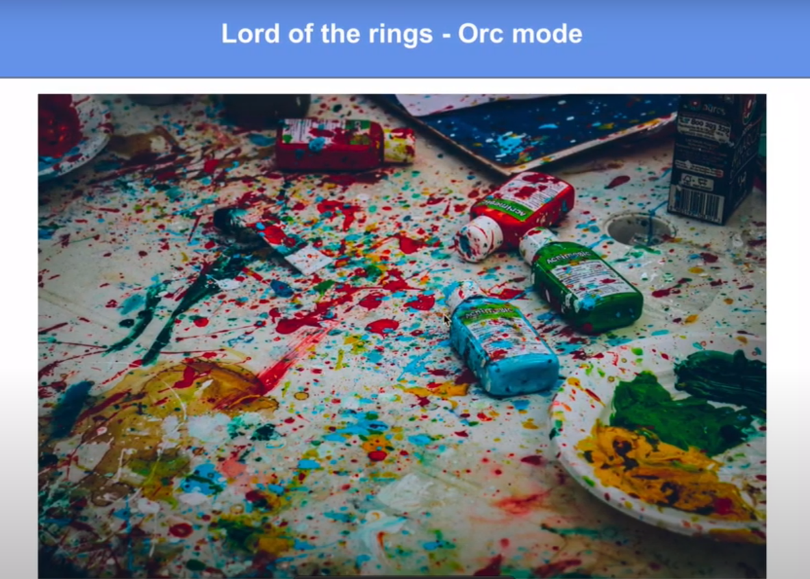
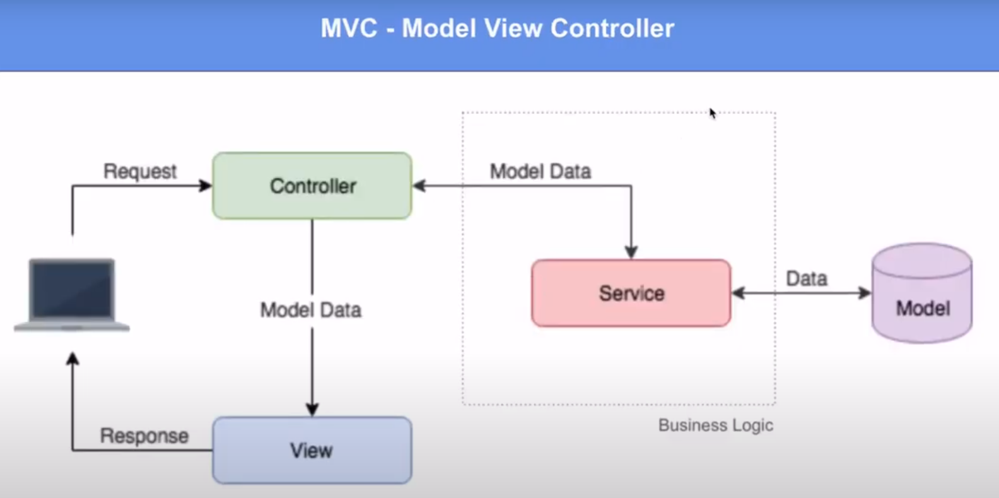
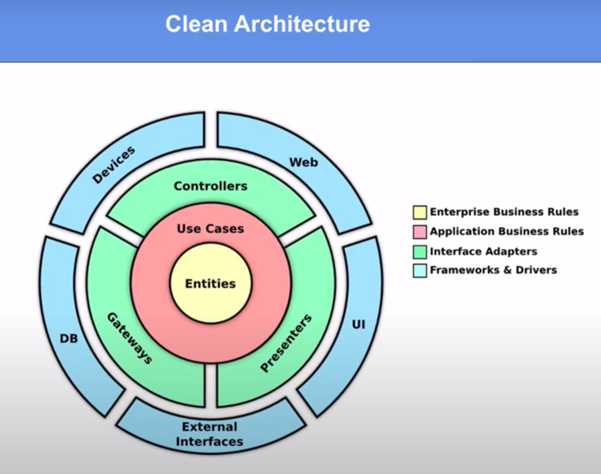

# Different microservice design patterns in Golang

[youtube](https://federicoleon.com/microservice-design-patterns-in-golang)
[github](https://github.com/federicoleon/golang-microservices)

- simple
- mvc
- clean architecture

## Orc mode

| Pros | Cons |
| ---- | ---- |
| Easy and quick for an MVP | No organization or structure whatsoever |
| That's it :-) | Impossible to scale |
| | Almost impossible to test |
| | One issue affects everything |

## Model View Controller

- Always start with domain
  - DTO data transfer object (struct)
  - DAO data access object (operations on DTO, e.g. create, save, get ...)

| Pros | Cons |
| ---- | ---- |
| Code well organized | If you don't have a set of strict rules about organization, everything goes to hell really fast |
| Each layer has well defined responsibilities | Increased complexity |
| Allows collaboration: multiple developers working on different layers | Business logic in services could get really complicated |
| Easy to maintain and scale | No clear usecases beyond controllers |
| "Easy" to test | |

## Clean Architecture

[link](https://blog.cleancoder.com/uncle-bob/2012/08/13/the-clean-architecture.html)

