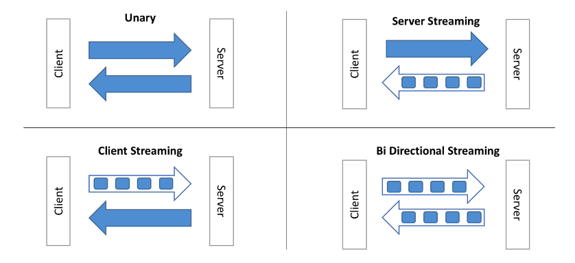
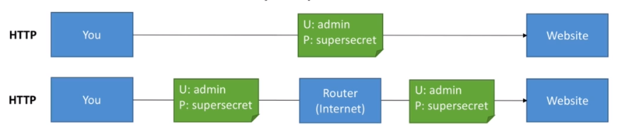
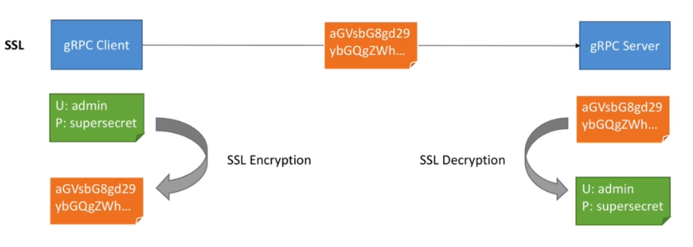
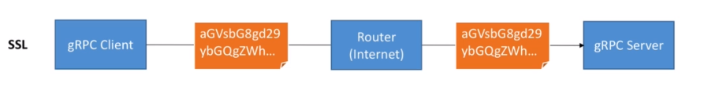
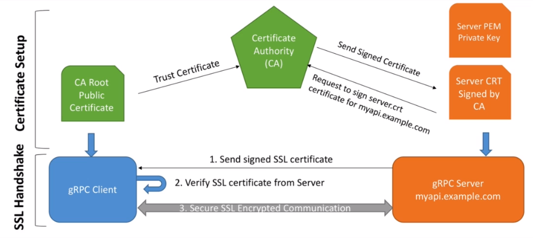

# Better than REST API! Build a fast scalable HTTP/2 API for a Golang micro service with gRPC, Protocol Buffers

[https://saxobank.udemy.com/course/grpc-golang/](https://saxobank.udemy.com/course/grpc-golang/)

## gRPC Internals Deep Dive

### Protocaol Bufers & Language Interoperability

- Protocol Buffers ar eused to define the:
  - Messages (data, Request and Response)
  - Service (Service name and RPC endpoints)
- We then generate code from it!

gRPC uses Protocol buffers for communications.

Let's measure the payload size vs JSON.

JSON: 55 bytes

```json
{
    "age": 35,
    "first_name": "Stephane",
    "last_name": "Maarek"
}
```

Protocol Buffers: 20 bytes

```proto
- message Person {
    int32 age = 1;
    string first_name = 2;
    string last_name = 3;
}
```

We save in Network Bandwidth.

- Parsing JSON is actually CPU intensive (because the format is human readable).
- Parsing Protocol Buffers (binary format) is less CPU intensive because it's closer to how a machine rpresents data.
- By using gRPC, the use of Protocol Buffers means faster and more efficient communication, friendly with mobile devices that have a slower CPU.

List of languages officially supported for code generation is on [https://grpc.io](https://grpc.io).

Main implementations:

- GRPC-JAVA: Pure omplementation of gRPC in Java.
- GRPC-GO: Pure omplementation of gRPC in Go.
- GRPC-C: Pure omplementation of gRPC in C. Underlyings rely on C bindings.
  - gRPC C++
  - gRPC Python
  - gRPC Ruby
  - gRPC Objective C
  - gRPC PHP
  - gRPC C#

Because the code can be generated for any language, it makes it super simple to create micro-services in any language that interact with each other.

Summary: Why Protocol Buffers?

- Easy to write message definition
- The definition of the API is independent from the implementation
- A huge amount of code can be generated, in any language, from a simple .proto file
- The payload is binary, therefore very efficient to send / receive on a network and serialize / de-serialize on a CPU
- Protocol Buffers defines rules to make an API evolve withou breaking existing clients, which is helpful for microservices

### HTTP/2

- gRPC leverages HTTP/2 as a backbone for communication
- Demo (HTTP/2 is much faster): [https://imagekit.io/demo/http2-vs-http1](https://imagekit.io/demo/http2-vs-http1)
- HTTP/2 is the newer standard for internet communications that address common pitfall of HTTP/1.1 on modern web pages
- Before we go into HTTP/2, let's look at some HTTP/1.1 request
  - HTTP/1.1 was released in 1997. It has worked for great many years!
  - HTTP/1.1 opens a TCP connection to a server at each request
  - It does not compress headers (which are plain text)
  - It only works with Request / Response mechanism (no server push)
  - HTTP was originally composed of two commands:
    - GET: to ask for content
    _ POST: to send content
  - Nowdays, a web page loads 80 assets on average
  - Headers are sent at every request and are PLAINTEXT (heavy size)
  - Each request opens a TCP connection
  - These inefficiencies add latency and increase network packet size
_ HTTP/2 was released in 2015. It has been battled tested for many years (and was before that tested by Google under the name SPDY)
- HTTP/2 supports multiplexing
  - The client & server can push messages in parallel over the same TCP connection
  - This greatly reduces latency
- HTTP/2 supports server push
  - Servers can push streams (multiple messages) for one request from the client
  - This saves roundtrips (latency)
- HTTP/2 supports header compression
  - Headers (text based) can now be compressed
  - These have much less impact on the packet size
  - Remember, the average HTTP request may have over 20 headers, due to cookies, content ache, and application headers
- HTTP/2 is binary
  - While HTTP/1.1 text makes it easy for debugging, it's not efficient over the network
  - Protocol Buffers is a binary protocol and makes it a great match for HTTP/2
- HTTP/2 is secure (TLS is non required but recommended by default)

HTTP/2 bottom line:

- Less chatter
- More efficient protocol (less bandwidth)
- Reduced latency
- Increased security
- And you get all these improvements out of the box by using the gRPC framework

### 4 Types of API in gRPC



- Unary is what a traditional API looks like (HTTP REST)
- HTTP/2 as we've seen, enables APIs to now have streaming capabilities
- The server an the client can push multiple messages as part of one request!
- In gRPC it's very easy to define these APIs as we'll see

### Scalability in gRPC

- gRPC servers are asynchronous by defult
- This means they do not block threads on request
- Therefore each gRPC server can serve millions of requests in parallel

- gRPC clients can be asynchronous or synchronous (blocking)
- The client decides which model works best for the performance needs
- gRPC clients can perform client side load balancing

As proof of scalability: Google has 10 billion gRPC requests being made per second internally

### Security in gRPC

- By default gRPC strongly advocates for you to use TLS (encryption over the wire) in your API
- This means that gRPC has security as a first class citizen
- Each language will provide an API to load gRPC with the required certificates and provide encryption capability out of the box
- Additionaly using Interceptors, we can also provide authentication

### gRPC vs REST

| gRPC | REST |
| ---- | ---- |
| Protocol Buffers - smaller, faster | JSON - text based, slower, bigger |
| HTTP/2 (lower latency) - from 2015 | HTTP/1.1 (higher latency) - from 1997 |
| Bidirectional & Async | Client => Server requests only |
| Stream Support | Request / Response support only |
| API oriented - "What" (no constraints - free design) | CRUD oriented (Create - Retrieve - Update - Delete / POST GET PUT DELETE) |
| Code generation through Protocol Buffers in any language - 1st class citizen | Code generation through OpenAPI / Swagger (add-on) - 2nd class citizen |
| RPC based - gRPC does the plumbing for us | HTTP verbs based - we have to write the plumbing or use a 3rd party library |

### Section Summary - Why Use gRPC

- Easy code definition in over 11 languages
- Uses a modern, low latency HTTP/2 transport mechanism
- TLS security is built in
- Support for streaming APIs for maximum performance
- gRPC is API oriented, instead of Resource Oriented like REST

## gRPC Project Overview and Setup

### Project Setup (Golang + VS Code + Protoc)

- Download the windows archive: [https://github.com/google/protobuf/releases](https://github.com/google/protobuf/releases)
  - Example: [https://github.com/google/protobuf/releases/download/v3.15.6/protoc-3.15.6-win64.zip](https://github.com/google/protobuf/releases/download/v3.15.6/protoc-3.15.6-win64.zip)
- Extract all to C:\proto3
- Your directory structure should now be
  - C:\proto3\bin
  - C:\proto3\include
- Finally, add C:\proto3\bin to your PATH

### Go Dependencies Setup

- Go gRPC from [https://github.com/grpc/grpc-go](https://github.com/grpc/grpc-go)
  - `go get -u google.golang.org/grpc`
- Go Protocol Buffers [https://github.com/golang/protobuf](https://github.com/golang/protobuf)
  - `go get -u github.com/golang/protobuf/protoc-gen-go`

  ```bash
  go get -u google.golang.org/grpc

  go get -u github.com/golang/protobuf/protoc-gen-go
  ```

### Code Generation Test

Create folder `greet/greetpb`

Inside the folder, create file `greet.proto`

```proto
syntax = "proto3";

package greet;
option go_package="greet/greetpb";

service GreetService{}
```

Run the following

```bash
protoc greet/greetpb/greet.proto --go_out=plugins=grpc:.
```

### gRPC Server Boilerplate Code

- Let's setup a gRPC Server with no service on it
- We'll see how to properly start & stop the Server oon a defined port
- The point is just to be done with "boilerplate code"

In the `greet` folder create a `greet_server` folder and there create a `server.go` file.

```go
package main

import (
  "fmt"
  "log"
  "net"
  "proeftuin/go-grpc-master-class/greet/greetpb"

  "google.golang.org/grpc"
)

type server struct{}

func main() {
  fmt.Println("Hello gRPC!")

  lis, err := net.Listen("tcp", "0.0.0.0:50051")
  if err != nil {
    log.Fatalf("Failed to listen: %v", err)
  }

  s := grpc.NewServer()
  greetpb.RegisterGreetServiceServer(s, &server{})

  if err := s.Serve(lis); err != nil {
    log.Fatalf("Failed to serve: %v", err)
  }
}
```

In the `greet` folder, initialize mod:

```bash
cd greet
go mod init
go mod tidy
```

This will create `go.mod` and `go.sum` files there.

Now run the server skeleton from the same `greet` folder:

```bash
go run greet_server/server.go
```

You should see the "Hello, gRPC!" text and then program will hang listening. Press `Ctrl+C` to exit.

### gRPC Client Boilerplate Code

- Let's setup a gRPC Client that connects to our  Server
- We'll see how to properly start & stop the Client
- The point is just to be done with "boilerplate code"

In the `greet` folder create a `greet_client` folder and there create a `client.go` file.

```go
import (
  "fmt"
  "log"
  "proeftuin/go-grpc-master-class/greet/greetpb"

  "google.golang.org/grpc"
)

func main() {
  fmt.Println("Hello I'm a client")
  cc, err := grpc.Dial("localhost:50051", grpc.WithInsecure())
  if err != nil {
    log.Fatalf("could not connect: %v", err)
  }
  defer cc.Close()

  c := greetpb.NewGreetServiceClient(cc)
  fmt.Printf("created client: %f", c)
}
```

In the `greet` folder, tidy mod:

```bash
cd greet
go mod tidy
```

Now run the client skeleton from the same `greet` folder:

```bash
go run greet_client/client.go
```

You should see the "Hello I'm a client!" text and the internals of the client struct.

## gRPC Unary

### What's an Unary API?

- Unary RPC calls are the basic Request / Response that everyone familiar with
- The client will send *one* message to the server and will receive *one* response from the server
- Unary RPC calls will be the most common for your APIs
  - Unary calls are very well suted when your data is small
  - Start with Unary when writing APIs and use streaming API if performance is an issue

- In gRPC Unary Calls are defined using Protocol Buffers
- For each RPC call we have to define a "Request" message and a "Response" message

### Greet API Definition

- Our message is `Greeting` and contains `first_name` and `last_name` string fields
- It will take a `GreetRequest` that contains a `Greeting`
- It will return a `GreetingResponse` that contains a `result` string

Update the `greet/greetpb/greet.proto` file as follows.

```proto
syntax = "proto3";

package greet;
option go_package="greet/greetpb";

message Greeting {
    string first_name = 1;
    string last_name = 2;
}

message GreetRequest {
    Greeting greeting = 1;
}

message GreetResponse {
    string result = 1;
}

service GreetService {
    // Unary
    rpc Greet(GreetRequest) returns (GreetResponse) {};
}
```

Re-generate the code from the directory above the `greet`.

```bash
protoc greet/greetpb/greet.proto --go_out=plugins=grpc:.
```

Explore the generated code in the `greet/greetpb/greet.pb.go` file.

### Unary API Server implementation

- We'll implement a Unary Greet RPC
- We'll hook our new GreetService to our Server
- We'll start our Server

We need to implement generated interface

```go
// GreetServiceServer is the server API for GreetService service.
type GreetServiceServer interface {
  // Unary
  Greet(context.Context, *GreetRequest) (*GreetResponse, error)
}
```

in our `server.go` which has:

```go
type server struct{}
```

```go
package main

import (
  "context"
  "fmt"
  "log"
  "net"
  "proeftuin/go-grpc-master-class/greet/greetpb"

  "google.golang.org/grpc"
)

type server struct{}

func (*server) Greet(ctx context.Context, req *greetpb.GreetRequest) (*greetpb.GreetResponse, error) {
  fmt.Printf("Greet function was invoked with %v\n", req)
  firstName := req.GetGreeting().GetFirstName()
  result := "Hello " + firstName
  res := &greetpb.GreetResponse{
    Result: result,
  }
  return res, nil
}

func main() {
  fmt.Println("Hello gRPC!")

  lis, err := net.Listen("tcp", "0.0.0.0:50051")
  if err != nil {
    log.Fatalf("Failed to listen: %v", err)
  }

  s := grpc.NewServer()
  greetpb.RegisterGreetServiceServer(s, &server{})

  if err := s.Serve(lis); err != nil {
    log.Fatalf("Failed to serve: %v", err)
  }
}
```

Now run the server from the `greet` folder. Press `Ctrl+C` to exit.

```bash
go run greet_server/server.go
```

### Unary API Client implementation

- We'll implement a client call for our Unary RPC
- We'll test it against our server that is running

Wee need to implement generated interface

```go
// GreetServiceClient is the client API for GreetService service.
type GreetServiceClient interface {
  // Unary
  Greet(ctx context.Context, in *GreetRequest, opts ...grpc.CallOption) (*GreetResponse, error)
}
```

in our `client.go`.

```go
package main

import (
  "context"
  "fmt"
  "log"
  "proeftuin/go-grpc-master-class/greet/greetpb"

  "google.golang.org/grpc"
)

func main() {
  fmt.Println("Hello I'm a client")
  cc, err := grpc.Dial("0.0.0.0:50051", grpc.WithInsecure())
  if err != nil {
    log.Fatalf("could not connect: %v", err)
  }
  defer cc.Close()

  c := greetpb.NewGreetServiceClient(cc)
  fmt.Printf("created client: %f", c)

  fmt.Println("Starting to do a Unary RPC...")
  req := &greetpb.GreetRequest{
    Greeting: &greetpb.Greeting{
      FirstName: "Stephane",
      LastName:  "Maarek",
    },
  }
  res, err := c.Greet(context.Background(), req)
  if err != nil {
    log.Fatalf("error while calling Greet RPC: %v", err)
  }
  log.Printf("Response from Greet: %v", res.Result)
}
```

Now run the server from the `greet` folder. Press `Ctrl+C` to exit.

```bash
go run greet_server/server.go
```

Now run the client from the `greet` folder.

```bash
go run greet_client/client.go
```

### Excersise: Calculator Service -- Sum API

In this excersise, your goal is to implement a Sum RPC Unary API in a Calculator Service.

- The function takes a Request message that has integers, and returns a Response that represents the sum of them.
- Remember to first implement the service definition in a proto file, alongside the RPC messages
- Implement the Server code first
- Test the server code by implementing the Client

Example: the client will send two numbers (2 and 40) and server will respond with 42.

#### Solution: Calculator Service -- Sum API

- Create folder `calculator/calculatorpb`.
- Inside the folder, create file `calculator.proto`.

```proto
syntax = "proto3";

package calculator;
option go_package="calculator/calculatorpb";

message SumRequest {
    int32 first_number = 1;
    int32 second_number = 2;
}

message SumResponse {
    int32 sum_result = 1;
}

service CalculatorService {
    // Unary
    rpc Sum(SumRequest) returns (SumResponse) {};
}
```

Generate the code from the folder above the `calculator` folder.

```bash
protoc calculator/calculatorpb/calculator.proto --go_out=plugins=grpc:.
```

- Create folder `calculator/calculator_server`.
- Inside the folder, create file `server.proto`.

```go
package main

import (
  "context"
  "fmt"
  "log"
  "net"
  "proeftuin/go-grpc-master-class/calculator/calculatorpb"

  "google.golang.org/grpc"
)

type server struct{}

func (*server) Sum(ctx context.Context, req *calculatorpb.SumRequest) (*calculatorpb.SumResponse, error) {
  fmt.Printf("Received Sum RPC: %v\n", req)
  firstNumber := req.FirstNumber
  secondNumber := req.SecondNumber
  sum := firstNumber + secondNumber
  res := &calculatorpb.SumResponse{
    SumResult: sum,
  }
  return res, nil
}

func main() {
  fmt.Println("Calculator Server")

  lis, err := net.Listen("tcp", "0.0.0.0:50051")
  if err != nil {
    log.Fatalf("Failed to listen: %v", err)
  }

  s := grpc.NewServer()
  calculatorpb.RegisterCalculatorServiceServer(s, &server{})

  if err := s.Serve(lis); err != nil {
    log.Fatalf("Failed to serve: %v", err)
  }
}
```

In the `calculator` folder, initialize mod:

```bash
cd calculator
go mod init
go mod tidy
```

This will create `go.mod` and `go.sum` files there.

- Create folder `calculator/calculator_client`.
- Inside the folder, create file `client.proto`.

```go
package main

import (
  "context"
  "fmt"
  "log"
  "proeftuin/go-grpc-master-class/calculator/calculatorpb"

  "google.golang.org/grpc"
)

func main() {
  fmt.Println("Hello I'm a client")
  cc, err := grpc.Dial("0.0.0.0:50051", grpc.WithInsecure())
  if err != nil {
    log.Fatalf("could not connect: %v", err)
  }
  defer cc.Close()

  c := calculatorpb.NewCalculatorServiceClient(cc)
  fmt.Printf("created client: %f", c)

  fmt.Println("Starting to do a Unary RPC...")
  req := &calculatorpb.SumRequest{
    FirstNumber:  2,
    SecondNumber: 40,
  }
  res, err := c.Sum(context.Background(), req)
  if err != nil {
    log.Fatalf("error while calling Sum RPC: %v", err)
  }
  log.Printf("Response from Sum: %v", res.SumResult)
}
```

In the `calculator` folder, tidy mod:

```bash
go mod tidy
```

Now run the server from the `calculator` folder. Press `Ctrl+C` to exit.

```bash
go run calculator_server/server.go
```

Now run the client from the `calculator` folder.

```bash
go run calculator_client/client.go
```

## gRPC Server Streaming

### What's a Server Streaming API?

- Server Streaming RPC API is a new kind API enabled thanks to HTTP/2
- The client will send *one* message to the server and will receive *many* responces from the server, possibly an infinite number
- Streaming Server is well suited for
  - When the server needs to send a lot of data (big data)
  - When the server needs to "PUSH" data to the client without having the client request for more (think live feed, chat, etc.)
- In gRPC Server Streaming Calls are defined using the keyword "stream"
- As for each RPC call we have to define a "Request" message and a "Response" message

### GreetManyTimes API Definition

- It will take *ONE* `GreetManuTimesRequest` that contains a `Greeting`
- It will return *MANY* `GreetManyTimesResponse` that contains a result string

Update `greet/greetpb/greet.proto` as follows.

```proto
syntax = "proto3";

package greet;
option go_package="greet/greetpb";

message Greeting {
    string first_name = 1;
    string last_name = 2;
}

message GreetRequest {
    Greeting greeting = 1;
}

message GreetResponse {
    string result = 1;
}

message GreetManyTimesRequest {
    Greeting greeting = 1;
}

message GreetManytimesResponse {
    string result = 1;
}

service GreetService {
    // Unary
    rpc Greet(GreetRequest) returns (GreetResponse) {};

    // Server Streaming
    rpc GreetManyTimes(GreetManyTimesRequest) returns (stream GreetManytimesResponse) {};
}
```

Generate the code from the folder above the `greet` folder.

```bash
protoc greet/greetpb/greet.proto --go_out=plugins=grpc:.
```

### Server Streaming API Server Implementation

Update `greet/greet_server/server.go` as follows.

```go
package main

import (
  "context"
  "fmt"
  "log"
  "net"
  "proeftuin/go-grpc-master-class/greet/greetpb"
  "strconv"
  "time"

  "google.golang.org/grpc"
)

type server struct{}

func (*server) Greet(ctx context.Context, req *greetpb.GreetRequest) (*greetpb.GreetResponse, error) {
  fmt.Printf("Greet function was invoked with %v\n", req)
  firstName := req.GetGreeting().GetFirstName()
  result := "Hello " + firstName
  res := &greetpb.GreetResponse{
    Result: result,
  }
  return res, nil
}

func (*server) GreetManyTimes(req *greetpb.GreetManyTimesRequest, stream greetpb.GreetService_GreetManyTimesServer) error {
  fmt.Printf("GreetManyTimes function was invoked with %v\n", req)
  firstName := req.GetGreeting().GetFirstName()
  for i := 0; i < 10; i++ {
    result := "Hello " + firstName + " number " + strconv.Itoa(i)
    res := &greetpb.GreetManytimesResponse{
      Result: result,
    }
    stream.Send(res)
    time.Sleep(1000 * time.Millisecond) // Not needed, just for demonstration.
  }
  return nil
}

func main() {
  fmt.Println("Hello gRPC!")

  lis, err := net.Listen("tcp", "0.0.0.0:50051")
  if err != nil {
    log.Fatalf("Failed to listen: %v", err)
  }

  s := grpc.NewServer()
  greetpb.RegisterGreetServiceServer(s, &server{})

  if err := s.Serve(lis); err != nil {
    log.Fatalf("Failed to serve: %v", err)
  }
}
```

Now run the server from the `greet` folder. Press `Ctrl+C` to exit.

```bash
go run greet_server/server.go
```

### Server Streaming API Client Implementation

- We'll implement a client call for our Sreaming Server RPC
- We'll test it against our server that is running

Update `greet/greet_client/client.go` as follows.

```go
package main

import (
  "context"
  "fmt"
  "io"
  "log"
  "proeftuin/go-grpc-master-class/greet/greetpb"

  "google.golang.org/grpc"
)

func main() {
  fmt.Println("Hello I'm a client")
  cc, err := grpc.Dial("0.0.0.0:50051", grpc.WithInsecure())
  if err != nil {
    log.Fatalf("could not connect: %v", err)
  }
  defer cc.Close()

  c := greetpb.NewGreetServiceClient(cc)
  fmt.Printf("created client: %f", c)

  doUnary(c)
  doServerStreaming(c)
}

func doUnary(c greetpb.GreetServiceClient) {
  fmt.Println("Starting to do a Unary RPC...")
  req := &greetpb.GreetRequest{
    Greeting: &greetpb.Greeting{
      FirstName: "Stephane",
      LastName:  "Maarek",
    },
  }
  res, err := c.Greet(context.Background(), req)
  if err != nil {
    log.Fatalf("error while calling Greet RPC: %v", err)
  }
  log.Printf("Response from Greet: %v", res.Result)
}

func doServerStreaming(c greetpb.GreetServiceClient) {
  fmt.Println("Starting to do a Server Streaming RPC...")

  req := &greetpb.GreetManyTimesRequest{
    Greeting: &greetpb.Greeting{
      FirstName: "Stephane",
      LastName:  "Maarek",
    },
  }

  resStream, err := c.GreetManyTimes(context.Background(), req)
  if err != nil {
    log.Fatalf("error while calling GreetManyTimes RPC: %v", err)
  }
  for {
    msg, err := resStream.Recv()
    if err == io.EOF {
      // we've reached the end of the stream
      break
    }
    if err != nil {
      log.Fatalf("error while reading stream: %v", err)
    }
    log.Printf("Response from GreetManyTimes: %v", msg.GetResult())
  }
}
```

Now run the server from the `greet` folder. Press `Ctrl+C` to exit.

```bash
go run greet_server/server.go
```

Now run the client from the `greet` folder.

```bash
go run greet_client/client.go
```

### Excersise: PrimeNumberDecomposition API

In this exercise, your goal is to implement a PrimeNumberDecomposition RPC Server Streaming API in a CalculatorService.

- The function takes a Request message that has one integer, and returns a stream of Responses that represent the prime number decomposition of that number (see below for the algorithm).
- Remember to first implement the service definition in a .proto file, alongside the RPC messages.
- Implement the Server code first.
- Test the server code by implementing the Client.

Example. The client will send one number (120) and the server will respond with a stream of (2,2,2,3,5), because 120=2*2*2*3*5.

Algorithm in pseudo code is below.

```c
k = 2
N = 210
while N > 1:
    if N % k == 0:   // if k evenly divides into N
        print k      // this is a factor
        N = N / k    // divide N by k so that we have the rest of the number left.
    else:
        k = k + 1
```

#### Solution: PrimeNumberDecomposition API

Update the `calculator/calculatorpb/calculator.proto` as follows.

```proto
syntax = "proto3";

package calculator;
option go_package="calculator/calculatorpb";

message SumRequest {
    int32 first_number = 1;
    int32 second_number = 2;
}

message SumResponse {
    int32 sum_result = 1;
}

message PrimeNumberDecompositionRequest {
    int64 number = 1;
}

message PrimeNumberDecompositionResponse {
    int64 prime_factor = 1;
}

service CalculatorService {
    // Unary
    rpc Sum(SumRequest) returns (SumResponse) {};
    // Server Streaming
    rpc PrimeNumberDecomposition(PrimeNumberDecompositionRequest) returns (stream PrimeNumberDecompositionResponse) {};
}
```

Generate the code from the folder above the `calculator` folder.

```bash
protoc calculator/calculatorpb/calculator.proto --go_out=plugins=grpc:.
```

Update the `calculator/calculator_server/server.go` as follows.

```go
package main

import (
  "context"
  "fmt"
  "log"
  "net"
  "proeftuin/go-grpc-master-class/calculator/calculatorpb"

  "google.golang.org/grpc"
)

type server struct{}

func (*server) Sum(ctx context.Context, req *calculatorpb.SumRequest) (*calculatorpb.SumResponse, error) {
  fmt.Printf("Received Sum RPC: %v\n", req)
  firstNumber := req.FirstNumber
  secondNumber := req.SecondNumber
  sum := firstNumber + secondNumber
  res := &calculatorpb.SumResponse{
    SumResult: sum,
  }
  return res, nil
}

func (*server) PrimeNumberDecomposition(req *calculatorpb.PrimeNumberDecompositionRequest, stream calculatorpb.CalculatorService_PrimeNumberDecompositionServer) error {
  fmt.Printf("Received PrimeNumberDecomposition RPC: %v\n", req)

  number := req.GetNumber()
  divisor := int64(2)

  for number > 1 {
    if number%divisor == 0 {
      stream.Send(&calculatorpb.PrimeNumberDecompositionResponse{
        PrimeFactor: divisor,
      })
      number = number / divisor
    } else {
      divisor++
      fmt.Printf("Divisor has increased to %v\n", divisor)
    }
  }
  return nil
}

func main() {
  fmt.Println("Calculator Server")

  lis, err := net.Listen("tcp", "0.0.0.0:50051")
  if err != nil {
    log.Fatalf("Failed to listen: %v", err)
  }

  s := grpc.NewServer()
  calculatorpb.RegisterCalculatorServiceServer(s, &server{})

  if err := s.Serve(lis); err != nil {
    log.Fatalf("Failed to serve: %v", err)
  }
}
```

Update the `calculator/calculator_client/client.go` as follows.

```go
package main

import (
  "context"
  "fmt"
  "io"
  "log"
  "proeftuin/go-grpc-master-class/calculator/calculatorpb"

  "google.golang.org/grpc"
)

func doUnary(c calculatorpb.CalculatorServiceClient) {
  fmt.Println("Starting to do a Sum Unary RPC...")
  req := &calculatorpb.SumRequest{
    FirstNumber:  2,
    SecondNumber: 40,
  }
  res, err := c.Sum(context.Background(), req)
  if err != nil {
    log.Fatalf("error while calling Sum RPC: %v", err)
  }
  log.Printf("Response from Sum: %v", res.SumResult)
}

func doServerStreaming(c calculatorpb.CalculatorServiceClient) {
  fmt.Println("Starting to do a PrimeDecomposition Server Streaming RPC...")
  req := &calculatorpb.PrimeNumberDecompositionRequest{
    Number: 12390392840,
  }
  stream, err := c.PrimeNumberDecomposition(context.Background(), req)
  if err != nil {
    log.Fatalf("error while calling PrimeDecomposition RPC: %v", err)
  }
  for {
    res, err := stream.Recv()
    if err == io.EOF {
      break
    }
    if err != nil {
      log.Fatalf("Something happened: %v", err)
    }
    fmt.Println(res.GetPrimeFactor())
  }
}

func main() {
  fmt.Println("Hello I'm a client")
  cc, err := grpc.Dial("0.0.0.0:50051", grpc.WithInsecure())
  if err != nil {
    log.Fatalf("could not connect: %v", err)
  }
  defer cc.Close()

  c := calculatorpb.NewCalculatorServiceClient(cc)
  fmt.Printf("created client: %f", c)

  doUnary(c)
  doServerStreaming(c)
}
```

Now run the server from the `calculator` folder. Press `Ctrl+C` to exit.

```bash
go run calculator_server/server.go
```

Now run the client from the `calculator` folder.

```bash
go run calculator_client/client.go
```

## gRPC Client Streaming

### What's a Client Streaming API?

- Client Streaming RPC API is a new kind API enabled thanks to HTTP/2
- The client will send *many* messages to the server and will receive *one* message from the server (at any time)
- Streaming Client is well suited for
  - When the client needs to send a lot of data (big data)
  - When the server processing is expensive and should happen as the client sends data
  - When the client needs to "PUSH" data to the server without really expecting a response
- In gRPC Client Streaming Calls are defined using the keyword ""stream"
- As for each RPC call we have to define a "Request" message and a "Response" message

### LongGreet API Definition

- It will take *MANY* `LongGreetRequest` that contains a `Greeting`
- It will return *ONE* `LongGreetResponse` that contains a result string

Update `greet/greetpb/greet.proto` as follows.

```proto
syntax = "proto3";

package greet;
option go_package="greet/greetpb";

message Greeting {
    string first_name = 1;
    string last_name = 2;
}

message GreetRequest {
    Greeting greeting = 1;
}

message GreetResponse {
    string result = 1;
}

message GreetManyTimesRequest {
    Greeting greeting = 1;
}

message GreetManytimesResponse {
    string result = 1;
}

message LongGreetRequest {
    Greeting greeting = 1;
}

message LongGreetResponse {
    string result = 1;
}

service GreetService {
    // Unary
    rpc Greet(GreetRequest) returns (GreetResponse) {};

    // Server Streaming
    rpc GreetManyTimes(GreetManyTimesRequest) returns (stream GreetManytimesResponse) {};

    // Client Streaming
    rpc LongGreet(stream LongGreetRequest) returns (LongGreetResponse) {};
}
```

Generate the code from the folder above the `greet` folder.

```bash
protoc greet/greetpb/greet.proto --go_out=plugins=grpc:.
```

### Client Streaming API Server Implementation

- We'll implement a Streaming Client LongGreet RPC
- As we'll see the API implementation will be a bit more difficult
- Note: the server will only respond to the client once the client is done sending requests (but in theory the server can respond whenever it wants)

Update `greet/greet_server/server.go` as follows.

```go
package main

import (
  "context"
  "fmt"
  "io"
  "log"
  "net"
  "proeftuin/go-grpc-master-class/greet/greetpb"
  "strconv"
  "time"

  "google.golang.org/grpc"
)

type server struct{}

func (*server) Greet(ctx context.Context, req *greetpb.GreetRequest) (*greetpb.GreetResponse, error) {
  fmt.Printf("Greet function was invoked with %v\n", req)
  firstName := req.GetGreeting().GetFirstName()
  result := "Hello " + firstName
  res := &greetpb.GreetResponse{
    Result: result,
  }
  return res, nil
}

func (*server) GreetManyTimes(req *greetpb.GreetManyTimesRequest, stream greetpb.GreetService_GreetManyTimesServer) error {
  fmt.Printf("GreetManyTimes function was invoked with %v\n", req)
  firstName := req.GetGreeting().GetFirstName()
  for i := 0; i < 10; i++ {
    result := "Hello " + firstName + " number " + strconv.Itoa(i)
    res := &greetpb.GreetManytimesResponse{
      Result: result,
    }
    stream.Send(res)
    time.Sleep(1000 * time.Millisecond) // Not needed, just for demonstration.
  }
  return nil
}

func (*server) LongGreet(stream greetpb.GreetService_LongGreetServer) error {
  fmt.Printf("LongGreet function was invoked with a streaming request\n")
  result := ""
  for {
    req, err := stream.Recv()
    if err == io.EOF {
      // we have finished reading the client stream
      return stream.SendAndClose(&greetpb.LongGreetResponse{
        Result: result,
      })
    }
    if err != nil {
      log.Fatalf("Error while reading client stream: %v", err)
    }

    firstName := req.GetGreeting().GetFirstName()
    result += "Hello " + firstName + "! "
  }
}

func main() {
  fmt.Println("Hello gRPC!")

  lis, err := net.Listen("tcp", "0.0.0.0:50051")
  if err != nil {
    log.Fatalf("Failed to listen: %v", err)
  }

  s := grpc.NewServer()
  greetpb.RegisterGreetServiceServer(s, &server{})

  if err := s.Serve(lis); err != nil {
    log.Fatalf("Failed to serve: %v", err)
  }
}
```

Now run the server from the `greet` folder. Press `Ctrl+C` to exit.

```bash
go run greet_server/server.go
```

### Client Streaming API Client Implementation

- We'll implement a client call for our Streaming Client RPC
- We'll test it against our server that is running

Update `greet/greet_client/client.go` as follows.

```go
package main

import (
  "context"
  "fmt"
  "io"
  "log"
  "proeftuin/go-grpc-master-class/greet/greetpb"
  "time"

  "google.golang.org/grpc"
)

func main() {
  fmt.Println("Hello I'm a client")
  cc, err := grpc.Dial("0.0.0.0:50051", grpc.WithInsecure())
  if err != nil {
    log.Fatalf("could not connect: %v", err)
  }
  defer cc.Close()

  c := greetpb.NewGreetServiceClient(cc)
  fmt.Printf("created client: %f", c)

  doUnary(c)
  doServerStreaming(c)
  doClientStreaming(c)
}

func doUnary(c greetpb.GreetServiceClient) {
  fmt.Println("Starting to do a Unary RPC...")
  req := &greetpb.GreetRequest{
    Greeting: &greetpb.Greeting{
      FirstName: "Stephane",
      LastName:  "Maarek",
    },
  }
  res, err := c.Greet(context.Background(), req)
  if err != nil {
    log.Fatalf("error while calling Greet RPC: %v\n", err)
  }
  log.Printf("Response from Greet: %v\n", res.Result)
}

func doServerStreaming(c greetpb.GreetServiceClient) {
  fmt.Println("Starting to do a Server Streaming RPC...")

  req := &greetpb.GreetManyTimesRequest{
    Greeting: &greetpb.Greeting{
      FirstName: "Stephane",
      LastName:  "Maarek",
    },
  }

  resStream, err := c.GreetManyTimes(context.Background(), req)
  if err != nil {
    log.Fatalf("error while calling GreetManyTimes RPC: %v\n", err)
  }
  for {
    msg, err := resStream.Recv()
    if err == io.EOF {
      // we've reached the end of the stream
      break
    }
    if err != nil {
      log.Fatalf("error while reading stream: %v\n", err)
    }
    log.Printf("Response from GreetManyTimes: %v\n", msg.GetResult())
  }
}

func doClientStreaming(c greetpb.GreetServiceClient) {
  fmt.Println("Starting to do a Client Streaming RPC...")

  requests := []*greetpb.LongGreetRequest{
    {
      Greeting: &greetpb.Greeting{FirstName: "Stephane"},
    },
    {
      Greeting: &greetpb.Greeting{FirstName: "John"},
    },
    {
      Greeting: &greetpb.Greeting{FirstName: "Lucy"},
    },
    {
      Greeting: &greetpb.Greeting{FirstName: "Mark"},
    },
    {
      Greeting: &greetpb.Greeting{FirstName: "Piper"},
    },
  }

  stream, err := c.LongGreet(context.Background())
  if err != nil {
    log.Fatalf("error while calling LongGreet: %v\n", err)
  }

  // we iterate over our slice and send each message individually
  for _, req := range requests {
    fmt.Printf("Sending req: %v\n", req)
    stream.Send(req)
    time.Sleep(1000 * time.Millisecond)
  }

  res, err := stream.CloseAndRecv()
  if err != nil {
    log.Fatalf("error while receiving response from LongGreet: %v\n", err)
  }
  fmt.Printf("LongGreet Response: %v\n", res)
}
```

Now run the server from the `greet` folder. Press `Ctrl+C` to exit.

```bash
go run greet_server/server.go
```

Now run the client from the `greet` folder.

```bash
go run greet_client/client.go
```

### Excersise: ComputeAverage API

In this exercise, your goal is to implement a ComputeAverage RPC Client Streaming API in a CalculatorService.

- The function takes a stream of Request message that has one integer, and returns a Response with a double that represents the computed average
- Remember to first implement the service definition in a .proto file, alongside the RPC messages
- Implement the Server code first
- Test the server code by implementing the Client

Example: the client will send a stream of number (1,2,3,4) and the server will respond with (2.5), because (1+2+3+4)/4 = 2.5.

#### Solution: ComputeAverage API

Update the `calculator/calculatorpb/calculator.proto` as follows.

```proto
syntax = "proto3";

package calculator;
option go_package="calculator/calculatorpb";

message SumRequest {
    int32 first_number = 1;
    int32 second_number = 2;
}

message SumResponse {
    int32 sum_result = 1;
}

message PrimeNumberDecompositionRequest {
    int64 number = 1;
}

message PrimeNumberDecompositionResponse {
    int64 prime_factor = 1;
}

message ComputeAverageRequest {
    int32 number = 1;
}

message ComputeAverageResponse {
    double average = 1;
}

service CalculatorService {
    // Unary
    rpc Sum(SumRequest) returns (SumResponse) {};
    // Server Streaming
    rpc PrimeNumberDecomposition(PrimeNumberDecompositionRequest) returns (stream PrimeNumberDecompositionResponse) {};
    // Client Streaming
    rpc ComputeAverage(stream ComputeAverageRequest) returns (ComputeAverageResponse) {};
}
```

Generate the code from the folder above the `calculator` folder.

```bash
protoc calculator/calculatorpb/calculator.proto --go_out=plugins=grpc:.
```

Update the `calculator/calculator_server/server.go` as follows.

```go
package main

import (
  "context"
  "fmt"
  "io"
  "log"
  "net"
  "proeftuin/go-grpc-master-class/calculator/calculatorpb"

  "google.golang.org/grpc"
)

type server struct{}

func (*server) Sum(ctx context.Context, req *calculatorpb.SumRequest) (*calculatorpb.SumResponse, error) {
  fmt.Printf("Received Sum RPC: %v\n", req)
  firstNumber := req.FirstNumber
  secondNumber := req.SecondNumber
  sum := firstNumber + secondNumber
  res := &calculatorpb.SumResponse{
    SumResult: sum,
  }
  return res, nil
}

func (*server) PrimeNumberDecomposition(req *calculatorpb.PrimeNumberDecompositionRequest, stream calculatorpb.CalculatorService_PrimeNumberDecompositionServer) error {
  fmt.Printf("Received PrimeNumberDecomposition RPC: %v\n", req)

  number := req.GetNumber()
  divisor := int64(2)

  for number > 1 {
    if number%divisor == 0 {
      stream.Send(&calculatorpb.PrimeNumberDecompositionResponse{
        PrimeFactor: divisor,
      })
      number = number / divisor
    } else {
      divisor++
      // fmt.Printf("Divisor has increased to %v\n", divisor)
    }
  }
  return nil
}

func (*server) ComputeAverage(stream calculatorpb.CalculatorService_ComputeAverageServer) error {
  fmt.Printf("Received ComputeAverage RPC\n")

  sum := int32(0)
  count := 0

  for {
    req, err := stream.Recv()
    if err == io.EOF {
      average := float64(sum) / float64(count)
      return stream.SendAndClose(&calculatorpb.ComputeAverageResponse{
        Average: average,
      })
    }
    if err != nil {
      log.Fatalf("Error while reading client stream: %v\n", err)
    }
    sum += req.GetNumber()
    count++
  }
}

func main() {
  fmt.Println("Calculator Server")

  lis, err := net.Listen("tcp", "0.0.0.0:50051")
  if err != nil {
    log.Fatalf("Failed to listen: %v", err)
  }

  s := grpc.NewServer()
  calculatorpb.RegisterCalculatorServiceServer(s, &server{})

  if err := s.Serve(lis); err != nil {
    log.Fatalf("Failed to serve: %v", err)
  }
}
```

Update the `calculator/calculator_client/client.go` as follows.

```go
package main

import (
  "context"
  "fmt"
  "io"
  "log"
  "proeftuin/go-grpc-master-class/calculator/calculatorpb"

  "google.golang.org/grpc"
)

func doUnary(c calculatorpb.CalculatorServiceClient) {
  fmt.Println("Starting to do a Sum Unary RPC...")
  req := &calculatorpb.SumRequest{
    FirstNumber:  2,
    SecondNumber: 40,
  }
  res, err := c.Sum(context.Background(), req)
  if err != nil {
    log.Fatalf("error while calling Sum RPC: %v\n", err)
  }
  log.Printf("Response from Sum: %v\n", res.SumResult)
}

func doServerStreaming(c calculatorpb.CalculatorServiceClient) {
  fmt.Println("Starting to do a PrimeDecomposition Server Streaming RPC...")
  req := &calculatorpb.PrimeNumberDecompositionRequest{
    Number: 12390392840,
  }
  stream, err := c.PrimeNumberDecomposition(context.Background(), req)
  if err != nil {
    log.Fatalf("error while calling PrimeDecomposition RPC: %v]\n", err)
  }
  for {
    res, err := stream.Recv()
    if err == io.EOF {
      break
    }
    if err != nil {
      log.Fatalf("Something happened: %v\n", err)
    }
    fmt.Println(res.GetPrimeFactor())
  }
}

func doClientStreaming(c calculatorpb.CalculatorServiceClient) {
  fmt.Println("Starting to do a ComputeAverage Client Streaming RPC...")

  stream, err := c.ComputeAverage(context.Background())
  if err != nil {
    log.Fatalf("Error while opening stream: %v\n", err)
  }

  numbers := []int32{3, 5, 9, 54, 23}

  for _, number := range numbers {
    fmt.Printf("Sending number: %v\n", number)
    stream.Send(&calculatorpb.ComputeAverageRequest{
      Number: number,
    })
  }

  res, err := stream.CloseAndRecv()
  if err != nil {
    log.Fatalf("Error while receiving response: %v\n", err)
  }

  fmt.Printf("The Average is: %v\n", res.GetAverage())
}

func main() {
  fmt.Println("Hello I'm a client")
  cc, err := grpc.Dial("0.0.0.0:50051", grpc.WithInsecure())
  if err != nil {
    log.Fatalf("could not connect: %v\n", err)
  }
  defer cc.Close()

  c := calculatorpb.NewCalculatorServiceClient(cc)
  fmt.Printf("created client: %f\n", c)

  doUnary(c)
  doServerStreaming(c)
  doClientStreaming(c)
}
```

Now run the server from the `calculator` folder. Press `Ctrl+C` to exit.

```bash
go run calculator_server/server.go
```

Now run the client from the `calculator` folder.

```bash
go run calculator_client/client.go
```

## gRPC Bi-Directional Streaming

### What's a Bi-Directional Streaming API?

- Bi-Directional Streaming RPC API are a new kind API enabled thanks to HTTP/2
- The client will send *many* messages to the server and will receive *many* responses from the server
- The number of requests and responses _does not have to match_
- Bi-Directional Streaming RPC is well suited for
  - When the client and the server need to send a lot of dta synchronously
  - "Chat" protocol
  - Long running connection
- In gRPC Bi-Directional Streaming API are defined using the keyword "stream", *twice*
- as for each RPC call we have to define a "Request" message and a "Response" message

### GreetEveryone API Definition

- It will take *MANY* `GreetEveryoneRequest` that contains a `Greeting`
- It will return *MANY* `GreetEveryoneResponse` that contains a result string

Update `greet/greetpb/greet.proto` as follows.

```proto
syntax = "proto3";

package greet;
option go_package="greet/greetpb";

message Greeting {
    string first_name = 1;
    string last_name = 2;
}

message GreetRequest {
    Greeting greeting = 1;
}

message GreetResponse {
    string result = 1;
}

message GreetManyTimesRequest {
    Greeting greeting = 1;
}

message GreetManytimesResponse {
    string result = 1;
}

message LongGreetRequest {
    Greeting greeting = 1;
}

message LongGreetResponse {
    string result = 1;
}

message GreetEveryoneRequest {
    Greeting greeting = 1;
}

message GreetEveryoneResponse {
    string result = 1;
}

service GreetService {
    // Unary
    rpc Greet(GreetRequest) returns (GreetResponse) {};

    // Server Streaming
    rpc GreetManyTimes(GreetManyTimesRequest) returns (stream GreetManytimesResponse) {};

    // Client Streaming
    rpc LongGreet(stream LongGreetRequest) returns (LongGreetResponse) {};

    // Bi-Directional Streaming
    rpc GreetEveryone(stream GreetEveryoneRequest) returns (stream GreetEveryoneResponse) {};
}
```

Generate the code from the folder above the `greet` folder.

```bash
protoc greet/greetpb/greet.proto --go_out=plugins=grpc:.
```

### By-Directional Streaming API Server Implementation

- We'll implement a Bi-Directional Streaming `GreetEveryone` RPC
- Note: although we will respond to every message in this example, it is not necessary to do so, and the server is free to choose how many responses to send for each client message

Update `greet/greet_server/server.go` as follows.

```go
package main

import (
  "context"
  "fmt"
  "io"
  "log"
  "net"
  "proeftuin/go-grpc-master-class/greet/greetpb"
  "strconv"
  "time"

  "google.golang.org/grpc"
)

type server struct{}

func (*server) Greet(ctx context.Context, req *greetpb.GreetRequest) (*greetpb.GreetResponse, error) {
  fmt.Printf("Greet function was invoked with %v\n", req)
  firstName := req.GetGreeting().GetFirstName()
  result := "Hello " + firstName
  res := &greetpb.GreetResponse{
    Result: result,
  }
  return res, nil
}

func (*server) GreetManyTimes(req *greetpb.GreetManyTimesRequest, stream greetpb.GreetService_GreetManyTimesServer) error {
  fmt.Printf("GreetManyTimes function was invoked with %v\n", req)
  firstName := req.GetGreeting().GetFirstName()
  for i := 0; i < 10; i++ {
    result := "Hello " + firstName + " number " + strconv.Itoa(i)
    res := &greetpb.GreetManytimesResponse{
      Result: result,
    }
    stream.Send(res)
    time.Sleep(1000 * time.Millisecond) // Not needed, just for demonstration.
  }
  return nil
}

func (*server) LongGreet(stream greetpb.GreetService_LongGreetServer) error {
  fmt.Printf("LongGreet function was invoked with a streaming request\n")
  result := ""
  for {
    req, err := stream.Recv()
    if err == io.EOF {
      // we have finished reading the client stream
      return stream.SendAndClose(&greetpb.LongGreetResponse{
        Result: result,
      })
    }
    if err != nil {
      log.Fatalf("Error while reading client stream: %v\n", err)
    }

    firstName := req.GetGreeting().GetFirstName()
    result += "Hello " + firstName + "! "
  }
}

func (*server) GreetEveryone(stream greetpb.GreetService_GreetEveryoneServer) error {
  fmt.Printf("GreetEveryone function was invoked with a streaming request\n")

  for {
    req, err := stream.Recv()
    if err == io.EOF {
      return nil
    }
    if err != nil {
      log.Fatalf("Error while reading client stream: %v\n", err)
      return err
    }
    firstName := req.GetGreeting().GetFirstName()
    result := "Hello " + firstName + "! "

    sendErr := stream.Send(&greetpb.GreetEveryoneResponse{
      Result: result,
    })
    if sendErr != nil {
      log.Fatalf("Error while sending data to client: %v\n", sendErr)
      return sendErr
    }
  }
}

func main() {
  fmt.Println("Hello gRPC!")

  lis, err := net.Listen("tcp", "0.0.0.0:50051")
  if err != nil {
    log.Fatalf("Failed to listen: %v\n", err)
  }

  s := grpc.NewServer()
  greetpb.RegisterGreetServiceServer(s, &server{})

  if err := s.Serve(lis); err != nil {
    log.Fatalf("Failed to serve: %v\n", err)
  }
}
```

Now run the server from the `greet` folder. Press `Ctrl+C` to exit.

```bash
go run greet_server/server.go
```

### By-Directional Streaming API Client Implementation

- We'll implement a client call for our Bi-Directional Streaming RPC
- We'll test it against our server that is running

Update `greet/greet_client/client.go` as follows.

```go
package main

import (
  "context"
  "fmt"
  "io"
  "log"
  "proeftuin/go-grpc-master-class/greet/greetpb"
  "time"

  "google.golang.org/grpc"
)

func main() {
  fmt.Println("Hello I'm a client")
  cc, err := grpc.Dial("0.0.0.0:50051", grpc.WithInsecure())
  if err != nil {
    log.Fatalf("could not connect: %v", err)
  }
  defer cc.Close()

  c := greetpb.NewGreetServiceClient(cc)
  fmt.Printf("created client: %f", c)

  doUnary(c)
  doServerStreaming(c)
  doClientStreaming(c)
  doBiDirectionalStreaming(c)
}

func doUnary(c greetpb.GreetServiceClient) {
  fmt.Println("Starting to do a Unary RPC...")
  req := &greetpb.GreetRequest{
    Greeting: &greetpb.Greeting{
      FirstName: "Stephane",
      LastName:  "Maarek",
    },
  }
  res, err := c.Greet(context.Background(), req)
  if err != nil {
    log.Fatalf("error while calling Greet RPC: %v\n", err)
  }
  log.Printf("Response from Greet: %v\n", res.Result)
}

func doServerStreaming(c greetpb.GreetServiceClient) {
  fmt.Println("Starting to do a Server Streaming RPC...")

  req := &greetpb.GreetManyTimesRequest{
    Greeting: &greetpb.Greeting{
      FirstName: "Stephane",
      LastName:  "Maarek",
    },
  }

  resStream, err := c.GreetManyTimes(context.Background(), req)
  if err != nil {
    log.Fatalf("error while calling GreetManyTimes RPC: %v\n", err)
  }
  for {
    msg, err := resStream.Recv()
    if err == io.EOF {
      // we've reached the end of the stream
      break
    }
    if err != nil {
      log.Fatalf("error while reading stream: %v\n", err)
    }
    log.Printf("Response from GreetManyTimes: %v\n", msg.GetResult())
  }
}

func doClientStreaming(c greetpb.GreetServiceClient) {
  fmt.Println("Starting to do a Client Streaming RPC...")

  requests := []*greetpb.LongGreetRequest{
    {
      Greeting: &greetpb.Greeting{FirstName: "Stephane"},
    },
    {
      Greeting: &greetpb.Greeting{FirstName: "John"},
    },
    {
      Greeting: &greetpb.Greeting{FirstName: "Lucy"},
    },
    {
      Greeting: &greetpb.Greeting{FirstName: "Mark"},
    },
    {
      Greeting: &greetpb.Greeting{FirstName: "Piper"},
    },
  }

  stream, err := c.LongGreet(context.Background())
  if err != nil {
    log.Fatalf("error while calling LongGreet: %v\n", err)
  }

  // we iterate over our slice and send each message individually
  for _, req := range requests {
    fmt.Printf("Sending req: %v\n", req)
    stream.Send(req)
    time.Sleep(1000 * time.Millisecond)
  }

  res, err := stream.CloseAndRecv()
  if err != nil {
    log.Fatalf("error while receiving response from LongGreet: %v\n", err)
  }
  fmt.Printf("LongGreet Response: %v\n", res)
}

func doBiDirectionalStreaming(c greetpb.GreetServiceClient) {
  fmt.Println("Starting to do a Bi-Directional Streaming RPC...")

  // we create a stream by invoking the client
  stream, err := c.GreetEveryone(context.Background())
  if err != nil {
    log.Fatalf("Error while creating stream: %v\n", err)
    return
  }

  requests := []*greetpb.GreetEveryoneRequest{
    {
      Greeting: &greetpb.Greeting{FirstName: "Stephane"},
    },
    {
      Greeting: &greetpb.Greeting{FirstName: "John"},
    },
    {
      Greeting: &greetpb.Greeting{FirstName: "Lucy"},
    },
    {
      Greeting: &greetpb.Greeting{FirstName: "Mark"},
    },
    {
      Greeting: &greetpb.Greeting{FirstName: "Piper"},
    },
  }

  waitc := make(chan struct{})
  // we send a bunch of messages to the client (go routine)
  go func() {
    // function to send a bunch of messages
    for _, req := range requests {
      fmt.Printf("Sending message: %v\n", req)
      stream.Send(req)
      time.Sleep(1000 * time.Millisecond)
    }
    stream.CloseSend()
  }()
  // we receive a bunch of messages from the client (go routine)
  go func() {
    // function to receive a bunch of messages
    for {
      res, err := stream.Recv()
      if err == io.EOF {
        break
      }
      if err != nil {
        log.Fatalf("Error while receiving: %v\n", err)
        break
      }
      fmt.Printf("Received: %v\n", res.GetResult())
    }
    close(waitc)
  }()

  // block until everything is done
  <-waitc
}
```

Now run the server from the `greet` folder. Press `Ctrl+C` to exit.

```bash
go run greet_server/server.go
```

Now run the client from the `greet` folder.

```bash
go run greet_client/client.go
```

### Excersise: FindMaximum API

In this exercise, your goal is to implement a FindMaximum RPC Bi-Directional Streaming API in a CalculatorService.

- The function takes a stream of Request message that has one integer, and returns a stream of Responses that represent the current maximum between all these integers
- Remember to first implement the service definition in a .proto file, alongside the RPC messages
- Implement the Server code first
- Test the server code by implementing the Client

Example: the client will send a stream of number (1,5,3,6,2,20) and the server will respond with a stream of (1,5,6,20).

#### Solution: FindMaximum API

Update the `calculator/calculatorpb/calculator.proto` as follows.

```proto
syntax = "proto3";

package calculator;
option go_package="calculator/calculatorpb";

message SumRequest {
    int32 first_number = 1;
    int32 second_number = 2;
}

message SumResponse {
    int32 sum_result = 1;
}

message PrimeNumberDecompositionRequest {
    int64 number = 1;
}

message PrimeNumberDecompositionResponse {
    int64 prime_factor = 1;
}

message ComputeAverageRequest {
    int32 number = 1;
}

message ComputeAverageResponse {
    double average = 1;
}

message FindMaximumRequest {
    int32 number = 1;
}

message FindMaximumResponse {
    int32 maximum = 1;
}

service CalculatorService {
    // Unary
    rpc Sum(SumRequest) returns (SumResponse) {};
    // Server Streaming
    rpc PrimeNumberDecomposition(PrimeNumberDecompositionRequest) returns (stream PrimeNumberDecompositionResponse) {};
    // Client Streaming
    rpc ComputeAverage(stream ComputeAverageRequest) returns (ComputeAverageResponse) {};
    // Bi-Directional Streaming
    rpc FindMaximum(stream FindMaximumRequest) returns (stream FindMaximumResponse) {};
}
```

Generate the code from the folder above the `calculator` folder.

```bash
protoc calculator/calculatorpb/calculator.proto --go_out=plugins=grpc:.
```

Update the `calculator/calculator_server/server.go` as follows.

```go
package main

import (
  "context"
  "fmt"
  "io"
  "log"
  "net"
  "proeftuin/go-grpc-master-class/calculator/calculatorpb"

  "google.golang.org/grpc"
)

type server struct{}

func (*server) Sum(ctx context.Context, req *calculatorpb.SumRequest) (*calculatorpb.SumResponse, error) {
  fmt.Printf("Received Sum RPC: %v\n", req)
  firstNumber := req.FirstNumber
  secondNumber := req.SecondNumber
  sum := firstNumber + secondNumber
  res := &calculatorpb.SumResponse{
    SumResult: sum,
  }
  return res, nil
}

func (*server) PrimeNumberDecomposition(req *calculatorpb.PrimeNumberDecompositionRequest, stream calculatorpb.CalculatorService_PrimeNumberDecompositionServer) error {
  fmt.Printf("Received PrimeNumberDecomposition RPC: %v\n", req)

  number := req.GetNumber()
  divisor := int64(2)

  for number > 1 {
    if number%divisor == 0 {
      stream.Send(&calculatorpb.PrimeNumberDecompositionResponse{
        PrimeFactor: divisor,
      })
      number = number / divisor
    } else {
      divisor++
      // fmt.Printf("Divisor has increased to %v\n", divisor)
    }
  }
  return nil
}

func (*server) ComputeAverage(stream calculatorpb.CalculatorService_ComputeAverageServer) error {
  fmt.Printf("Received ComputeAverage RPC\n")

  sum := int32(0)
  count := 0

  for {
    req, err := stream.Recv()
    if err == io.EOF {
      average := float64(sum) / float64(count)
      return stream.SendAndClose(&calculatorpb.ComputeAverageResponse{
        Average: average,
      })
    }
    if err != nil {
      log.Fatalf("Error while reading client stream: %v\n", err)
    }
    sum += req.GetNumber()
    count++
  }
}

func (*server) FindMaximum(stream calculatorpb.CalculatorService_FindMaximumServer) error {
  fmt.Println("Received FindMaximum RPC")
  maximum := int32(0)

  for {
    req, err := stream.Recv()
    if err == io.EOF {
      return nil
    }
    if err != nil {
      log.Fatalf("Error while reading client stream: %v\n", err)
      return err
    }
    number := req.GetNumber()
    if number > maximum {
      maximum = number
      sendErr := stream.Send(&calculatorpb.FindMaximumResponse{
        Maximum: maximum,
      })
      if sendErr != nil {
        log.Fatalf("Error while sending data to client: %v\n", sendErr)
        return sendErr
      }
    }
  }
}

func main() {
  fmt.Println("Calculator Server")

  lis, err := net.Listen("tcp", "0.0.0.0:50051")
  if err != nil {
    log.Fatalf("Failed to listen: %v", err)
  }

  s := grpc.NewServer()
  calculatorpb.RegisterCalculatorServiceServer(s, &server{})

  if err := s.Serve(lis); err != nil {
    log.Fatalf("Failed to serve: %v", err)
  }
}
```

Update the `calculator/calculator_client/client.go` as follows.

```go
package main

import (
  "context"
  "fmt"
  "io"
  "log"
  "proeftuin/go-grpc-master-class/calculator/calculatorpb"
  "time"

  "google.golang.org/grpc"
)

func doUnary(c calculatorpb.CalculatorServiceClient) {
  fmt.Println("Starting to do a Sum Unary RPC...")
  req := &calculatorpb.SumRequest{
    FirstNumber:  2,
    SecondNumber: 40,
  }
  res, err := c.Sum(context.Background(), req)
  if err != nil {
    log.Fatalf("error while calling Sum RPC: %v\n", err)
  }
  log.Printf("Response from Sum: %v\n", res.SumResult)
}

func doServerStreaming(c calculatorpb.CalculatorServiceClient) {
  fmt.Println("Starting to do a PrimeDecomposition Server Streaming RPC...")
  req := &calculatorpb.PrimeNumberDecompositionRequest{
    Number: 12390392840,
  }
  stream, err := c.PrimeNumberDecomposition(context.Background(), req)
  if err != nil {
    log.Fatalf("error while calling PrimeDecomposition RPC: %v]\n", err)
  }
  for {
    res, err := stream.Recv()
    if err == io.EOF {
      break
    }
    if err != nil {
      log.Fatalf("Something happened: %v\n", err)
    }
    fmt.Println(res.GetPrimeFactor())
  }
}

func doClientStreaming(c calculatorpb.CalculatorServiceClient) {
  fmt.Println("Starting to do a ComputeAverage Client Streaming RPC...")

  stream, err := c.ComputeAverage(context.Background())
  if err != nil {
    log.Fatalf("Error while opening stream: %v\n", err)
  }

  numbers := []int32{3, 5, 9, 54, 23}

  for _, number := range numbers {
    fmt.Printf("Sending number: %v\n", number)
    stream.Send(&calculatorpb.ComputeAverageRequest{
      Number: number,
    })
  }

  res, err := stream.CloseAndRecv()
  if err != nil {
    log.Fatalf("Error while receiving response: %v\n", err)
  }

  fmt.Printf("The Average is: %v\n", res.GetAverage())
}

func doBiDirectionalStreaming(c calculatorpb.CalculatorServiceClient) {
  fmt.Println("Starting to do a FindMaximum Bi-Directional Streaming RPC...")

  stream, err := c.FindMaximum(context.Background())

  if err != nil {
    log.Fatalf("Error while opening stream and calling FindMaximum: %v\n", err)
  }

  waitc := make(chan struct{})

  // send go routine
  go func() {
    numbers := []int32{4, 7, 2, 19, 4, 6, 32}
    for _, number := range numbers {
      fmt.Printf("Sending number: %v\n", number)
      stream.Send(&calculatorpb.FindMaximumRequest{
        Number: number,
      })
      time.Sleep(1000 * time.Millisecond)
    }
    stream.CloseSend()
  }()
  // receive go routine
  go func() {
    for {
      res, err := stream.Recv()
      if err == io.EOF {
        break
      }
      if err != nil {
        log.Fatalf("Problem while reading server stream: %v\n", err)
        break
      }
      maximum := res.GetMaximum()
      fmt.Printf("Received a new maximum of...: %v\n", maximum)
    }
    close(waitc)
  }()
  <-waitc
}

func main() {
  fmt.Println("Hello I'm a client")
  cc, err := grpc.Dial("0.0.0.0:50051", grpc.WithInsecure())
  if err != nil {
    log.Fatalf("could not connect: %v\n", err)
  }
  defer cc.Close()

  c := calculatorpb.NewCalculatorServiceClient(cc)
  fmt.Printf("created client: %f\n", c)

  doUnary(c)
  doServerStreaming(c)
  doClientStreaming(c)
  doBiDirectionalStreaming(c)
}
```

Now run the server from the `calculator` folder. Press `Ctrl+C` to exit.

```bash
go run calculator_server/server.go
```

Now run the client from the `calculator` folder.

```bash
go run calculator_client/client.go
```

## gRPC Advanced Features Deep Dive

### Errors in gRPC

- It is common for your API to sometimes return error codes
- In HTTP, there are *many* error codes
  - 2xx for success
  - 3xx for ...
  - 4xx for ...
  - 5xx for ...
- While HTTP codes are standardized they're not usually clear
- With gRPC, there are a few error codes: [https://grpc.io/docs/guides/error/](https://grpc.io/docs/guides/error/)
- There is also a complete reference to implementation of error codes that close a lot of gaps with the documentation: [https://avi.im/grpc-errors/](https://avi.im/grpc-errors/)
- If an application needs to return an extra information on top of an error code, it can use a metadata context

```go
// server
// To send an error, return status.Errorf with error message and code
// status.Errorf(<grpc error code>, <error message>)
return status.Errorf(codes.InvalidArgument, "Ouch!")

// client
// To handle the error, check error returned from gRPC call:
_, err := client.GRPCMethod(...)
statusCode := status.FromError(err)
```

#### From grpc.io/docs/guides/error

If an error occurs, gRPC returns one of its error status codes instead, with an optional string error message.

The following error status codes are supported in all gRPC languages.

General errors

| Case | Status code |
| ---- | ----------- |
| Client application cancelled the request | GRPC_STATUS_CANCELLED |
| Deadline expired before server returned status | GRPC_STATUS_DEADLINE_EXCEEDED |
| Method not found on server | GRPC_STATUS_UNIMPLEMENTED |
| Server shutting down | GRPC_STATUS_UNAVAILABLE |
| Server threw an exception (or did something other than returning a status code to terminate the RPC) | GRPC_STATUS_UNKNOWN |

Network failures

| Case | Status code |
| ---- | ----------- |
| No data transmitted before deadline expires. Also applies to cases where some data is transmitted and no other failures are detected before the deadline expires | GRPC_STATUS_DEADLINE_EXCEEDED |
| Some data transmitted (for example, the request metadata has been written to the TCP connection) before the connection breaks | GRPC_STATUS_UNAVAILABLE |

Protocol errors

| Case | Status code |
| ---- | ----------- |
| Could not decompress but compression algorithm supported | GRPC_STATUS_INTERNAL |
| Compression mechanism used by client not supported by the server | GRPC_STATUS_UNIMPLEMENTED |
| Flow-control resource limits reached | GRPC_STATUS_RESOURCE_EXHAUSTED |
| Flow-control protocol violation | GRPC_STATUS_INTERNAL |
| Error parsing returned status | GRPC_STATUS_UNKNOWN |
| Unauthenticated: credentials failed to get metadata | GRPC_STATUS_UNAUTHENTICATED |
| Invalid host set in authority metadata | GRPC_STATUS_UNAUTHENTICATED |
| Error parsing response protocol buffer | GRPC_STATUS_INTERNAL |
| Error parsing request protocol buffer | GRPC_STATUS_INTERNAL |

### Errors implementation

- Let's implement an error message for a new SquareRoot Unary API
- We'll create SquareRoot RPC
- We'll implement the Server with the error handling
- We'll implement the Client with the error handling

Update the `calculator/calculatorpb/calculator.proto` as follows.

```proto
syntax = "proto3";

package calculator;
option go_package="calculator/calculatorpb";

message SumRequest {
    int32 first_number = 1;
    int32 second_number = 2;
}

message SumResponse {
    int32 sum_result = 1;
}

message PrimeNumberDecompositionRequest {
    int64 number = 1;
}

message PrimeNumberDecompositionResponse {
    int64 prime_factor = 1;
}

message ComputeAverageRequest {
    int32 number = 1;
}

message ComputeAverageResponse {
    double average = 1;
}

message FindMaximumRequest {
    int32 number = 1;
}

message FindMaximumResponse {
    int32 maximum = 1;
}

message SquareRootRequest {
    int32 number = 1;
}

message SquareRootResponse {
    double number_root = 1;
}

service CalculatorService {
    // Unary
    rpc Sum(SumRequest) returns (SumResponse) {};
    // Server Streaming
    rpc PrimeNumberDecomposition(PrimeNumberDecompositionRequest) returns (stream PrimeNumberDecompositionResponse) {};
    // Client Streaming
    rpc ComputeAverage(stream ComputeAverageRequest) returns (ComputeAverageResponse) {};
    // Bi-Directional Streaming
    rpc FindMaximum(stream FindMaximumRequest) returns (stream FindMaximumResponse) {};
    // Error handling
    // This RPC will throw an exception if the sent number is negative
    // The error being sent is of type INVALID_ARGUMENT
    rpc SquareRoot(SquareRootRequest) returns (SquareRootResponse) {};
}
```

Generate the code from the folder above the `calculator` folder.

```bash
protoc calculator/calculatorpb/calculator.proto --go_out=plugins=grpc:.
```

Update the `calculator/calculator_server/server.go` as follows.

```go
package main

import (
  "context"
  "fmt"
  "io"
  "log"
  "math"
  "net"
  "proeftuin/go-grpc-master-class/calculator/calculatorpb"

  "google.golang.org/grpc"
  "google.golang.org/grpc/codes"
  "google.golang.org/grpc/status"
)

type server struct{}

func (*server) Sum(ctx context.Context, req *calculatorpb.SumRequest) (*calculatorpb.SumResponse, error) {
  fmt.Printf("Received Sum RPC: %v\n", req)
  firstNumber := req.FirstNumber
  secondNumber := req.SecondNumber
  sum := firstNumber + secondNumber
  res := &calculatorpb.SumResponse{
    SumResult: sum,
  }
  return res, nil
}

func (*server) PrimeNumberDecomposition(req *calculatorpb.PrimeNumberDecompositionRequest, stream calculatorpb.CalculatorService_PrimeNumberDecompositionServer) error {
  fmt.Printf("Received PrimeNumberDecomposition RPC: %v\n", req)

  number := req.GetNumber()
  divisor := int64(2)

  for number > 1 {
    if number%divisor == 0 {
      stream.Send(&calculatorpb.PrimeNumberDecompositionResponse{
        PrimeFactor: divisor,
      })
      number = number / divisor
    } else {
      divisor++
      // fmt.Printf("Divisor has increased to %v\n", divisor)
    }
  }
  return nil
}

func (*server) ComputeAverage(stream calculatorpb.CalculatorService_ComputeAverageServer) error {
  fmt.Printf("Received ComputeAverage RPC\n")

  sum := int32(0)
  count := 0

  for {
    req, err := stream.Recv()
    if err == io.EOF {
      average := float64(sum) / float64(count)
      return stream.SendAndClose(&calculatorpb.ComputeAverageResponse{
        Average: average,
      })
    }
    if err != nil {
      log.Fatalf("Error while reading client stream: %v\n", err)
    }
    sum += req.GetNumber()
    count++
  }
}

func (*server) FindMaximum(stream calculatorpb.CalculatorService_FindMaximumServer) error {
  fmt.Println("Received FindMaximum RPC")
  maximum := int32(0)

  for {
    req, err := stream.Recv()
    if err == io.EOF {
      return nil
    }
    if err != nil {
      log.Fatalf("Error while reading client stream: %v\n", err)
      return err
    }
    number := req.GetNumber()
    if number > maximum {
      maximum = number
      sendErr := stream.Send(&calculatorpb.FindMaximumResponse{
        Maximum: maximum,
      })
      if sendErr != nil {
        log.Fatalf("Error while sending data to client: %v\n", sendErr)
        return sendErr
      }
    }
  }
}

func (*server) SquareRoot(ctx context.Context, req *calculatorpb.SquareRootRequest) (*calculatorpb.SquareRootResponse, error) {
  fmt.Println("Received SquareRoot RPC")
  number := req.GetNumber()
  if number < 0 {
    return nil, status.Errorf(
      codes.InvalidArgument,
      fmt.Sprintf("Received a negative number: %v", number),
    )
  }
  return &calculatorpb.SquareRootResponse{
    NumberRoot: math.Sqrt(float64(number)),
  }, nil
}

func main() {
  fmt.Println("Calculator Server")

  lis, err := net.Listen("tcp", "0.0.0.0:50051")
  if err != nil {
    log.Fatalf("Failed to listen: %v", err)
  }

  s := grpc.NewServer()
  calculatorpb.RegisterCalculatorServiceServer(s, &server{})

  if err := s.Serve(lis); err != nil {
    log.Fatalf("Failed to serve: %v", err)
  }
}
```

Update the `calculator/calculator_client/client.go` as follows.

```go
package main

import (
  "context"
  "fmt"
  "io"
  "log"
  "proeftuin/go-grpc-master-class/calculator/calculatorpb"
  "time"

  "google.golang.org/grpc"
  "google.golang.org/grpc/codes"
  "google.golang.org/grpc/status"
)

func doUnary(c calculatorpb.CalculatorServiceClient) {
  fmt.Println("Starting to do a Sum Unary RPC...")
  req := &calculatorpb.SumRequest{
    FirstNumber:  2,
    SecondNumber: 40,
  }
  res, err := c.Sum(context.Background(), req)
  if err != nil {
    log.Fatalf("error while calling Sum RPC: %v\n", err)
  }
  log.Printf("Response from Sum: %v\n", res.SumResult)
}

func doServerStreaming(c calculatorpb.CalculatorServiceClient) {
  fmt.Println("Starting to do a PrimeDecomposition Server Streaming RPC...")
  req := &calculatorpb.PrimeNumberDecompositionRequest{
    Number: 12390392840,
  }
  stream, err := c.PrimeNumberDecomposition(context.Background(), req)
  if err != nil {
    log.Fatalf("error while calling PrimeDecomposition RPC: %v]\n", err)
  }
  for {
    res, err := stream.Recv()
    if err == io.EOF {
      break
    }
    if err != nil {
      log.Fatalf("Something happened: %v\n", err)
    }
    fmt.Println(res.GetPrimeFactor())
  }
}

func doClientStreaming(c calculatorpb.CalculatorServiceClient) {
  fmt.Println("Starting to do a ComputeAverage Client Streaming RPC...")

  stream, err := c.ComputeAverage(context.Background())
  if err != nil {
    log.Fatalf("Error while opening stream: %v\n", err)
  }

  numbers := []int32{3, 5, 9, 54, 23}

  for _, number := range numbers {
    fmt.Printf("Sending number: %v\n", number)
    stream.Send(&calculatorpb.ComputeAverageRequest{
      Number: number,
    })
  }

  res, err := stream.CloseAndRecv()
  if err != nil {
    log.Fatalf("Error while receiving response: %v\n", err)
  }

  fmt.Printf("The Average is: %v\n", res.GetAverage())
}

func doBiDirectionalStreaming(c calculatorpb.CalculatorServiceClient) {
  fmt.Println("Starting to do a FindMaximum Bi-Directional Streaming RPC...")

  stream, err := c.FindMaximum(context.Background())

  if err != nil {
    log.Fatalf("Error while opening stream and calling FindMaximum: %v\n", err)
  }

  waitc := make(chan struct{})

  // send go routine
  go func() {
    numbers := []int32{4, 7, 2, 19, 4, 6, 32}
    for _, number := range numbers {
      fmt.Printf("Sending number: %v\n", number)
      stream.Send(&calculatorpb.FindMaximumRequest{
        Number: number,
      })
      time.Sleep(1000 * time.Millisecond)
    }
    stream.CloseSend()
  }()
  // receive go routine
  go func() {
    for {
      res, err := stream.Recv()
      if err == io.EOF {
        break
      }
      if err != nil {
        log.Fatalf("Problem while reading server stream: %v\n", err)
        break
      }
      maximum := res.GetMaximum()
      fmt.Printf("Received a new maximum of...: %v\n", maximum)
    }
    close(waitc)
  }()
  <-waitc
}

func doErrorUnary(c calculatorpb.CalculatorServiceClient) {
  fmt.Println("Starting to do a SquareRoot Unary RPC...")

  // correct call
  doErrorCall(c, 10)

  // error call
  doErrorCall(c, -2)
}

func doErrorCall(c calculatorpb.CalculatorServiceClient, n int32) {
  res, err := c.SquareRoot(context.Background(), &calculatorpb.SquareRootRequest{Number: n})

  if err != nil {
    respErr, ok := status.FromError(err)
    if ok {
      // actual error from gRPC (user error)
      fmt.Printf("Error message from server: %v\n", respErr.Message())
      fmt.Println(respErr.Code())
      if respErr.Code() == codes.InvalidArgument {
        fmt.Println("We probably sent a negative number!")
        return
      }
    } else {
      log.Fatalf("Big Error calling SquareRoot: %v", err)
      return
    }
  }
  fmt.Printf("Result of square root of %v: %v\n", n, res.GetNumberRoot())
}

func main() {
  fmt.Println("Hello I'm a client")
  cc, err := grpc.Dial("0.0.0.0:50051", grpc.WithInsecure())
  if err != nil {
    log.Fatalf("could not connect: %v\n", err)
  }
  defer cc.Close()

  c := calculatorpb.NewCalculatorServiceClient(cc)
  fmt.Printf("created client: %f\n", c)

  doUnary(c)
  doServerStreaming(c)
  doClientStreaming(c)
  doBiDirectionalStreaming(c)
  doErrorUnary(c)
}
```

Now run the server from the `calculator` folder. Press `Ctrl+C` to exit.

```bash
go run calculator_server/server.go
```

Now run the client from the `calculator` folder.

```bash
go run calculator_client/client.go
```

### Deadlines

- Deadlines allow gRPC clients to specify how long they are willing to wait for an RPC to complete before the RPC is terminated with the error DEADLINE_EXCEEDED
- The gRPC documentation recommends you set a deadline for all client RPC calls
- Setting the deadline is up to you: how long do you feel your API should have to complete?
- The server should check if the deadline has exceeded and cancel the work it is doing
- This blog describes deadline in depth: [https://grpc.io/blog/deadlines/](https://grpc.io/blog/deadlines/)
- Note: deadlines are propagated across if gRPC calls are chained
- A => B => C (deadline for A is passed to B and then passed to C)

Snippets from the deadline blog.

```go
// setting a deadline
clientDeadline := time.Now().Add(time.Duration(*deadlineMs) * time.Millisecond)
ctx, cancel := context.WithDeadline(ctx, clientDeadline)

// checking deadlines
if ctx.Err() == context.Canceled {
  return status.New(codes.Canceled, "Client cancelled, abandoning.")
}

// adjusting deadlines
var deadlineMs = flag.Int("deadline_ms", 20*1000, "Default deadline in milliseconds.")
ctx, cancel := context.WithTimeout(ctx, time.Duration(*deadlineMs) * time.Millisecond)
```

### Deadlines hands-on

- We'll create a `GreetWithDeadline` RPC call
- We'll implement the server to return the response after 3000 ms
- The server will check if the client cancelled the request
- We'll implement the client to set a deadline of 5000 ms
- we'll implement the client to set a deadline of 1000 ms

Update `greet/greetpb/greet.proto` as follows.

```proto
syntax = "proto3";

package greet;
option go_package="greet/greetpb";

message Greeting {
    string first_name = 1;
    string last_name = 2;
}

message GreetRequest {
    Greeting greeting = 1;
}

message GreetResponse {
    string result = 1;
}

message GreetManyTimesRequest {
    Greeting greeting = 1;
}

message GreetManytimesResponse {
    string result = 1;
}

message LongGreetRequest {
    Greeting greeting = 1;
}

message LongGreetResponse {
    string result = 1;
}

message GreetEveryoneRequest {
    Greeting greeting = 1;
}

message GreetEveryoneResponse {
    string result = 1;
}

message GreetWithDeadlineRequest {
    Greeting greeting = 1;
}

message GreetWithDeadlineResponse {
    string result = 1;
}

service GreetService {
    // Unary
    rpc Greet(GreetRequest) returns (GreetResponse) {};

    // Server Streaming
    rpc GreetManyTimes(GreetManyTimesRequest) returns (stream GreetManytimesResponse) {};

    // Client Streaming
    rpc LongGreet(stream LongGreetRequest) returns (LongGreetResponse) {};

    // Bi-Directional Streaming
    rpc GreetEveryone(stream GreetEveryoneRequest) returns (stream GreetEveryoneResponse) {};

    // Unary With Deadline
    rpc GreetWithDeadline(GreetWithDeadlineRequest) returns (GreetWithDeadlineResponse) {};
}
```

Generate the code from the folder above the `greet` folder.

```bash
protoc greet/greetpb/greet.proto --go_out=plugins=grpc:.
```

Update `greet/greet_server/server.go` as follows.

```go
package main

import (
  "context"
  "fmt"
  "io"
  "log"
  "net"
  "proeftuin/go-grpc-master-class/greet/greetpb"
  "strconv"
  "time"

  "google.golang.org/grpc"
  "google.golang.org/grpc/codes"
  "google.golang.org/grpc/status"
)

type server struct{}

func (*server) Greet(ctx context.Context, req *greetpb.GreetRequest) (*greetpb.GreetResponse, error) {
  fmt.Printf("Greet function was invoked with %v\n", req)
  firstName := req.GetGreeting().GetFirstName()
  result := "Hello " + firstName
  res := &greetpb.GreetResponse{
    Result: result,
  }
  return res, nil
}

func (*server) GreetManyTimes(req *greetpb.GreetManyTimesRequest, stream greetpb.GreetService_GreetManyTimesServer) error {
  fmt.Printf("GreetManyTimes function was invoked with %v\n", req)
  firstName := req.GetGreeting().GetFirstName()
  for i := 0; i < 10; i++ {
    result := "Hello " + firstName + " number " + strconv.Itoa(i)
    res := &greetpb.GreetManytimesResponse{
      Result: result,
    }
    stream.Send(res)
    time.Sleep(1000 * time.Millisecond) // Not needed, just for demonstration.
  }
  return nil
}

func (*server) LongGreet(stream greetpb.GreetService_LongGreetServer) error {
  fmt.Printf("LongGreet function was invoked with a streaming request\n")
  result := ""
  for {
    req, err := stream.Recv()
    if err == io.EOF {
      // we have finished reading the client stream
      return stream.SendAndClose(&greetpb.LongGreetResponse{
        Result: result,
      })
    }
    if err != nil {
      log.Fatalf("Error while reading client stream: %v\n", err)
    }

    firstName := req.GetGreeting().GetFirstName()
    result += "Hello " + firstName + "! "
  }
}

func (*server) GreetEveryone(stream greetpb.GreetService_GreetEveryoneServer) error {
  fmt.Printf("GreetEveryone function was invoked with a streaming request\n")

  for {
    req, err := stream.Recv()
    if err == io.EOF {
      return nil
    }
    if err != nil {
      log.Fatalf("Error while reading client stream: %v\n", err)
      return err
    }
    firstName := req.GetGreeting().GetFirstName()
    result := "Hello " + firstName + "! "

    sendErr := stream.Send(&greetpb.GreetEveryoneResponse{
      Result: result,
    })
    if sendErr != nil {
      log.Fatalf("Error while sending data to client: %v\n", sendErr)
      return sendErr
    }
  }
}

func (*server) GreetWithDeadline(ctx context.Context, req *greetpb.GreetWithDeadlineRequest) (*greetpb.GreetWithDeadlineResponse, error) {
  fmt.Printf("GreetWithDeadline function was invoked with %v\n", req)
  for i := 0; i < 3; i++ {
    if ctx.Err() == context.DeadlineExceeded {
      // the client canceled the request
      fmt.Println("The client canceled the request!")
      return nil, status.Error(codes.Canceled, "the client canceled the request")
    }
    time.Sleep(1 * time.Second)
  }
  firstName := req.GetGreeting().GetFirstName()
  result := "Hello " + firstName
  res := &greetpb.GreetWithDeadlineResponse{
    Result: result,
  }
  return res, nil
}

func main() {
  fmt.Println("Hello gRPC!")

  lis, err := net.Listen("tcp", "0.0.0.0:50051")
  if err != nil {
    log.Fatalf("Failed to listen: %v\n", err)
  }

  s := grpc.NewServer()
  greetpb.RegisterGreetServiceServer(s, &server{})

  if err := s.Serve(lis); err != nil {
    log.Fatalf("Failed to serve: %v\n", err)
  }
}
```

Update `greet/greet_client/client.go` as follows.

```go
package main

import (
  "context"
  "fmt"
  "io"
  "log"
  "proeftuin/go-grpc-master-class/greet/greetpb"
  "time"

  "google.golang.org/grpc"
  "google.golang.org/grpc/codes"
  "google.golang.org/grpc/status"
)

func main() {
  fmt.Println("Hello I'm a client")
  cc, err := grpc.Dial("0.0.0.0:50051", grpc.WithInsecure())
  if err != nil {
    log.Fatalf("could not connect: %v", err)
  }
  defer cc.Close()

  c := greetpb.NewGreetServiceClient(cc)
  fmt.Printf("created client: %f", c)

  doUnary(c)
  doServerStreaming(c)
  doClientStreaming(c)
  doBiDirectionalStreaming(c)
  doUnaryWithDeadline(c, 5*time.Second) // should complete
  doUnaryWithDeadline(c, 1*time.Second) // should timeout
}

func doUnary(c greetpb.GreetServiceClient) {
  fmt.Println("Starting to do a Unary RPC...")
  req := &greetpb.GreetRequest{
    Greeting: &greetpb.Greeting{
      FirstName: "Stephane",
      LastName:  "Maarek",
    },
  }
  res, err := c.Greet(context.Background(), req)
  if err != nil {
    log.Fatalf("error while calling Greet RPC: %v\n", err)
  }
  log.Printf("Response from Greet: %v\n", res.Result)
}

func doServerStreaming(c greetpb.GreetServiceClient) {
  fmt.Println("Starting to do a Server Streaming RPC...")

  req := &greetpb.GreetManyTimesRequest{
    Greeting: &greetpb.Greeting{
      FirstName: "Stephane",
      LastName:  "Maarek",
    },
  }

  resStream, err := c.GreetManyTimes(context.Background(), req)
  if err != nil {
    log.Fatalf("error while calling GreetManyTimes RPC: %v\n", err)
  }
  for {
    msg, err := resStream.Recv()
    if err == io.EOF {
      // we've reached the end of the stream
      break
    }
    if err != nil {
      log.Fatalf("error while reading stream: %v\n", err)
    }
    log.Printf("Response from GreetManyTimes: %v\n", msg.GetResult())
  }
}

func doClientStreaming(c greetpb.GreetServiceClient) {
  fmt.Println("Starting to do a Client Streaming RPC...")

  requests := []*greetpb.LongGreetRequest{
    {
      Greeting: &greetpb.Greeting{FirstName: "Stephane"},
    },
    {
      Greeting: &greetpb.Greeting{FirstName: "John"},
    },
    {
      Greeting: &greetpb.Greeting{FirstName: "Lucy"},
    },
    {
      Greeting: &greetpb.Greeting{FirstName: "Mark"},
    },
    {
      Greeting: &greetpb.Greeting{FirstName: "Piper"},
    },
  }

  stream, err := c.LongGreet(context.Background())
  if err != nil {
    log.Fatalf("error while calling LongGreet: %v\n", err)
  }

  // we iterate over our slice and send each message individually
  for _, req := range requests {
    fmt.Printf("Sending req: %v\n", req)
    stream.Send(req)
    time.Sleep(1000 * time.Millisecond)
  }

  res, err := stream.CloseAndRecv()
  if err != nil {
    log.Fatalf("error while receiving response from LongGreet: %v\n", err)
  }
  fmt.Printf("LongGreet Response: %v\n", res)
}

func doBiDirectionalStreaming(c greetpb.GreetServiceClient) {
  fmt.Println("Starting to do a Bi-Directional Streaming RPC...")

  // we create a stream by invoking the client
  stream, err := c.GreetEveryone(context.Background())
  if err != nil {
    log.Fatalf("Error while creating stream: %v\n", err)
    return
  }

  requests := []*greetpb.GreetEveryoneRequest{
    {
      Greeting: &greetpb.Greeting{FirstName: "Stephane"},
    },
    {
      Greeting: &greetpb.Greeting{FirstName: "John"},
    },
    {
      Greeting: &greetpb.Greeting{FirstName: "Lucy"},
    },
    {
      Greeting: &greetpb.Greeting{FirstName: "Mark"},
    },
    {
      Greeting: &greetpb.Greeting{FirstName: "Piper"},
    },
  }

  waitc := make(chan struct{})
  // we send a bunch of messages to the client (go routine)
  go func() {
    // function to send a bunch of messages
    for _, req := range requests {
      fmt.Printf("Sending message: %v\n", req)
      stream.Send(req)
      time.Sleep(1000 * time.Millisecond)
    }
    stream.CloseSend()
  }()
  // we receive a bunch of messages from the client (go routine)
  go func() {
    // function to receive a bunch of messages
    for {
      res, err := stream.Recv()
      if err == io.EOF {
        break
      }
      if err != nil {
        log.Fatalf("Error while receiving: %v\n", err)
        break
      }
      fmt.Printf("Received: %v\n", res.GetResult())
    }
    close(waitc)
  }()

  // block until everything is done
  <-waitc
}

func doUnaryWithDeadline(c greetpb.GreetServiceClient, timeout time.Duration) {
  fmt.Println("Starting to do a UnaryWithDeadline RPC...")
  req := &greetpb.GreetWithDeadlineRequest{
    Greeting: &greetpb.Greeting{
      FirstName: "Stephane",
      LastName:  "Maarek",
    },
  }
  ctx, cancel := context.WithTimeout(context.Background(), timeout)
  defer cancel()

  res, err := c.GreetWithDeadline(ctx, req)
  if err != nil {

    statusErr, ok := status.FromError(err)
    if ok {
      if statusErr.Code() == codes.DeadlineExceeded {
        fmt.Println("Timeout was hit! Deadline was exceeded")
      } else {
        fmt.Printf("unexpected error: %v", statusErr)
      }
    } else {
      log.Fatalf("error while calling GreetWithDeadline RPC: %v", err)
    }
    return
  }
  log.Printf("Response from GreetWithDeadline: %v", res.Result)
}
```

Now run the server from the `greet` folder. Press `Ctrl+C` to exit.

```bash
go run greet_server/server.go
```

Now run the client from the `greet` folder.

```bash
go run greet_client/client.go
```

### SSL security

- In production gRPC calls should be running with encryption enabled
- This is done by generating SSL certificates
- SSL allows communication to be secure end-to-end and ensuring no "man in the middle" attack can be performed
- First, let's understand how SSL works

When you communicate over the internet, your data is visible by all the servers that transfer your packet.
Any router in the middle can view the packets you're sending ising PLAINTEXT.
It's not secure enough when the data is sensitive.



SSL allows clients and servers to encrypt packet.



SSL enables clients and servers to securely exchange data.
Routers cannot view the content of the internet packets.



TLS (Transport Layer Security), successor of SSL, encrypts the connection between 2 endpoints for secure data exchange.

- Based on SSL certificates
- Two ways of using SSL (gRPC can use both)
  - 1-way verification, e.g. browser => web server (ENCRYPTION)
  - 2-way verification, e.g. SSL authentication (AUTHENTICATION)



### SSL security hands-on

- We'll setup a certificate authority
- We'll setup a server certificate
- We'll sign a server certificate
- We'll setup the Server to use TLS
- We'll setup the Client to connect securely over TLS

Links:

- [https://github.com/grpc/grpc-go](https://github.com/grpc/grpc-go)
- [https://grpc.io/docs/guides/auth/](https://grpc.io/docs/guides/auth/)
- [https://github.com/grpc/grpc-go/blob/master/Documentation/grpc-auth-support.md](https://github.com/grpc/grpc-go/blob/master/Documentation/grpc-auth-support.md)

Examples from links above.

```go
// Base case - no encryption or authentication

// Client

conn, _ := grpc.Dial("localhost:50051", grpc.WithInsecure())
// error handling omitted
client := pb.NewGreeterClient(conn)
// ...

// Server

s := grpc.NewServer()
lis, _ := net.Listen("tcp", "localhost:50051")
// error handling omitted
s.Serve(lis)

// With server authentication SSL/TLS

// Client

creds, _ := credentials.NewClientTLSFromFile(certFile, "")
conn, _ := grpc.Dial("localhost:50051", grpc.WithTransportCredentials(creds))
// error handling omitted
client := pb.NewGreeterClient(conn)
// ...

// Server
creds, _ := credentials.NewServerTLSFromFile(certFile, keyFile)
s := grpc.NewServer(grpc.Creds(creds))
lis, _ := net.Listen("tcp", "localhost:50051")
// error handling omitted
s.Serve(lis)
```

Script to use with OpenSSL to generate certificates.

```bash
#!/bin/bash
# Inspired from: https://github.com/grpc/grpc-java/tree/master/examples#generating-self-signed-certificates-for-use-with-grpc

# Output files
# ca.key: Certificate Authority private key file (this shouldn't be shared in real-life)
# ca.crt: Certificate Authority trust certificate (this should be shared with users in real-life)
# server.key: Server private key, password protected (this shouldn't be shared)
# server.csr: Server certificate signing request (this should be shared with the CA owner)
# server.crt: Server certificate signed by the CA (this would be sent back by the CA owner) - keep on server
# server.pem: Conversion of server.key into a format gRPC likes (this shouldn't be shared)

# Summary 
# Private files: ca.key, server.key, server.pem, server.crt
# "Share" files: ca.crt (needed by the client), server.csr (needed by the CA)

# Changes these CN's to match your hosts in your environment if needed.
SERVER_CN=localhost

# Step 1: Generate Certificate Authority + Trust Certificate (ca.crt)
openssl genrsa -passout pass:1111 -des3 -out ca.key 4096
openssl req -passin pass:1111 -new -x509 -days 3650 -key ca.key -out ca.crt -subj "/CN=${SERVER_CN}"

# Step 2: Generate the Server Private Key (server.key)
openssl genrsa -passout pass:1111 -des3 -out server.key 4096

# Step 3: Get a certificate signing request from the CA (server.csr)
openssl req -passin pass:1111 -new -key server.key -out server.csr -subj "/CN=${SERVER_CN}" -config ssl.cnf

# Step 4: Sign the certificate with the CA we created (it's called self signing) - server.crt
openssl x509 -req -passin pass:1111 -days 3650 -in server.csr -CA ca.crt -CAkey ca.key -set_serial 01 -out server.crt -extensions req_ext -extfile ssl.cnf

# Step 5: Convert the server certificate to .pem format (server.pem) - usable by gRPC
openssl pkcs8 -topk8 -nocrypt -passin pass:1111 -in server.key -out server.pem
```

Update `greet/greet_client/client.go` as follows.

```go
func main() {
  fmt.Println("Hello I'm a client")

  tls := true
  opts := grpc.WithInsecure()
  if tls {
    certFile := "ssl/ca.crt" // Certificate Authority Trust certificate
    creds, sslErr := credentials.NewClientTLSFromFile(certFile, "")
    if sslErr != nil {
      log.Fatalf("Error while loading CA trust certificate: %v", sslErr)
      return
    }
    opts = grpc.WithTransportCredentials(creds)
  }

  cc, err := grpc.Dial("localhost:50051", opts)
  if err != nil {
    log.Fatalf("could not connect: %v", err)
  }
  defer cc.Close()

  c := greetpb.NewGreetServiceClient(cc)
  fmt.Printf("created client: %f", c)

  doUnary(c)
  doServerStreaming(c)
  doClientStreaming(c)
  doBiDirectionalStreaming(c)
  doUnaryWithDeadline(c, 5*time.Second) // should complete
  doUnaryWithDeadline(c, 1*time.Second) // should timeout
}
```

Full code is

```go
package main

import (
  "context"
  "fmt"
  "io"
  "log"
  "proeftuin/go-grpc-master-class/greet/greetpb"
  "time"

  "google.golang.org/grpc"
  "google.golang.org/grpc/codes"
  "google.golang.org/grpc/credentials"
  "google.golang.org/grpc/status"
)

func main() {
  fmt.Println("Hello I'm a client")

  tls := true
  opts := grpc.WithInsecure()
  if tls {
    certFile := "ssl/ca.crt" // Certificate Authority Trust certificate
    creds, sslErr := credentials.NewClientTLSFromFile(certFile, "")
    if sslErr != nil {
      log.Fatalf("Error while loading CA trust certificate: %v", sslErr)
      return
    }
    opts = grpc.WithTransportCredentials(creds)
  }

  cc, err := grpc.Dial("localhost:50051", opts)
  if err != nil {
    log.Fatalf("could not connect: %v", err)
  }
  defer cc.Close()

  c := greetpb.NewGreetServiceClient(cc)
  fmt.Printf("created client: %f", c)

  doUnary(c)
  doServerStreaming(c)
  doClientStreaming(c)
  doBiDirectionalStreaming(c)
  doUnaryWithDeadline(c, 5*time.Second) // should complete
  doUnaryWithDeadline(c, 1*time.Second) // should timeout
}

func doUnary(c greetpb.GreetServiceClient) {
  fmt.Println("Starting to do a Unary RPC...")
  req := &greetpb.GreetRequest{
    Greeting: &greetpb.Greeting{
      FirstName: "Stephane",
      LastName:  "Maarek",
    },
  }
  res, err := c.Greet(context.Background(), req)
  if err != nil {
    log.Fatalf("error while calling Greet RPC: %v\n", err)
  }
  log.Printf("Response from Greet: %v\n", res.Result)
}

func doServerStreaming(c greetpb.GreetServiceClient) {
  fmt.Println("Starting to do a Server Streaming RPC...")

  req := &greetpb.GreetManyTimesRequest{
    Greeting: &greetpb.Greeting{
      FirstName: "Stephane",
      LastName:  "Maarek",
    },
  }

  resStream, err := c.GreetManyTimes(context.Background(), req)
  if err != nil {
    log.Fatalf("error while calling GreetManyTimes RPC: %v\n", err)
  }
  for {
    msg, err := resStream.Recv()
    if err == io.EOF {
      // we've reached the end of the stream
      break
    }
    if err != nil {
      log.Fatalf("error while reading stream: %v\n", err)
    }
    log.Printf("Response from GreetManyTimes: %v\n", msg.GetResult())
  }
}

func doClientStreaming(c greetpb.GreetServiceClient) {
  fmt.Println("Starting to do a Client Streaming RPC...")

  requests := []*greetpb.LongGreetRequest{
    {
      Greeting: &greetpb.Greeting{FirstName: "Stephane"},
    },
    {
      Greeting: &greetpb.Greeting{FirstName: "John"},
    },
    {
      Greeting: &greetpb.Greeting{FirstName: "Lucy"},
    },
    {
      Greeting: &greetpb.Greeting{FirstName: "Mark"},
    },
    {
      Greeting: &greetpb.Greeting{FirstName: "Piper"},
    },
  }

  stream, err := c.LongGreet(context.Background())
  if err != nil {
    log.Fatalf("error while calling LongGreet: %v\n", err)
  }

  // we iterate over our slice and send each message individually
  for _, req := range requests {
    fmt.Printf("Sending req: %v\n", req)
    stream.Send(req)
    time.Sleep(1000 * time.Millisecond)
  }

  res, err := stream.CloseAndRecv()
  if err != nil {
    log.Fatalf("error while receiving response from LongGreet: %v\n", err)
  }
  fmt.Printf("LongGreet Response: %v\n", res)
}

func doBiDirectionalStreaming(c greetpb.GreetServiceClient) {
  fmt.Println("Starting to do a Bi-Directional Streaming RPC...")

  // we create a stream by invoking the client
  stream, err := c.GreetEveryone(context.Background())
  if err != nil {
    log.Fatalf("Error while creating stream: %v\n", err)
    return
  }

  requests := []*greetpb.GreetEveryoneRequest{
    {
      Greeting: &greetpb.Greeting{FirstName: "Stephane"},
    },
    {
      Greeting: &greetpb.Greeting{FirstName: "John"},
    },
    {
      Greeting: &greetpb.Greeting{FirstName: "Lucy"},
    },
    {
      Greeting: &greetpb.Greeting{FirstName: "Mark"},
    },
    {
      Greeting: &greetpb.Greeting{FirstName: "Piper"},
    },
  }

  waitc := make(chan struct{})
  // we send a bunch of messages to the client (go routine)
  go func() {
    // function to send a bunch of messages
    for _, req := range requests {
      fmt.Printf("Sending message: %v\n", req)
      stream.Send(req)
      time.Sleep(1000 * time.Millisecond)
    }
    stream.CloseSend()
  }()
  // we receive a bunch of messages from the client (go routine)
  go func() {
    // function to receive a bunch of messages
    for {
      res, err := stream.Recv()
      if err == io.EOF {
        break
      }
      if err != nil {
        log.Fatalf("Error while receiving: %v\n", err)
        break
      }
      fmt.Printf("Received: %v\n", res.GetResult())
    }
    close(waitc)
  }()

  // block until everything is done
  <-waitc
}

func doUnaryWithDeadline(c greetpb.GreetServiceClient, timeout time.Duration) {
  fmt.Println("Starting to do a UnaryWithDeadline RPC...")
  req := &greetpb.GreetWithDeadlineRequest{
    Greeting: &greetpb.Greeting{
      FirstName: "Stephane",
      LastName:  "Maarek",
    },
  }
  ctx, cancel := context.WithTimeout(context.Background(), timeout)
  defer cancel()

  res, err := c.GreetWithDeadline(ctx, req)
  if err != nil {

    statusErr, ok := status.FromError(err)
    if ok {
      if statusErr.Code() == codes.DeadlineExceeded {
        fmt.Println("Timeout was hit! Deadline was exceeded")
      } else {
        fmt.Printf("unexpected error: %v", statusErr)
      }
    } else {
      log.Fatalf("error while calling GreetWithDeadline RPC: %v", err)
    }
    return
  }
  log.Printf("Response from GreetWithDeadline: %v", res.Result)
}
```

Update `greet/greet_server/server.go` as follows.

```go
func main() {
  fmt.Println("Hello gRPC!")

  lis, err := net.Listen("tcp", "localhost:50051")
  if err != nil {
    log.Fatalf("Failed to listen: %v\n", err)
  }

  opts := []grpc.ServerOption{}
  tls := true
  if tls {
    certFile := "ssl/server.crt"
    keyFile := "ssl/server.pem"
    creds, sslErr := credentials.NewServerTLSFromFile(certFile, keyFile)
    if sslErr != nil {
      log.Fatalf("Failed loading certificates: %v\n", sslErr)
      return
    }
    opts = append(opts, grpc.Creds(creds))
  }

  s := grpc.NewServer(opts...)
  greetpb.RegisterGreetServiceServer(s, &server{})

  if err := s.Serve(lis); err != nil {
    log.Fatalf("Failed to serve: %v\n", err)
  }
}
```

Full code is

```go
package main

import (
  "context"
  "fmt"
  "io"
  "log"
  "net"
  "proeftuin/go-grpc-master-class/greet/greetpb"
  "strconv"
  "time"

  "google.golang.org/grpc"
  "google.golang.org/grpc/codes"
  "google.golang.org/grpc/credentials"
  "google.golang.org/grpc/status"
)

type server struct{}

func (*server) Greet(ctx context.Context, req *greetpb.GreetRequest) (*greetpb.GreetResponse, error) {
  fmt.Printf("Greet function was invoked with %v\n", req)
  firstName := req.GetGreeting().GetFirstName()
  result := "Hello " + firstName
  res := &greetpb.GreetResponse{
    Result: result,
  }
  return res, nil
}

func (*server) GreetManyTimes(req *greetpb.GreetManyTimesRequest, stream greetpb.GreetService_GreetManyTimesServer) error {
  fmt.Printf("GreetManyTimes function was invoked with %v\n", req)
  firstName := req.GetGreeting().GetFirstName()
  for i := 0; i < 10; i++ {
    result := "Hello " + firstName + " number " + strconv.Itoa(i)
    res := &greetpb.GreetManytimesResponse{
      Result: result,
    }
    stream.Send(res)
    time.Sleep(1000 * time.Millisecond) // Not needed, just for demonstration.
  }
  return nil
}

func (*server) LongGreet(stream greetpb.GreetService_LongGreetServer) error {
  fmt.Printf("LongGreet function was invoked with a streaming request\n")
  result := ""
  for {
    req, err := stream.Recv()
    if err == io.EOF {
      // we have finished reading the client stream
      return stream.SendAndClose(&greetpb.LongGreetResponse{
        Result: result,
      })
    }
    if err != nil {
      log.Fatalf("Error while reading client stream: %v\n", err)
    }

    firstName := req.GetGreeting().GetFirstName()
    result += "Hello " + firstName + "! "
  }
}

func (*server) GreetEveryone(stream greetpb.GreetService_GreetEveryoneServer) error {
  fmt.Printf("GreetEveryone function was invoked with a streaming request\n")

  for {
    req, err := stream.Recv()
    if err == io.EOF {
      return nil
    }
    if err != nil {
      log.Fatalf("Error while reading client stream: %v\n", err)
      return err
    }
    firstName := req.GetGreeting().GetFirstName()
    result := "Hello " + firstName + "! "

    sendErr := stream.Send(&greetpb.GreetEveryoneResponse{
      Result: result,
    })
    if sendErr != nil {
      log.Fatalf("Error while sending data to client: %v\n", sendErr)
      return sendErr
    }
  }
}

func (*server) GreetWithDeadline(ctx context.Context, req *greetpb.GreetWithDeadlineRequest) (*greetpb.GreetWithDeadlineResponse, error) {
  fmt.Printf("GreetWithDeadline function was invoked with %v\n", req)
  for i := 0; i < 3; i++ {
    if ctx.Err() == context.DeadlineExceeded {
      // the client canceled the request
      fmt.Println("The client canceled the request!")
      return nil, status.Error(codes.Canceled, "the client canceled the request")
    }
    time.Sleep(1 * time.Second)
  }
  firstName := req.GetGreeting().GetFirstName()
  result := "Hello " + firstName
  res := &greetpb.GreetWithDeadlineResponse{
    Result: result,
  }
  return res, nil
}

func main() {
  fmt.Println("Hello gRPC!")

  lis, err := net.Listen("tcp", "localhost:50051")
  if err != nil {
    log.Fatalf("Failed to listen: %v\n", err)
  }

  opts := []grpc.ServerOption{}
  tls := true
  if tls {
    certFile := "ssl/server.crt"
    keyFile := "ssl/server.pem"
    creds, sslErr := credentials.NewServerTLSFromFile(certFile, keyFile)
    if sslErr != nil {
      log.Fatalf("Failed loading certificates: %v\n", sslErr)
      return
    }
    opts = append(opts, grpc.Creds(creds))
  }

  s := grpc.NewServer(opts...)
  greetpb.RegisterGreetServiceServer(s, &server{})

  if err := s.Serve(lis); err != nil {
    log.Fatalf("Failed to serve: %v\n", err)
  }
}
```

### gRPC Reflection & evans CLI

- As we've seen, for Clients to connect to our Server, they need to have a .proto filewhich defines the service
- This is fine for production (you definitely want to know the API definition in advance)
- For development, when you have a gRPC server you don't know, sometimes you wish you could ask the server: "What APIs do you have?"
- That's reflection!
- We may want reflection for two reasons
  - Having servers "expose" which endpoints are available
  - Allowing *command line interface* (CLI) to talk to our server without have a preliminary .proto file
- Let's implement Reflection on our Server
- We'll use the *evans* CLI to practice on the client side

Explore examples on [https://github.com/grpc/grpc-go/tree/master/reflection](https://github.com/grpc/grpc-go/tree/master/reflection)

```go
import "google.golang.org/grpc/reflection"

s := grpc.NewServer()
pb.RegisterYourOwnServer(s, &server{})

// Register reflection service on gRPC server.
reflection.Register(s)

s.Serve(lis)
```

Update the `calculator/calculator_server/server.go` as follows.

```go
package main

import (
  "context"
  "fmt"
  "io"
  "log"
  "math"
  "net"
  "proeftuin/go-grpc-master-class/calculator/calculatorpb"

  "google.golang.org/grpc"
  "google.golang.org/grpc/codes"
  "google.golang.org/grpc/reflection"
  "google.golang.org/grpc/status"
)

type server struct{}

func (*server) Sum(ctx context.Context, req *calculatorpb.SumRequest) (*calculatorpb.SumResponse, error) {
  fmt.Printf("Received Sum RPC: %v\n", req)
  firstNumber := req.FirstNumber
  secondNumber := req.SecondNumber
  sum := firstNumber + secondNumber
  res := &calculatorpb.SumResponse{
    SumResult: sum,
  }
  return res, nil
}

func (*server) PrimeNumberDecomposition(req *calculatorpb.PrimeNumberDecompositionRequest, stream calculatorpb.CalculatorService_PrimeNumberDecompositionServer) error {
  fmt.Printf("Received PrimeNumberDecomposition RPC: %v\n", req)

  number := req.GetNumber()
  divisor := int64(2)

  for number > 1 {
    if number%divisor == 0 {
      stream.Send(&calculatorpb.PrimeNumberDecompositionResponse{
        PrimeFactor: divisor,
      })
      number = number / divisor
    } else {
      divisor++
      // fmt.Printf("Divisor has increased to %v\n", divisor)
    }
  }
  return nil
}

func (*server) ComputeAverage(stream calculatorpb.CalculatorService_ComputeAverageServer) error {
  fmt.Printf("Received ComputeAverage RPC\n")

  sum := int32(0)
  count := 0

  for {
    req, err := stream.Recv()
    if err == io.EOF {
      average := float64(sum) / float64(count)
      return stream.SendAndClose(&calculatorpb.ComputeAverageResponse{
        Average: average,
      })
    }
    if err != nil {
      log.Fatalf("Error while reading client stream: %v\n", err)
    }
    sum += req.GetNumber()
    count++
  }
}

func (*server) FindMaximum(stream calculatorpb.CalculatorService_FindMaximumServer) error {
  fmt.Println("Received FindMaximum RPC")
  maximum := int32(0)

  for {
    req, err := stream.Recv()
    if err == io.EOF {
      return nil
    }
    if err != nil {
      log.Fatalf("Error while reading client stream: %v\n", err)
      return err
    }
    number := req.GetNumber()
    if number > maximum {
      maximum = number
      sendErr := stream.Send(&calculatorpb.FindMaximumResponse{
        Maximum: maximum,
      })
      if sendErr != nil {
        log.Fatalf("Error while sending data to client: %v\n", sendErr)
        return sendErr
      }
    }
  }
}

func (*server) SquareRoot(ctx context.Context, req *calculatorpb.SquareRootRequest) (*calculatorpb.SquareRootResponse, error) {
  fmt.Println("Received SquareRoot RPC")
  number := req.GetNumber()
  if number < 0 {
    return nil, status.Errorf(
      codes.InvalidArgument,
      fmt.Sprintf("Received a negative number: %v", number),
    )
  }
  return &calculatorpb.SquareRootResponse{
    NumberRoot: math.Sqrt(float64(number)),
  }, nil
}

func main() {
  fmt.Println("Calculator Server")

  lis, err := net.Listen("tcp", "0.0.0.0:50051")
  if err != nil {
    log.Fatalf("Failed to listen: %v", err)
  }

  s := grpc.NewServer()
  calculatorpb.RegisterCalculatorServiceServer(s, &server{})

  // Register reflection service on gRPC server.
  reflection.Register(s)

  if err := s.Serve(lis); err != nil {
    log.Fatalf("Failed to serve: %v", err)
  }
}
```

Download `evans` from [https://github.com/ktr0731/evans/releases](https://github.com/ktr0731/evans/releases)

Start server, then start `evans -r` and explore services.

## CRUD API with MongoDB

- Install Mongo DB community server from [https://www.mongodb.com/try/download/community](https://www.mongodb.com/try/download/community)
- Download and install `Studio 3T` from [https://robomongo.org/](https://robomongo.org/)
- Install golang driver for Mongo DB from [https://github.com/mongodb/mongo-go-driver](https://github.com/mongodb/mongo-go-driver)
  - `go get go.mongodb.org/mongo-driver/mongo` or `go get github.com/mongodb/mongo-go-driver/mongo`

## Next steps

### gRPC Services in the Real World

- Google uses gRPC for some of its most important cloud services
  - Google Pub/Sub
  - Goole Spanner
- Let's see what their definition file looks like
  - [https://github.com/googleapis/googleapis/blob/master/google/pubsub/v1/pubsub.proto](https://github.com/googleapis/googleapis/blob/master/google/pubsub/v1/pubsub.proto)
  - [https://github.com/googleapis/googleapis/blob/master/google/spanner/v1/spanner.proto](https://github.com/googleapis/googleapis/blob/master/google/spanner/v1/spanner.proto)
- Also [https://github.com/grpc-ecosystem/grpc-gateway](https://github.com/grpc-ecosystem/grpc-gateway)

### What about Gogo?

`Gogo` aims to provide an alternative at how Protocol Buffers and gRPC are implemented in Go.

This different implementation from the one provided by Google has many benefits, mainly around performance and usability, as well as providing more code generation options, which makes this project one of the most important in the gRPC ecosystem today.

You can find the project alongside its 1800+ stars on GitHub here: [https://github.com/gogo/protobuf](https://github.com/gogo/protobuf)

If you'd like to read about it, I strongly recommend this blog: [https://jbrandhorst.com/post/gogoproto/](https://jbrandhorst.com/post/gogoproto/)

### What's next?

- Read the documentation: [https://grpc.io/](https://grpc.io/)
- Try migrating your REST API to gRPC or use a new project to experiment with gRPC
- The gRPC ecosystem is booming, stay up to date with the gRPC & Protocol Buffers release and on the lookout for new projects!
- Play with the technology and have some fun!
