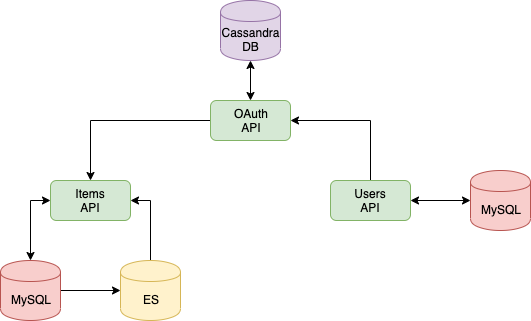
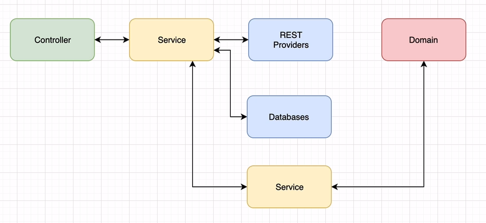
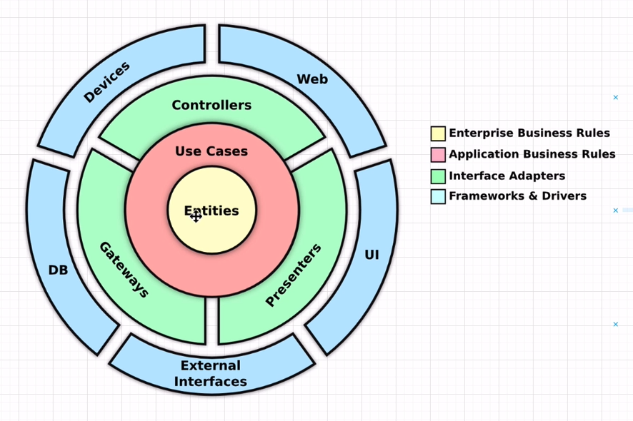
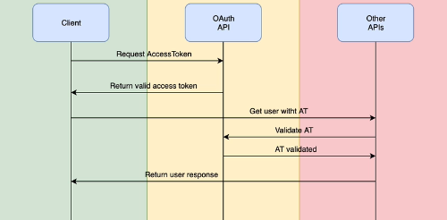
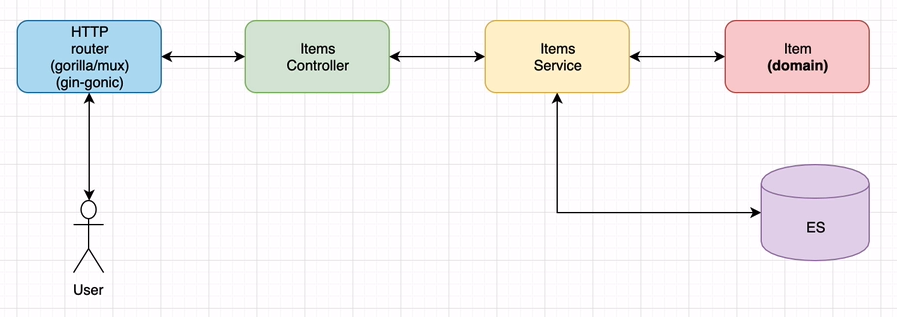
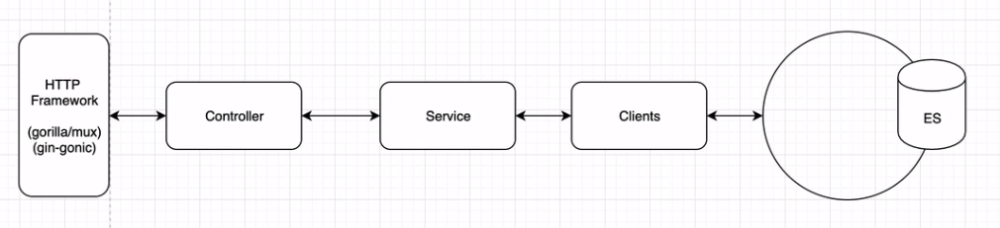

# How to design & develop REST microservices in Go

[part 1, youtube](https://federicoleon.com/microservice-design-patterns-in-golang/)
[part 2, udemy](https://saxobank.udemy.com/course/golang-how-to-design-and-build-rest-microservices-in-go)



- Users API (Gin + MVC pattern + MySQL)
  [github](https://github.com/federicoleon/bookstore_users-api)
- OAuth API (Gin + Domain Driven Design + CassandraDB)
  [github](https://github.com/federicoleon/bookstore_oauth-api)
- OAuth common library (OAuth client for all of our APIs)
  [github](https://github.com/federicoleon/bookstore_oauth-go)
- Utils shared library (Common errors and more. Keep error handling consisten in our entire ecosystem)
  [github](https://github.com/federicoleon/bookstore_utils-go)
- Items API (Gorilla/mux + MVC + ElasticSearch)
  [github](https://github.com/federicoleon/bookstore_items-api)

Building process.

```sh
# directories:
# proeftuin/go-rest-microservices/bookstore-utils-go
# proeftuin/go-rest-microservices/bookstore-oauth-go
# proeftuin/go-rest-microservices/bookstore-oauth-api
# proeftuin/go-rest-microservices/bookstore-users-api
# proeftuin/go-rest-microservices/bookstore-items-api

cd proeftuin/go-rest-microservices
go mod init
go mod tidy
cd bookstore-oauth-api
go build main.go
cd ..
cd bookstore-users-api
go build main.go
cd ..
cd bookstore-items-api
go build main.go
cd ..
```










