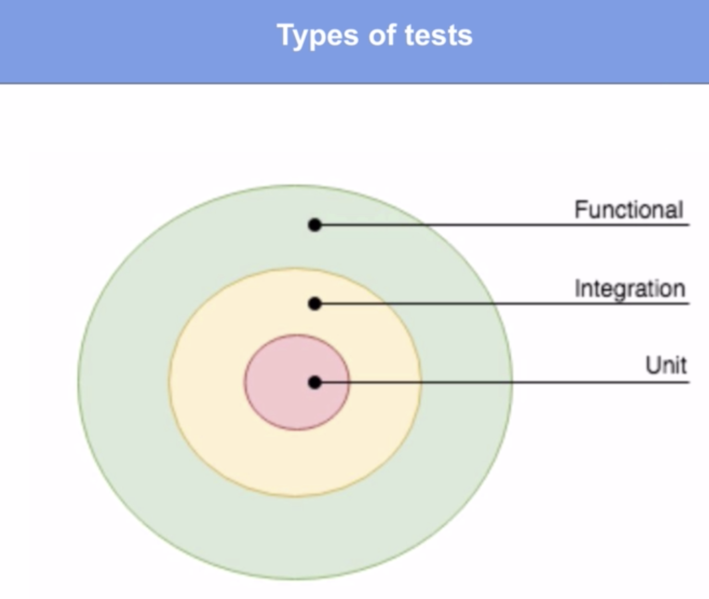
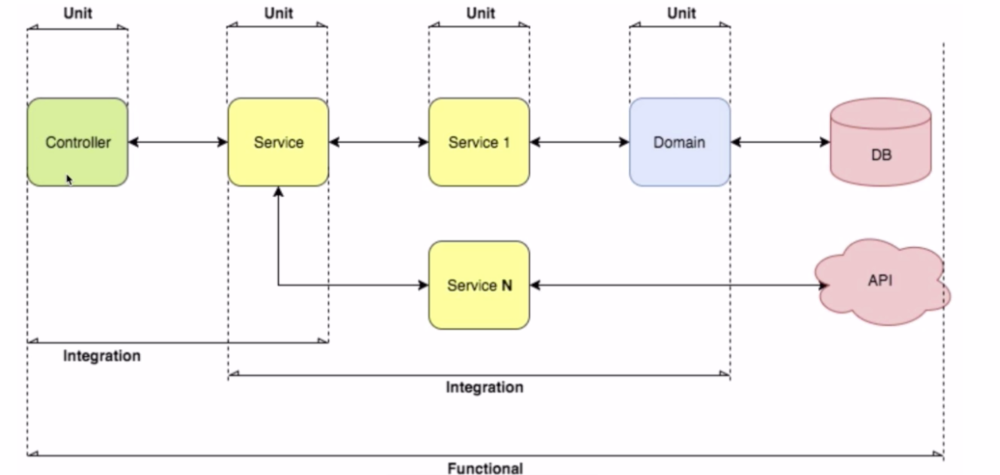
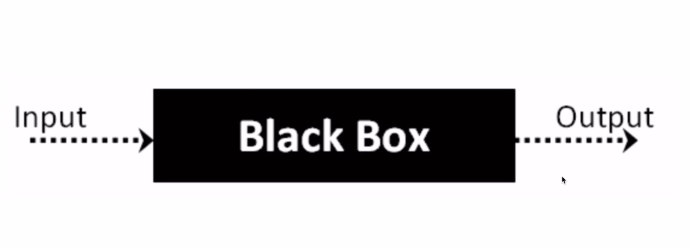
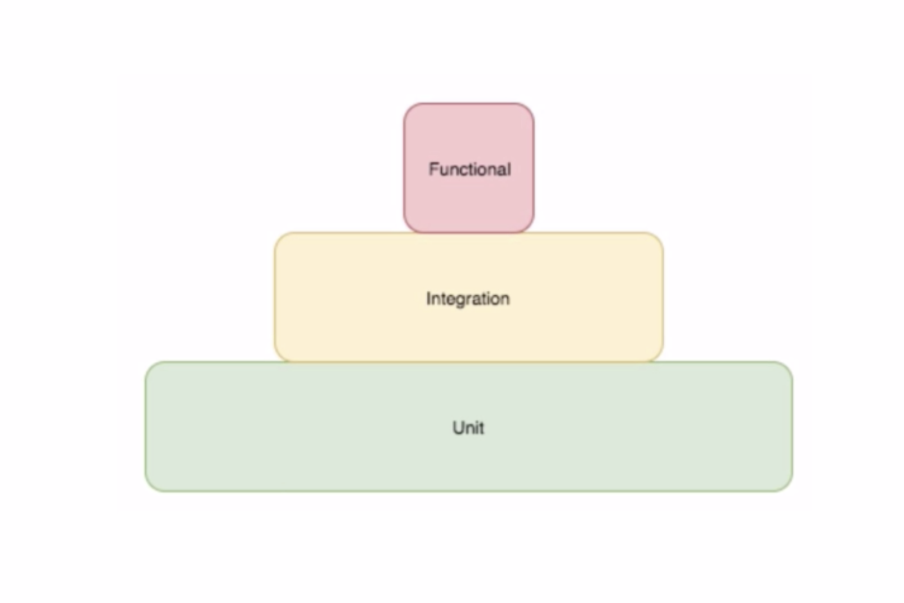

# Unit, integration and functional Testing in Golang

- [https://saxobank.udemy.com/course/unit-integration-and-functional-testing-in-golang-go/](https://saxobank.udemy.com/course/unit-integration-and-functional-testing-in-golang-go/)
- [https://federicoleon.com/category/programming-languages/golang/](https://federicoleon.com/category/programming-languages/golang/)
- [https://github.com/federicoleon/golang-testing](https://github.com/federicoleon/golang-testing)
- [https://github.com/federicoleon?tab=repositories](https://github.com/federicoleon?tab=repositories)

## Introduction to testing

We are going to review the concept of testing regardless of the language that or the programming language that you're using at the moment.

The concepts are the same. This is from the engineering point of view not the software developer point of view.



Let's first review the unit tests.

The unit tests allow us to perform a validation against our code to make sure that what we wrote actually works.

The main characteristic that we have in our unit tests is that in both unit and integration you shouldn't be using any IO. You shouldn't be hitting your hard drive or your actual database or different aspects of your application. You must be isolating the components that you want to unit test or integration test in order to make sure that you are testing those components and not the complete application.

You have two types of unit test: the white box and the black box and in this concept it is a little blurry because if you're performing white box tests then you have access to the source code.

You can take a look at how private variables and functions actually work so in white box testing you have access to the private functions in your package or in the artifact under test.

In the black box test you are putting your test case outside your package. Your testing and you're allowed to test only the public and the protected variables, methods or components that you have but you need to be aware of what you are actually testing.

So Go allows both black box and the white box test but we recommend to use and actually Google recommends to use the white box testing.

In that way you can test every part of your application without changing the visibility or the behavior of the logic that you have, you are encapsulating all of the behavior and logic inside your package.

So a unit test is testing a single piece of code, a single artifact, a single logic.

In the integration test we are working with more than one.

Suppose that we are testing a function and this function is calling another function. If we don't coded that second function in our package we are performing an integration test.

So we have integration tests to make sure that different layers, different functions, different logic or different artifacts inside our code integrate in a good way are doing their work properly.



The final test that we have is the functional test and the functional test has a single characteristic: in order to perform a function test you need your application run. You need to start and run your application and perform the request against the running application.



Summary: this is called the pyramid of tests.



- This is the way you should have your test cases developed.
- You should rely mostly on unit tests.
- Once you have the unit test on you you make sure that all of the components and all of the layers of your application are actually working.
- Then you perform several integration tests to make sure that all of these components are working properly.
- And finally you have if you must you have perhaps just one or two functional tests to make sure that your application actually works when it is started.
- The functional tests as you can see since they start the application they are going to work with a working database or they are going to call on a staging or testing database that you might be using.
- In order to start and run your application your functional test needs to make sure that you have all the resources that you might be using available for testing.

## Basic testing

### Basic unit tests

Create `src/api/utils/sort/sort1_test.go` file

```go
package sort

import (
  "testing"
)

func TestBubbleSortOrder(t *testing.T) {
  // Init
  elements := []int{9, 7, 5, 3, 1, 2, 4, 6, 8, 0}

  // Execution
  BubbleSort(elements)

  // Validation
  if elements[0] != 0 {
    t.Error("first element should be 0")
  }
  if elements[len(elements)-1] != 9 {
    t.Error("last element should be 9")
  }
}
```

#### Steps to follow when writing a test case

- Test must be in the package of the function we are testing
- File name `file_test.go`
- Test funtion name starts with `Test`

```go
func TestFunctionName(t Testing.T) {
    // Init
    // Execute
    // Validate
}
```

1. Initialization
2. Execution
3. Validation

```sh
# Run Tests
go test # everything in package

# Verbose
go test -v .

# Coverage
go test -cover
```

### Code Coverage - the diabolic metric

- Do not rely on test coverage!
- It only says lines of code have been executed.

### Basic integration tests

### Basic benchmarks

```go
func BenchmarkFunctionName(b *testing.B) {
  elements := sort.GetElements(20000)
  for i := 0; i < b.N; i++ {
    Sort(elements)
  }
}
```

### How to test functions with timeouts

```go
func TestBubbleSortWithTimeout(t *testing.T) {
  elements := GetElements(10)

  assert.NotNil(t, elements)
  assert.EqualValues(t, 10, len(elements))
  assert.EqualValues(t, 9, elements[0])
  assert.EqualValues(t, 0, elements[len(elements)-1])

  timeoutChan := make(chan bool, 1)
  defer close(timeoutChan)

  go func() {
    BubbleSort(elements)
    timeoutChan <- false
  }()

  go func() {
    time.Sleep(500 * time.Millisecond)
    timeoutChan <- true
  }()

  if <-timeoutChan {
    assert.Fail(t, "bubble sort took more than 500 ms")
    return
  }
  assert.NotNil(t, elements)
  assert.EqualValues(t, 10, len(elements))
  assert.EqualValues(t, 0, elements[0])
  assert.EqualValues(t, 9, elements[len(elements)-1])
}
```

## Testing REST API integration

### Asserts: missing by design

See [https://github.com/stretchr/testify](https://github.com/stretchr/testify)

### Testing REST API Calls

See [https://github.com/mercadolibre/golang-restclient/tree/master/rest](https://github.com/mercadolibre/golang-restclient/tree/master/rest)

### Mock and unit test external REST API calls

```go
package locations_provider

import (
  "testing"
  "github.com/stretchr/testify/assert"
  "net/http"
  "github.com/mercadolibre/golang-restclient/rest"
  "os"
)

func TestMain(m *testing.M) {
  rest.StartMockupServer()
  os.Exit(m.Run())
}

func TestGetCountryNotFound(t *testing.T) {
  rest.FlushMockups()
  rest.AddMockups(&rest.Mock{
    URL:          "https://api.mercadolibre.com/countries/AR",
    HTTPMethod:   http.MethodGet,
    RespHTTPCode: http.StatusNotFound,
    RespBody:     `{"message": "Country not found","error": "not_found","status": 404,"cause": []}`,
  })

  country, err := GetCountry("AR")

  assert.Nil(t, country)
  assert.NotNil(t, err)
  assert.EqualValues(t, http.StatusNotFound, err.Status)
  assert.EqualValues(t, "Country not found", err.Message)
}
```

## Testing the whole app

### Mocking entire layers of the application

See [https://github.com/gin-gonic/gin](https://github.com/gin-gonic/gin)

### Functional testing

## Testing SQL integration

### How to test SQL clients

See [https://github.com/go-sql-driver/mysql](https://github.com/go-sql-driver/mysql)

### Add query features to our client
